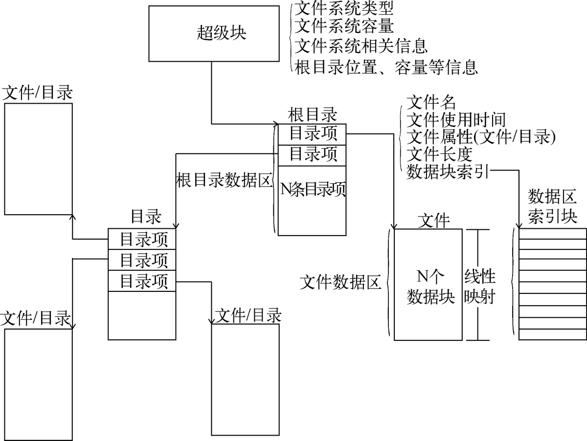
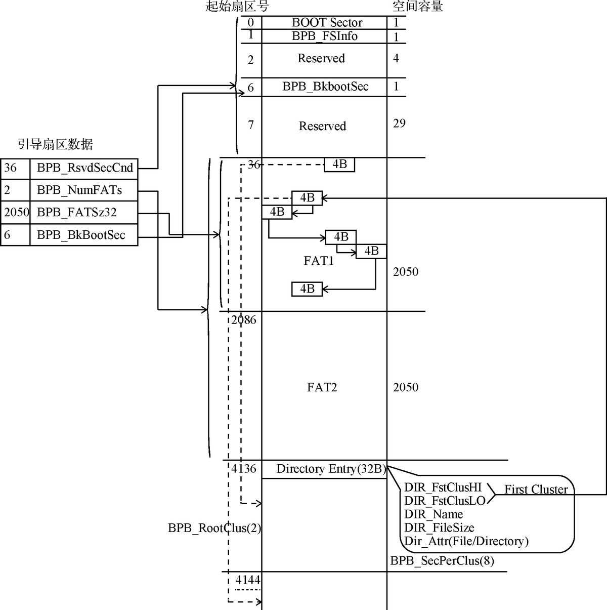
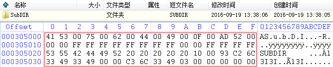
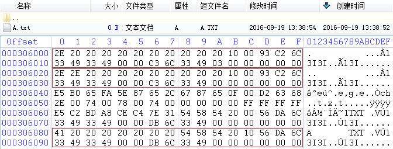
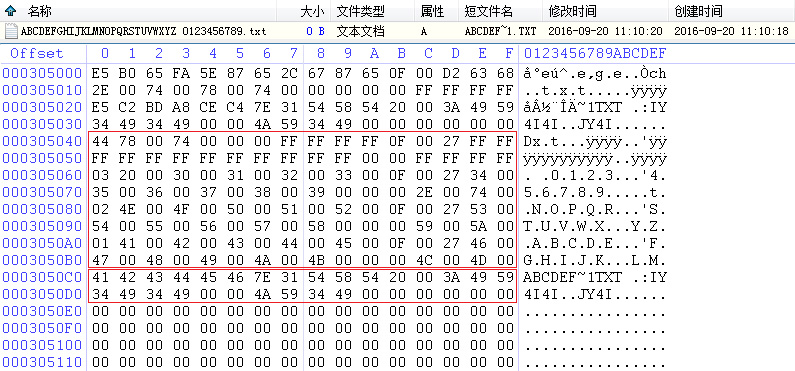
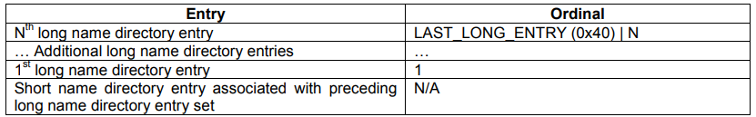
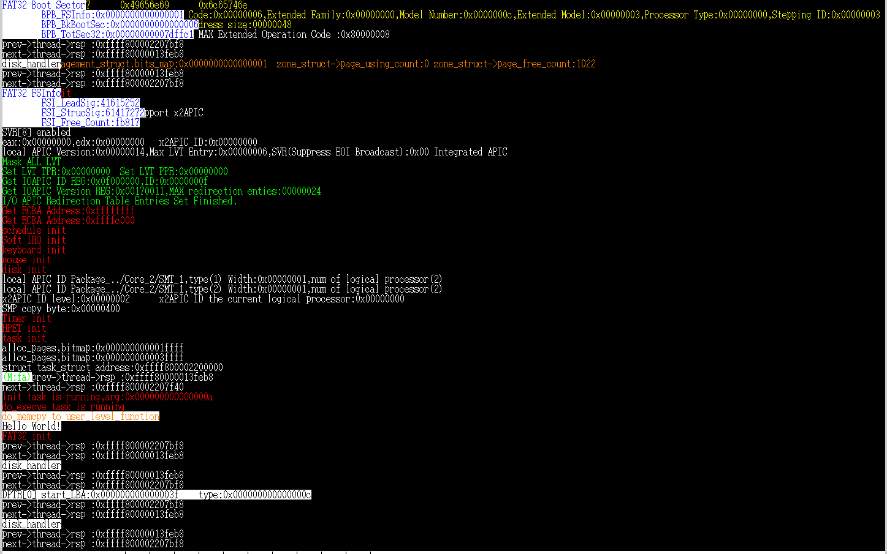
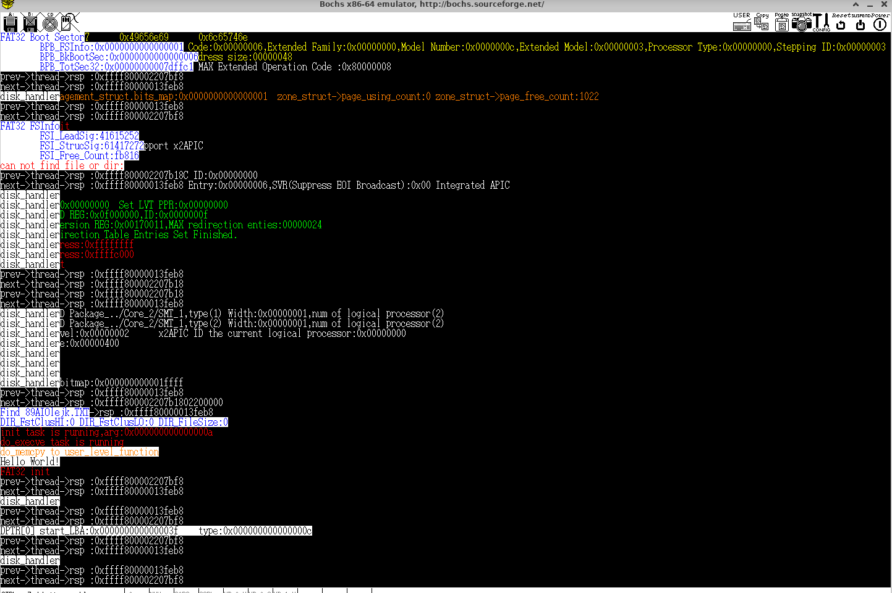
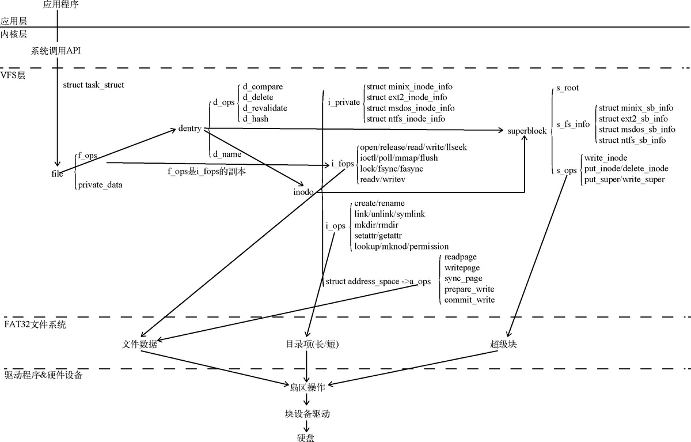

# <<一個64位操作系統的設計與實現>>第13章文件系統
一個文件會由信息與數據兩部分組成，信息部分紀錄文件名、文件長度、數據扇區索引等內容，而數據區則紀錄文件的實際數據。比如第三章bootloader使用的FAT12文件格式根目錄區對應的就是信息部分，FAT表項則用於表示文件的下一個扇區，而數據區是真正存放數據的地方。  
文件系統通常會包含超級快、目錄項與數據區三個部分，圖一為文件系統的結構圖。  
**超級塊(Super Block)**:啟動扇區、引導扇區，用於紀錄文件系統的全局信息。  
**目錄項(Directory Entry)**:主要用於保存目錄名稱、長度、屬性、數據塊索引表與操作時間等信息。  
**數據區(Data Block)**:文件與目錄最主要的差別就在這裡，雖然都是數據，但目錄保存的是子目錄項，這個子目錄項可以是目錄或是文件。  


<p class="text-center">
圖一、文件系統概述
</p>

## FAT32文件系統概述
FAT32文件系統的引導扇區定義大多與FAT12/16相同，但FAT32新增了一些參數。  

| 名稱                    | 偏移 | 長度 | 內容                                   |
| ----------------------- | ---- | ---- | -------------------------------------- |
| BS_jmpBoot              | 0    | 3    | 跳轉指令                               |
| BS_OEMName              | 3    | 8    | 生產廠商名                             |
| BPB_BytesPerSec         | 11   | 2    | 扇區容量                               |
| BPB_BytesPerClus        | 13   | 1    | 每叢集扇區數量                           |
| BPB_RsvdSecCnt          | 14   | 2    | 保留扇區數量(在FAT12/16中為1，FAT32非零即可) |
| BPB_NumFATs             | 16   | 1    | FAT表的份數                            |
| BPB_RootEntCnt          | 17   | 2    | 根目錄可容納目錄項數(FAT32為0)           |
| BPB_TotSec16            | 19   | 2    | 總扇區數                               |
| BPB_Media               | 21   | 1    | 介質描述符                             |
| BPB_FATSz16             | 22   | 2    | 每FAT扇區數                            |
| BPB_SecPerTrk           | 24   | 2    | 每磁道扇區數量                         |
| BPB_NumHeads            | 26   | 2    | 磁頭數                                 |
| BPB_HiddSec             | 28   | 4    | 隱藏扇區數(從LBA 0扇區開始到起始扇區的扇區數量)|
| BPB_TotSec32            | 32   | 4    | 若BPB_TotSec16=0，則由這裡紀錄扇區數量 |
| BPB_FATSz32 (FAT32獨有) |36     | 4     |  每FAT扇區數(BPB_FATSz16必須為0)                                      |
| BPB_ExtFlags(FAT32獨有)  | 40  |   2   | bit0-3:活動FAT表(從0開始)<br>bit4-6:保留<br>bit7:更新FAT表(0)實時更新、(1)更新bit0-3指定的FAT表<br>bit8-15:保留     |
| BPB_FSVer(FAT32獨有)     | 42  | 2     | FAT32版本號                                       |
| BPB_RootClus(FAT32獨有) | 44   | 4     | 根目錄起始cluster編號，通常為2(通常數據區也在這個cluster編號)|
| BPB_FSInfo(FAT32獨有)   | 48    |2     | BPB_FSInfo結構體所在扇區號                                       |
| BPB_BkBootSec(FAT32獨有)|50     | 2    | 引導扇區的備份扇區號，通常為6。同時也備份FSInfo，位置緊跟在引導扇區備份後面   |
| BPB_Reserved           |   52   | 12  | 保留                                       |
| BS_DrvNum               | 64   | 1    | int 13h的驅動器號                      |
| BS_Reserved1            | 65   | 1    | 未使用                                 |
| BS_BootSig              | 66   | 1    | 擴展引導標記(29h)                      |
| BS_VollD                | 67   | 4    | 捲序列號                               |
| BS_VolLab               | 71   | 11   | 捲標                                   |
| BS_FileSysType          | 82   | 8    | 文件系統類型                           |
| 引導程式碼              | 90   | 420  | 引導程式碼、數據與其他信息             |
| 結束標誌                | 510  | 2    | 結束標誌 0xAA55                        |

**FSInfo扇區**
在FAT32文件系統可支援較FAT12/16大上許多的記憶體設備，這也使得其用於索引數據扇區的FAT表佔據非常大的容量，這導致在FAT表中索引一個文件會變得非常耗時，尤其在系統啟動期間。因此FAT32文件系統會在保留區域中添加輔助結構體FSInfo，以幫助文計線統存處信息，其結構如下表所示。  

| 名稱           | 偏移 | 長度 | 功能                                                                             |
| -------------- | ---- | ---- | ------------------------------------------------------------------ --------- |
| FSI_LeadSig    | 0    | 4    | FSInfo扇區標示符，值為0x41615252                                                 |
| FSI_Reserved1  | 4    | 480  | 保留使用，全部為0                                                                |
| FSI_StrucSig   | 484  | 4    | 另一個標示符，值為0x61417272                                                     |
| FSI_Free_Count | 488  | 4    | 上次紀錄的空閒cluster數量。如果為0xFFFFFFFF則表示空閒數量未知                    |
| FSI_Nxt_Free   | 492  | 4    | 空閒cluster的起始搜索位置。若為0xFFFFFFFF，則默認從2號cluster開始搜索空閒cluster |
| FSI_Reserved2  | 496  | 12   | 保留使用，全部為0                                                                |
| FSI_TrailSig   | 508  | 4    | 結束標誌，數值固定為0xaa550000                                                   |

需注意的是`FSI_Free_Count`與`FSI_Nxt_Free`僅為參考值，這是為了FAT32文件系統計算與索引空閒cluster提供的參考值，並不是實時更新的準確數值。  

**FAT表**
FAT表將記錄下一個cluster的編號，FAT文件系統的數字對應的就是表項的長度，如FAT12為12位元、FAT16為16位元、FAT32為32位元。  
FAT32文件系統的FAT表項佔據32位元但實際僅有低28位元為有效位，高4位元則保留使用。在操作過程中，文件管理程式指會修改低28位元，高4為指會在格式化時更改。  


| FAT項  | 實例值    | 功能描述                                                       |
| ------ | --------- | -------------------------------------------------------------- |
| 0      | 0FFFFFF8h | 磁碟標示字                                                     |
| 1      | FFFFFFFFh | 第一個cluster被占用                                            |
| 2      | 00000003h | x0000002h~xFFFFFEFh：已用cluster，標示文件的下一個clusater編號 |
| 3      | 00000000h | 可用cluster(未使用的cluster)                                   |
| ...... | 0FFFFFF7h | 損壞的cluster                                                  |
| ...... | 0FFFFFF8h | xFFFFFF8 - xFFFFFFFh用於表示文件的結尾                         |
| ...... | 0FFFFFF0h | xFFFFFF0h~xFFFFFF6h為保留的cluster                             |

由於FAT32文件系統指使用低28位索引FAT表，高4位的數字並不重要這裡的x用於表示0x0 - 0xf的任意值。  

**根目錄與數據區**
與FAT12/16文件系統不同FAT32文件系統在設計時並沒有獨立配給根目錄區空間而是包含在數據區中。這使得根附錄大小可以動態增長，以打破根目錄數量的限制。此外FAT32文件系統引入常目錄項結構，使得文件名最長可支援255個字符(短目錄項最多只有11個)。  
下表為短目錄項的結構(32 Byte)。  


| 名稱             | 偏移 | 長度 | 功能                     |
| ---------------- | ---- | ---- | ------------------------ |
| DIR_Name         | 0    | 11   | 基礎名8byte，擴展名3byte |
| DIR_Attr         | 11   | 1    | 文件屬性<br>0x01=只讀<br>0x02=隱藏<br>0x04=系統文件<br>0x08=VOLUME_ID<br>0x10=目錄<br>0x20=存檔<br>0x0F為長文件名          |
| DIR_NTRes        | 12   | 1    | 保留                     |
| DIR_CrtTimeTenth | 13   | 1    | 文件創建時間(毫秒)       |
| DIR_CrtTime      | 14   | 2    | 文件創建時間             |
| DIR_CrtDate      | 16   | 2    | 文件創建日期             |
| DIR_LastAccDate  | 18   | 2    | 最後訪問日期             |
| DIR_FstClusHI    | 20   | 2    | 起始cluster編號(高2byte) |
| DIR_WrtTime      | 22   | 2    | 最後寫入時間             |
| DIR_WrtDate      | 24   | 2    | 最後寫入日期             |
| DIR_FstClusLO    | 26   | 2    | 起始cluster編號(低2byte) |
| DIR_FileSize     | 28   | 4    | 文件大小                 |

**文件名**:如果DIR_Name[0]為0xE5、0x00、0x05表示這是無效或是空閒的目錄項。文件的基礎名開始處不可為空白字符0x20只有在文件名小於基礎名長度8byte才可以使用空白字符0x20補足。  

**文件屬性**:請注意這裡每個位元都代表單一的獨立屬性，比如一個只讀的系統文件屬性為`0x1 | 0x4 = 0x5`。`VOLUME_ID`用於硬碟分區命名，如C槽、D槽。而存檔屬性則是文件的備份功能，用於寄路上次備份後有哪些文件被改過，當對文件執行建立、重命名、寫入時就會置位。而0xF則定義為長文件名，另外設定文件系統時不會有文件同時具有只讀、隱藏、系統文件、VOLUME_ID這4種屬性的文件，因此不用擔心衝突問題。  

**起始cluster號碼**:為保證目錄項格式的兼容性起始cluster編號會被拆成高2byte與低2byte，並保存在不同變量中。  

**長目錄項**:短目錄項的擴展，將文件的編碼方式從ASCII升級為Unicode，因此文字名可支援更多語言符號。  

| 名稱           | 偏移 | 長度 | 功能                                   |
| -------------- | ---- | ---- | -------------------------------------- |
| LDIR_Ord       | 0    | 1    | 長目錄項序號                           |
| LDIR_Name1     | 1    | 10   | 長文件名的1-5個字符，每個字符佔據2Byte |
| LDIR_Attr      | 11   | 1    | 屬性必須為0x0F(長文件名)               |
| LDIR_Type      | 12   | 1    | 若為0則代表為長目錄項的子項            |
| LDIR_Chksum    | 13   | 1    | 短文件名的校驗和                       |
| LDIR_Name2     | 14   | 12   | 長文件名的第6-11個字符                 |
| LDIR_FstClusLO | 26   | 2    | 必須為0                                |
| LDIR_Name3     | 28   | 4    | 長文件名的第12-13個字符                 |

**長文件名**:由3個存儲區域組成，每個字符大小為2byte以Unicode表示，並以NUL(空字符)結尾。剩餘空間以0xFF填充。  

**校驗和**:計算短目錄項的文件名獲得，圖二為計算公式。


<p class="text-center">
圖二、校驗和計算公式
</p>

我覺得書中說明的校驗和ChkSum不夠清楚，因此在此放上[Microsoft FAT Specification](https://academy.cba.mit.edu/classes/networking_communications/SD/FAT.pdf)的說明。  
```
//----------------------------------------------------------------------------- 
 // ChkSum()
 // Returns an unsigned byte checksum computed on an unsigned byte 
 // array. The array must be 11 bytes long and is assumed to contain 
 // a name stored in the format of a MS-DOS directory entry. 
 // Passed: pFcbName Pointer to an unsigned byte array assumed to be 
// 11 bytes long. 
 // Returns: Sum An 8-bit unsigned checksum of the array pointed 
// to by pFcbName. 
 //------------------------------------------------------------------------------ 
 unsigned char ChkSum (unsigned char *pFcbName) 
 { 
     short FcbNameLen; 
     unsigned char Sum; 
     Sum = 0; 
         for (FcbNameLen=11; FcbNameLen!=0; FcbNameLen--) { 
         // NOTE: The operation is an unsigned char rotate right 
         Sum = ((Sum & 1) ? 0x80 : 0) + (Sum >> 1) + *pFcbName++; 
         } 
     return (Sum); 
 }
```

**長目錄項序號**:起始序號為1，對於紀錄長文件名的最後一個目錄項，第6位必須置位以表示結尾。  



<p class="text-center">
圖三、FAT文件系統結構
</p>

圖三展示了FAT32文件系統的架構。扇區0用於存放引導區(boot)，而扇區1存放FSInfo結構體，這個結構體包含文件系統的信息。引導區和FSInfo的備份被存放在扇區6（由BPB_BkbootSec指定）。保留區域之後，從扇區36開始放置FAT表。FAT表通常有兩份，其中一份作為備份使用。接著是根目錄區和數據區。  

文件的數據是通過FAT表來鏈接的，以下是文件查找過程的說明：  
>1.從根目錄區獲取起始cluster編號，例如0x123，這表示文件的數據從cluster 0x123開始。  
>2.檢索FAT表中第0x123項，其值為0x456，表示文件的下一個數據位置為cluster 0x456。  
>3.再次查找FAT表中第0x456項，其值為0xFFFFFF8，這表示文件到此結束，沒有下一個cluster。  

另外FAT32文件系統要求文件名必須唯一，但實際上短目錄項紀錄著文件名的前8個基礎字符，這使得短目錄項的文件名很容易出現重複的狀況。為了解決此問題FAT32文件系統會以「部份文件名」+「~N」的方式來區別這些文件(N的取值範圍為1-999999)。
比如我們有兩個文件名稱分別為「ABCDEFAAA.txt」與「ABCDEFBBB.txt」，那他們的短目錄項可能會變成「ABCDEF~1.TXT」與「ABCDEF~2.TXT」。  
另外FAT32文件系統也支援.與..分別代表當前目錄與父目錄的文件名。  
以下幾張圖為書中提供的範例。  



<p class="text-center">
圖四、文件SUBDIR的短目錄項數據
</p>

這裡建立了子目錄SUBDIR(先不管名稱大小寫，大小寫是DIR_NTRes標示)。其屬性`LDIR_Attr`(offset=11)為0x10表示此文件為目錄。而`DIR_FstClusLO`(offset=26)、`DIR_FstClusHI`(offset=20)可得知這個目錄數據區位於cluster 0x3。  



<p class="text-center">
圖五、文件SUBDIR的數據區
</p>

由於文件SUBDIR是個目錄，因此其數據區紀錄為各文件的目錄項。圖五中可觀察到文件名.這代表當前目錄，.的起始cluster編號為0x3可驗證這就是目錄本身。而文件名..則代表父目錄其起始cluster編號為0x0此為根目錄的起始cluster編號。  

對於一份文件其短目錄項會與長目錄項相鄰，書中以「ABCDEFGHIJKLMNOPQRSTUVWXYZ 0123456789.txt」的文件名為例。  



<p class="text-center">
圖六、文件ABCDEFGHIJKLMNOPQRSTUVWXYZ 0123456789.txt的目錄項
</p>

請注意，在字符“Z”和“0”之間實際上存在一個空格，因此「 012345689.t」這一項實際包含13個字符，而不是12個字符（圖三中少輸入了一個空格）。在FAT32文件系統中，文件名的長目錄項是以逆序方式存儲的，從序號最高的長目錄項開始，到序號為1的長目錄項，最後緊接著一個短目錄項。  
最後一項的序號為0x44，這是因為該項的0x40位元用於標示長文件名的結尾。在[Microsoft FAT Specification](https://academy.cba.mit.edu/classes/networking_communications/SD/FAT.pdf)中有以下描述。  



<p class="text-center">
圖七、FAT32文件系統長目錄項的序號描述
</p>

## 實現基於路徑名的文件系統檢索功能。  
### 硬碟驅動升級  
依據信號量的描述，信號量可借助等待佇列管裡每一個等待資源的行程。而硬碟驅動程式可借助等待佇列管裡訪問硬碟的行程。我們可依據這個性質讓執行讓等待硬碟I/O的行程休眠，讓處理器專注於消耗性行程的處理。  
```
kernel/disk.h
struct block_buffer_node {
    unsigned int count;
    unsigned char cmd; // 執行命令
    unsigned long LBA; // 48位元LBA地址
    unsigned char *buffer; // 對應內存位
    void(*end_handler)(unsigned long nr, unsigned long parameter); // 後續處理方法
    wait_queue_t wait_queue;
};

struct request_queue {
    wait_queue_t wait_queue_list; // 請求佇列
    struct block_buffer_node *in_using; // 處理中的請求
    long block_request_count; // 剩餘請求數量
};
```
原本結構體`struct request_queue`與`struct block_buffer_node`都是透過`struct List`將硬碟訪問請求串接，這裡修改成`wait_queue_t`讓硬碟的訪問請求可以直接索引到對應的行程。  

```
kernel/disk.c
void disk_init()
{
    struct IO_APIC_RET_entry entry;
    entry.vector = 0x2f;
    ...
    register_irq(0x2f, &entry, &disk_handler, (unsigned long)&disk_request, &disk_int_controller, "disk1"); // 註冊硬碟中斷
    // 向量號0x2e與0x2f都是硬碟的中斷，但對應不同的硬碟驅動器。

    io_out8(PORT_DISK1_ALT_STA_CTL, 0); // 啟用中斷。

    wait_queue_init(&disk_request.wait_queue_list, NULL); // 目前尚無訪問硬碟的行程，輸入為NULL
    ...
}
```
第11章中，我們使用變數`disk_flag`來等待硬碟操作完成。在第12章，我們實現了行程調度器並定義了等待佇列，允許我們將當前行程進行休眠，釋放行程占用的CPU資源，直到硬碟中斷處理函數將其喚醒。這種方法可取代`disk_flag`的功能，並避免了等待硬碟I/O所花費CPU資源。  

```
kernel/disk.c
struct block_buffer_node *make_request(long cmd, unsigned long blocks, long count, unsigned char *buffer)
{
    struct block_buffer_node *node = (struct block_buffer_node*)kmalloc(sizeof(*node), 0);
    wait_queue_init(&node->wait_queue, current); // 為當前的行程製作請求包
    ...
}

void add_request(struct block_buffer_node *node)
{
    list_add_to_before(&disk_request.wait_queue_list.wait_list, &node->wait_queue.wait_list); // 添加到循環佇列的最尾端
    disk_request.block_request_count++;
}

long cmd_out()
{
    wait_queue_t *tmp = container_of(list_next(&disk_request.wait_queue_list.wait_list), wait_queue_t, wait_list);
    struct block_buffer_node *node = disk_request.in_using = container_of(tmp, struct block_buffer_node, wait_queue);
    ...
}
```
上面設些函式將`struct List`的操作修改為`wait_queue_t`。  
```
kernel/disk.c

void wait_for_finish()
{
    current->state = TASK_INTERRUPTIBLE;
    schedule();
}
```
製作請求包後程式就會立即執行`wait_for_finish`休眠任務並等待硬碟操做完成。  
```
void read_handler(unsigned long nr, unsigned long parameter)
{
    struct block_buffer_node *node = ((struct request_queue*)parameter)->in_using;
    ...
    end_request(node);
}

void write_handler(unsigned long nr, unsigned long parameter)
{
    struct block_buffer_node *node = ((struct request_queue *)parameter)->in_using;
    ...
    end_request(node);
}

void other_handler(unsigned long nr, unsigned long parameter)
{
    struct block_buffer_node *node = ((struct request_queue *)parameter)->in_using;
    ...
    end_request(node);
}
```
當硬碟操作完成後，會產生一個中斷，隨後由中斷處理函式執行指定的handler。將函式`end_request`添加一個輸入參數`node`，該參數用於喚醒休眠的行程。  
```
void end_request(struct block_buffer_node *node)
{
    if (node == NULL)
    color_printk(RED, BLACK, "end_request error\n");
    node->wait_queue.tsk->state = TASK_RUNNING; // 喚醒任務 
    insert_task_queue(node->wait_queue.tsk);     
    node->wait_queue.tsk->flags |= NEED_SCHEDULE;

    kfree((unsigned long*)disk_request.in_using);
    disk_request.in_using = NULL;
    
    if(disk_request.block_request_count)
        cmd_out();
}
```

### 檢索FAT32文件系統基礎數據

接下來將依據FAT32文件系統的各式數據結構建立結構體。

硬碟扇區由引導程式碼(0h-1BDh)、硬碟分區表(1BEh-1FDh)、結束符三部分組成。下描述了硬碟分區表的結構。  

| 偏移 | 長度 | 範例值     | 描述                              |
| ---- | ---- | ---------- | --------------------------------- |
| 0    | 1    | 80h        | 引導標示符，標記此分區為活動分區  |
| 1    | 1    | 01h        | 起始磁頭號                        |
| 2    | 2    | 0001h      | 起始扇區號(低6位)與柱面號(高10位) |
| 4    | 1    | 01h        | 分區類型ID值                      |
| 5    | 1    | FEh        | 結束磁頭號                        |
| 6    | 2    | 013FH      | 結束扇區號(低6位)與柱面號(高10位) |
| 8    | 4    | 0000,003Fh | 起始邏輯扇區(LBA)                 |
| 12   | 4    | 0000,7D43h | 分據區用磁碟扇區數                |

根據上表的描述我們可建立以下結構體，取得硬碟分區信息。  
```
kernel/fat32.h

struct Disk_Partition_Table_Entry {
    unsigned char flags;
    unsigned char start_head;
    unsigned short start_sector     :6,  // 0-5
                   start_cylinder   :10; // 6-15
    unsigned char type;
    unsigned char end_head;
    unsigned short end_sector       :6,  // 0-5
                   end_cylinder     :10; // 6-15
    unsigned int start_LBA;
    unsigned int sectors_limit;
}__attribute__((packed));

struct Disk_Partition_Table {
    unsigned char BS_Reserved[446];
    struct Disk_Partition_Table_Entry DPTE[4];
    unsigned short BS_TrailSig;
}__attribute__((packed));

```
結構體`struct Disk_Partition_Table_Entry`為硬碟分區表的項目，通過解析此資料可以檢索出FAT32文件系統(分區類型值為0Bh)扇區號(LBA)與扇區數目。  
```
kernel/fat32.h

struct FAT32_BootSector {
    unsigned char BS_jmpBoot[3];
    unsigned char BS_OEMName[8];
    unsigned short BPB_BytesPerSec;
    unsigned char BPB_SecPerClus;
    unsigned short BPB_RsvdSecCnt;
    unsigned char BPB_NumFATs;
    unsigned short BPB_RootEntCnt;
    unsigned short BPB_TotSec16;
    unsigned char BPB_Media;
    unsigned short BPB_FATSz16;
    unsigned short BPB_SecPerTrk;
    unsigned short BPB_NumHeads;
    unsigned int BPB_HiddSec;
    unsigned int BPB_TotSec32;
    
    unsigned int BPB_FATSz32;
    unsigned short BPB_ExtFlags;
    unsigned short BPB_FSVer;
    unsigned int BPB_RootClus;
    unsigned short BPB_FSInfo;
    unsigned short BPB_BkBootSec;
    unsigned char BPB_Reserved[12];

    unsigned char BS_DrvNum;
    unsigned char BS_Reserved1;
    unsigned char BS_BootSig;
    unsigned int BS_VolID;
    unsigned char BS_VolLab[11];
    unsigned char BS_FilSysType[8];

    unsigned char BootCode[420];
    unsigned short BS_TrailSig;
}__attribute__((packed));

struct FAT32_FSInfo {
    unsigned int FSI_LeadSig;
    unsigned char FSI_Reserved1[480];
    unsigned int FSI_StrucSig;
    unsigned int FSI_Free_Count;
    unsigned int FSI_Nxt_Free;
    unsigned char FSI_Reserved2[12];
    unsigned int FSI_TrailSig;    
}__attribute__((packed));

```
這裡定義的結構體則對應FAT32文件系統的引導扇區與FSInfo結構體。  

```
kernel/fat32.c

void DISK1_FAT32_FS_init()
{
    int i;
    struct Disk_Partition_Table DPT;
    struct FAT32_BootSector fat32_bootsector;
    struct FAT32_FSInfo fat32_fsinfo;
    unsigned char buf[512];

    memset(buf, 0, sizeof buf);

    IDE_device_operation.transfer(ATA_READ_CMD, 0, 1, buf);
    DPT = *(struct Disk_Partition_Table*) buf;
    color_printk(BLACK, WHITE, "DPTR[0] start_LBA:%#018lx\ttype:%#018lx\n", 
                 DPT.DPTE[0].start_LBA, DPT.DPTE[0].type);

    memset(buf, 0, sizeof buf); // 取得硬碟分區表。
    IDE_device_operation.transfer(ATA_READ_CMD, DPT.DPTE[0].start_LBA, 1, buf); // 根據分區表讀取FAT32文件的起始扇區。
    fat32_bootsector = *(struct FAT32_BootSector*)buf;
    color_printk(BLUE, WHITE, "FAT32 Boot Sector\n\tBPB_FSInfo:%#018lx\n\tBPB_BkBootSec:%#018lx\n\tBPB_TotSec32:%#018lx\n",
                 fat32_bootsector.BPB_FSInfo, fat32_bootsector.BPB_BkBootSec, fat32_bootsector.BPB_TotSec32);
    
    memset(buf, 0, sizeof buf);

    IDE_device_operation.transfer(ATA_READ_CMD, DPT.DPTE[0].start_LBA + fat32_bootsector.BPB_FSInfo, 1,(unsigned char*)buf);
    fat32_fsinfo = *(struct FAT32_FSInfo*)buf; // 讀取.BPB_FSInfo結構體。
    
    color_printk(BLUE, WHITE, "FAT32 FSInfo\n\tFSI_LeadSig:%lx\n\tFSI_StrucSig:%lx\n\tFSI_Free_Count:%lx\n",
                 fat32_fsinfo.FSI_LeadSig, fat32_fsinfo.FSI_StrucSig, fat32_fsinfo.FSI_Free_Count);
}
```
這部分的程式碼執行流程相當簡單。首先，從硬碟的起始扇區讀取分區表，然後從中選取FAT32文件系統的起始扇區地址。接著，從FAT32文件系統的起始扇區中讀取FSInfo結構體所在的扇區號。最後，取得FSInfo結構體的內容並打印相關信息。  


<p class="text-center">
圖八、bochs虛擬機運行結果
</p>

圖八顯示了Bochs虛擬機的執行結果，表明程式執行正確。螢幕上方的數據顯示為零，這是因為我使用`bximage`生成的鏡像文件，其中沒有填入任何數據。  
目前，我依照書中的指示撰寫的系統存在一個問題：如果在系統調用期間發生定時器中斷並導致行程切換，當這個行程被重新交換回來時會發生錯誤。目前我尚未解決這個問題，因此我在執行系統調用期間屏蔽了所有中斷繞過此問題，直到系統調用完成後才恢復中斷的處理。  

### FAT32虛擬硬碟建立
為了近一部撰寫基於FAT32的文件系統，我們需要建立MBR與FAT32文件系統。在bochs官方文檔中有以下描述。  

```
9.21.11. vvfat
9.21.11.1. description
The "vvfat" disk image mode is mostly a port of Qemu's "virtual VFAT" block driver (written by Johannes E. Schindelin). It supports the read-only part of this implementation plus some additions. The structures of the virtual disk are created from the contents of the specified local directory when Bochs is starting. All writes to this virtual disk go to a volatile redolog and when closing Bochs, the user can decide whether or not to commit the changes. If "No" is seclected, all changes will be lost when Bochs quits and the files of the local directory are not modified. Otherwise, the changes of files and directories are committed. WARNING: Don't use important data without backup in the "vvfat" directory when using this "optional commit" feature.

In addition to Qemu's "vvfat" implementation the Bochs one supports configurable disk geometry, FAT32 and reading MBR and/or boot sector from file. When using the autodetection feature, the CHS values 1024/16/63 (Qemu defaults) are used. To use an MBR image file from a real disk it must be named vvfat_mbr.bin and placed in the specified directory. Bochs uses the geometry and file system type from this file and doesn't show it on the virtual disk. The same applies to a boot sector image file, but it must be named vvfat_boot.bin. Using both image file is also possible if they match (grabbed from the same disk).

FAT32 is enabled for disk with minimum 2 GB size, or if MBR / boot sector image enable this filesystem. When using "vvfat" for a floppy, FAT12 is used (1.44M media only). In all other cases FAT16 is used. Long filename support is always present.

Special FAT file attributes are stored in a special file named vvfat_attr.cfg. When using the "optional commit" feature, modified attributes are saved to this file. The "optional commit" also supports setting the file modification date and time.
```
在vvfat模式下，我們可以指定一個目錄作為虛擬硬碟使用。如果需要指定MBR，只需在該目錄下添加vvfat_mbr.bin文件即可。  
```
.bochsrc

...
ata1: enabled=1, ioaddr1=0x170, ioaddr2=0x370, irq=15
ata1-master: type=disk, path="vvfat_disk", mode=vvfat, cylinders=8192, heads=16, spt=63, translation=lba
...
```
我重新調整了.bochsrc文件，將硬碟模式改為vvfat，並建立了一個名為vvfat_disk的目錄來模擬硬碟。讓我意外的是，在測試時發現Bochs會自動根據.bochsrc文件生成MBR，而不需要額外設定vvfat_mbr.bin文件。運行結果如圖九所示。  
目前這個FAT32文件系統僅作為學習用途，為了簡化操作，程式碼將不會切換不同的硬碟驅動器，也不會切換主/從硬碟驅動器。因此，在這裡我只定義了`ata1-master`作為`vvfat`模式，接下來所有的硬碟操作都圍繞這個目錄進行。  
請注意在bochs模式下硬碟大小必須超過2GB才會開啟FAT32模式，否則硬碟則會以FAT16文件系統解釋，這一點需要多留意。  



<p class="text-center">
圖九、bochs虛擬機運行結果
</p>

### 路徑名搜索文件  
FAT32文件系統以叢集（cluster）為儲存單位，因此我們的作業系統在進行硬碟操作時，也需要升級為以叢集為單位連續訪問多個扇區。根據ATA規範，在PIO模式下使用控制命令一次性訪問多個連續扇區時，每完成一個扇區的操作後，硬碟會向處理器發送中斷信號，以通知處理器準備處理下一個扇區。在此過程中，我們可以利用變數`count`來記錄當前還有多少扇區等待處理。  

```
kernel/disk.c

void read_handler(unsigned long nr, unsigned long parameter)
{
    struct block_buffer_node *node = ((struct request_queue*)parameter)->in_using;
    
    // 判斷硬碟操作是否出錯。
    if(io_in8(PORT_DISK1_STATUS_CMD) & DISK_STATUS_ERROR)
        color_printk(RED, BLACK, "read_handler:%#010x\n", io_in8(PORT_DISK1_ERR_FEATURE)); // 取得錯誤狀態
    else
        port_insw(PORT_DISK1_DATA, node->buffer, 256);  // 這裡寫256是因為insw指令每次處理2byte(w表示word)。
    
    node->count--;
    if (node->count) {
        node->buffer += 512;
        return;        
    }
    end_request(node);
}

void write_handler(unsigned long nr, unsigned long parameter)
{
    struct block_buffer_node *node = ((struct request_queue *)parameter)->in_using;

    if(io_in8(PORT_DISK1_STATUS_CMD) & DISK_STATUS_ERROR)
        color_printk(RED, BLACK, "write_handler:%#010x\n", io_in8(PORT_DISK1_ERR_FEATURE));
    
    node->count--;
    if (node->count) {
        node->buffer += 512;
        while(!(io_in8(PORT_DISK1_STATUS_CMD) & DISK_STATUS_REQ))
            nop();
        port_outsw(PORT_DISK1_DATA,node->buffer,256);
        return;
    }
    end_request(node);
}

void other_handler(unsigned long nr, unsigned long parameter)
{
    struct block_buffer_node *node = ((struct request_queue *)parameter)->in_using;

    if(io_in8(PORT_DISK1_STATUS_CMD) & DISK_STATUS_ERROR)
        color_printk(RED, BLACK, "other_handler:%#010x\n", io_in8(PORT_DISK1_ERR_FEATURE));
    else
        port_insw(PORT_DISK1_DATA, node->buffer, 256);
    end_request(node);
}
```
這裡僅僅是增加變數`count`作為判斷條件，只有當`count`為零時才執行`end_request`通知行程硬碟I/O以處理完畢。  

接下來將處理FAT32文件系統的長目錄項與短目錄項。  
```
kernel/fat32.h

struct FAT32_Directory {
    unsigned char DIR_Name[11];
    unsigned char DIR_Attr;
    unsigned char DIR_NTRes;
    unsigned char DIR_CrtTimeTenth;
    unsigned short DIR_CrtTime;	
    unsigned short DIR_CrtDate;
    unsigned short DIR_LastAccDate;
    unsigned short DIR_FstClusHI;
    unsigned short DIR_WrtTime;
    unsigned short DIR_WrtDate;
    unsigned short DIR_FstClusLO;
    unsigned int DIR_FileSize;
}__attribute__((packed));

// 下面這兩個巨集用於DIR_NTRes表示基礎名與擴展名的大小寫，使用時為小寫。
#define LOWERCASE_BASE  (8)
#define LOWERCASE_EXT   (16)

struct FAT32_LongDirectory {
    unsigned char LDIR_Ord;
    unsigned short LDIR_Name1[5];
    unsigned char LDIR_Attr;
    unsigned char LDIR_Type;
    unsigned char LDIR_Chksum;
    unsigned short LDIR_Name2[6];
    unsigned short LDIR_FstClusLO; // 必須為0
    unsigned short LDIR_Name3[2];    
}__attribute__((packed));
```
這裡我們就依據FAT32文件系統的定義，建立結構體。  
```
kernel/disk.c

struct Disk_Partition_Table DPT;
struct FAT32_BootSector fat32_bootsector;
struct FAT32_FSInfo fat32_fsinfo;

unsigned long FirstDataSector = 0; // 數據區起始扇區號
unsigned long BytesPerClus = 0; // 每叢集的大小
unsigned long FirstFAT1Sector = 0; // FAT1表的起始扇區號
unsigned long FirstFAT2Sector = 0; // FAT2表的起始扇區號
```
由於硬碟的空間布局基本上是固定的，因此我們可以將一些參數提升為全局變數，讓所有硬碟操作函式都能夠訪問這些參數。  
```
void DISK1_FAT32_FS_init()
{
    ...
    struct FAT32_Directory *dentry = NULL;
    ...

    FirstDataSector = DPT.DPTE[0].start_LBA + fat32_bootsector.BPB_RsvdSecCnt
                      + fat32_bootsector.BPB_FATSz32 * fat32_bootsector.BPB_NumFATs;
    FirstFAT1Sector = DPT.DPTE[0].start_LBA + fat32_bootsector.BPB_RsvdSecCnt;
    FirstFAT2Sector = FirstFAT1Sector + fat32_bootsector.BPB_FATSz32;
    BytesPerClus = fat32_bootsector.BPB_SecPerClus * fat32_bootsector.BPB_BytesPerSec;

    dentry = path_walk("/JIOL123Llliwos/89AIOlejk.TXT", 0); // 測試
    if(dentry != NULL)
        color_printk(BLUE, BLACK, "Find 89AIOlejk.TXT\nDIR_FstClusHI:%lx\tDIR_FstClusLO:%lx\tDIR_FileSize:%lx\n",
                     dentry->DIR_FstClusHI, dentry->DIR_FstClusLO, dentry->DIR_FileSize);
    else
        color_printk(BLUE, BLACK, "Can`t find file\n");
}
```
在函式`DISK1_FAT32_FS_init`用於取得MBR中FAT32文件系統的空間布局，同時從FAT32文件系統的起始扇區取得根目錄、FAT表等結構的空間布局。這裡添加`path_walk`僅用於測試從目錄名搜索文件的功能。  
```
kernel/fat32.c

struct FAT32_Directory *path_walk(char *name, unsigned long flags)
{
    char *tmp_name = NULL;
    int tmp_name_len = 0;
    struct FAT32_Directory *parent = NULL;
    struct FAT32_Directory *path = NULL;
    char *dentry_name = NULL;

    while (*name == '/')
        name++;
    if (!*name)
        return NULL;

    parent = (struct FAT32_Directory*)kmalloc(sizeof(*parent), 0);
    dentry_name = (char*)kmalloc(PAGE_4K_SIZE, 0); // 不知道為什麼要分配4KB空間，文件名最多就255個字符。
    memset(parent, 0, sizeof(*parent));
    memset(dentry_name, 0, PAGE_4K_SIZE);

    // 從根目錄開始一層一層訪問。
    parent->DIR_FstClusLO = fat32_bootsector.BPB_RootClus & 0xffff;
    parent->DIR_FstClusHI = (fat32_bootsector.BPB_RootClus >> 16) & 0xffff;

    for (;;) {
        tmp_name = name;
        while (*name && (*name!= '/'))
            name++;
        // 這是雙指針，name為一個文件名或目錄名的左端點，tmp_name為右端點。
        tmp_name_len = name - tmp_name; // 文件名長度。
        memcpy(tmp_name, dentry_name, tmp_name_len);
        dentry_name[tmp_name_len] = '\0';

        path = lookup(dentry_name, tmp_name_len, parent, flags); // 查找文件
        if (path = NULL) {
            color_printk(RED, WHITE, "can not find file or dir:%s\n", dentry_name);
            kfree(dentry_name);
            kfree(parent);
            return NULL;
        }

        if (!*name)
            goto last_component; // 找到目標文件。
        while (*name == '/')
            name++;
        if (!*name)
            goto last_slash;
        
        *parent = *path; // 如果不是目標文件，繼續往下找。
        kfree(path);
    }

last_slash:
last_component:

    if (flags & 1) {
        kfree(dentry_name);
        kfree(path);
        return parent;
    }

    kfree(dentry_name);
    kfree(parent);
    return path;
}
```
函式`path_walk`用於查找指定文件是否存在。考慮到文件可能有多層目錄嵌套。這裡使用雙指針來確定檔案或是目錄名，辨別方法就是遇到`\0`或是`\`停止掃描並取出文件名，請注意這個判斷並沒有考慮Microsoft官方文件說明的非法文件名的狀況。  
取得文件名後調用函式`lookup`來取得指定文件或是目錄。並且在結尾處透過判斷變數`name`是否為`\0`判斷是搜尋到目標文件，找到了就會跳轉到標籤`last_component`。考量到對於目錄可以將`\`作為結尾所以新增標籤`last_slash`判斷最後一個輸入為`\`的狀況。  
而輸入參數`flags`用於決定返回當前目錄或是父目錄。  

函式`look_up`將根據文件名查找段目錄項與長目錄項，直至找到匹配項次為止。作者這一部分寫得比較雜，這裡會拆成幾個部分講述。之後可能會重構這部分的程式碼。  
```
kernel/fat32.c

struct FAT32_Directory *look_up(char *name, int name_len, struct FAT32_Directory *dentry, unsigned long flags)
{
    unsigned long cluster = 0;
    unsigned long sector = 0;
    unsigned char *buf = NULL;
    unsigned char tmp;
    int i, j, x;

    struct FAT32_Directory *tmp_dentry = NULL; // 短目錄項
    struct FAT32_LongDirectory *tmpl_dentry = NULL; // 長目錄項。
    struct FAT32_Directory *p = NULL; 

    buf = (unsigned char*)kmalloc(BytesPerClus, 0);  

    cluster =  (dentry->DIR_FstClusHI << 16 | dentry->DIR_FstClusLO) & 0x0fffffff; // FAT32文件僅用低28位元表示叢集(cluster)編號。

next_cluster:

    sector = FirstDataSector + (cluster - 2) * BytesPerClus / fat32_bootsector.BPB_BytesPerSec; // 前兩個FAT表的叢集編號不用計入。

    if (!IDE_device_operation.transfer(ATA_READ_CMD, sector, fat32_bootsector.BPB_SecPerClus, buf)) {
        color_printk(RED, BLACK, "FAT32 FS (lookup) read disk ERROR!!!!!!!\n");
        kfree(buf);
        return NULL;        
    }

    tmp_dentry = (struct FAT32_Directory*)buf;
    ...
}
```
函式`look_up`用於在目錄項`dentry`下查找是否存在指定的檔案名稱`name`。該函式的輸入參數包括檔案名稱`name`及其長度`name_len`，父目錄項 `dentry`，以及標誌位`flags`。  
首先，我們定義了變數`cluster`，表示當前正在搜索的叢集編號，`sector`，表示扇區號，變數`buf`是用於存儲一個叢集的臨時緩衝區。  
在函式的開頭，我們根據父目錄項`dentry`指示的檔案起始位置開始查找。FAT32檔案系統考量相容性因素，將檔案的起始叢集編號拆分為高位和低位，分別存儲在`DIR_FstClusHI`和`DIR_FstClusLO`中。需要注意的是，FAT32的叢集編號實際上只使用28位，高4位需要忽略。因此，在組合高低位時，將按位與操作 & 0x0FFFFFFF來確保叢集編號的正確性。  

根據當前的叢集編號`cluster`可計算出目標扇區的LBA地址。由於FAT表的前兩個叢集編號（叢集0和叢集1)是保留的，不用於實際資料存儲，因此需要將叢集編號減去2，即使用`cluster - 2`。接下來，調用`IDE_device_operation.transfer`，從磁碟中讀取指定叢集的資料到緩衝區`buf`中，以便進行後續的目錄項查找操作。  
另外，父目錄的數據區可能橫跨多個叢集，這裡使用`next_cluster`標籤用於處理讀取下一個叢集的情況，處理方式會在函式的其他部分見到。  
```
kernel/fat32.c

struct FAT32_Directory *look_up(char *name, int name_len, struct FAT32_Directory *dentry, unsigned long flags)
{
    ...

    // 一個目錄項佔據32byte。
    for (i = 0; i < BytesPerClus; i += 32, tmp_dentry++) {
        if (tmp_dentry->DIR_Attr == ATTR_LONG_NAME ||
            tmp_dentry->DIR_Name[0] == 0xe5 ||
            tmp_dentry->DIR_Name[0] == 0x00 ||
            tmp_dentry->DIR_Name[0] == 0x05)
            continue;
        // 跳過長目錄項與空閒目錄項。
        // 0x05實際上是對應KANJI字元集的特例，由於0xe5在KANJI中是有效字所以使用0x05代替0xe5表示空閒目錄項。
    
        tmpl_dentry = (struct FAT32_LongDirectory*)tmp_dentry - 1; // FAT32中對應文件名的目錄項是以逆序儲存的。
    ...
```
for將遍歷一個叢集的所有目錄項。由於每個目錄項佔據32bytes的空間，因此迴圈變數`i`每次增量為32，同時指標`tmp_dentry`逐一指向下一個目錄項。  
在FAT32文件系統中，文件名可以由多個長目錄項和一個短目錄項組成，並且以逆序方式存放。舉例而言，如果文件名需要兩個長目錄項與一個短目錄項存放，則它們的存放順序為：  
>長目錄項 2 | 長目錄項 1 | 短目錄項  

為了定位到合法的短目錄項，程式碼使用以下條件來篩選和跳過無效的目錄項：  
>tmp_dentry->DIR_Attr == ATTR_LONG_NAME：判斷該目錄項是否為長目錄項。  
>tmp_dentry->DIR_Name[0] == 0x00：表示目錄項列表的結束，後續沒有有效的目錄項。  
>tmp_dentry->DIR_Name[0] == 0xe5：表示該目錄項已被刪除或未使用。  
>tmp_dentry->DIR_Name[0] == 0x05：這是針對日文KANJI字元集的特殊情況。由於0xe5在KANJI中是有效的字元，因此使用0x05來表示空的目錄項，以避免誤判。  

透過continue，這些無效或不需要的目錄項將被跳過。當找到合法的短目錄項後，`tmp_dentry - 1`可取得長目錄項的起始地址。  

```
kernel/fat32.c

struct FAT32_Directory *look_up(char *name, int name_len, struct FAT32_Directory *dentry, unsigned long flags)
{
    ...
    for (i = 0; i < BytesPerClus; i += 32, tmp_dentry++) {
        ...
        j = 0;
        while(tmpl_dentry->LDIR_Attr == ATTR_LONG_NAME && tmpl_dentry->LDIR_Ord != 0xe5) {
            // 長目錄項將文件名拆成3部分，分別對應5個字符、6個字符、2個字符，並且每一部分都以Unicode編碼(2byte)。
            for (x = 0; x < 5; x++) {
                if (j > name_len && tmpl_dentry->LDIR_Name1[x] == 0xffff)
                    continue;
                else if (j > name_len || tmpl_dentry->LDIR_Name1[x] != (unsigned short)(name[j++]))
                    goto continue_cmp_fail;
            }

            for (x = 0; x < 6; x++) {
                if (j > name_len && tmpl_dentry->LDIR_Name2[x] == 0xffff)
                    continue;
                else if (j > name_len || tmpl_dentry->LDIR_Name2[x] != (unsigned short)(name[j++]))
                    goto continue_cmp_fail;                
            }

            for (x = 0; x < 2; x++) {
                if (j > name_len && tmpl_dentry->LDIR_Name3[x] == 0xffff)
                    continue;
                else if (j > name_len || tmpl_dentry->LDIR_Name3[x] != (unsigned short)(name[j++]))
                    goto continue_cmp_fail;                 
            }

            if (j >= name_len) {
                p = (struct FAT32_Directory*)kmalloc(sizeof(*p), 0);
                *p = *tmp_dentry;
                kfree(buf);
                return p;
            }
            tmpl_dentry--; // 匹配下一個長目錄項。
        }
    ...
    }
}

```
這一部份用於匹配長目錄項與文件名稱。首先透過以下條件篩選長目錄項:  
>tmpl_dentry->LDIR_Attr == ATTR_LONG_NAME：確認當前的目錄項是長目錄項。  
>tmpl_dentry->LDIR_Ord != 0xe5：確保該目錄項不是已刪除或未使用的項目。  

在FAT32中，長檔名是透過一系列的長目錄項存儲。每個長目錄項將檔名拆分為三個部分，分別是`LDIR_Name1[5]`、`LDIR_Name2[6]`、`LDIR_Name3[2]`共計13個字元，每個字元將以Unicode編碼，這三個for迴圈就是對應長目錄項的三個部分。  
在每個for迴圈中，若當前目錄項字元不等於目標檔名的字元就跳轉到標籤`continue_cmp_fail`表示匹配失敗，匹配成功就將`tmp_dentry`賦值到`p`後返回。  
```
kernel/fat32.c

struct FAT32_Directory *look_up(char *name, int name_len, struct FAT32_Directory *dentry, unsigned long flags)
{
    ...
    for (i = 0; i < BytesPerClus; i += 32, tmp_dentry++) {
        ...
        j = 0;
        for (x = 0; x < 8; x++) {
            tmp = tmp_dentry->DIR_Name[x];
            switch (tmp) {
                case ' ':
                    // 考慮是目錄的狀況
                    if (!(tmp_dentry->DIR_Attr & ATTR_DIRECTORY)) {
                        if (name[j] == '.') {
                            continue; 
                        } else if (tmp == name[j]) {
                            j++;
                            break;
                        } else {
                            goto continue_cmp_fail;
                        }
                    } else {
                        if (j < name_len && tmp == name[j]) {
                            j++;
                            break;
                        } else if (j == name_len) {
                            continue;
                        } else {
                            goto continue_cmp_fail;                            
                        }
                    }
                    break;
                case 'A' ... 'Z':
                case 'a' ... 'z':
                    // 目前的作業系統只支援ASCII編碼
                    
                    // FAT32使用DIR_NTRes來標示短目錄項的大小寫。(短目錄項一律儲存大寫字母)
                    tmp ^= tmp_dentry->DIR_NTRes & LOWERCASE_BASE ? 1 << 5 : 0;
                    if (j < name_len && (tmp != name[j]))
                        goto continue_cmp_fail;
                    j++;
                    break;
                
                case '0' ... '9':
                    if (j < name_len && (tmp != name[j]))
                        goto continue_cmp_fail;
                    j++;
                    break;

                default:
                    j++;
                    break;
                // 如果基礎名小於8個字符剩下會使用空格代替。
            }
        }
        //  匹配短目錄項的擴展名(後3byte)。
        if (!(tmp_dentry->DIR_Attr & ATTR_DIRECTORY)) {
            j++;
            for (x = 8; x < 11; x++) {
                tmp = tmp_dentry->DIR_Name[x];
                switch (tmp) {
                    case 'A' ... 'Z':
                    case 'a' ... 'z':
                        tmp ^= tmp_dentry->DIR_NTRes & LOWERCASE_EXT ? 1 << 5 : 0;
                        if (j < name_len && (tmp != name[j]))
                            goto continue_cmp_fail;
                        j++;
                        break;
                    
                    case '0' ... '9':
                        if (j < name_len && (tmp != name[j]))
                            goto continue_cmp_fail;
                        j++;
                        break;

                    case ' ':
                        if (j < name_len && (tmp != name[j]))
                            goto continue_cmp_fail;
                        j++;
                        break;                        
                    default:
                        goto continue_cmp_fail;
                }                
            }
            ...
        }
    }
    ...
}
```
這一部分的程式碼用於匹配短目錄項。短目錄項分為基礎名（8 bytes）和擴展名（3 bytes）兩部分，基礎名與擴展名之間的句點（.）會被省略。  
程式使用 switch 語句來處理不同的情況。若目標檔名的當前字元是句點（.），則開始比對擴展名。此外，短目錄項的字母一律以大寫儲存，但基礎名與擴展名的大小寫狀態是由`DIR_NTRes`來標示的，需要根據這個標誌轉換大小寫。  
如果目錄項與檔案匹配失敗，程式將跳轉到`continue_cmp_fail`，繼續檢查下一個目錄項。另外，如果名稱不足8 bytes，剩餘部分會以空格字元填充。對於目錄文件，擴展名可以不存在。  


```
kernel/fat32.c

struct FAT32_Directory *look_up(char *name, int name_len, struct FAT32_Directory *dentry, unsigned long flags)
{
    ...
    for (i = 0; i < BytesPerClus; i += 32, tmp_dentry++) {
    ...
    
        p = (struct FAT32_Directory*)kmalloc(sizeof(*p), 0);
        *p = *tmp_dentry;
        kfree(buf);
        return p;
continue_cmp_fail:;
    }

    cluster = DISK1_FAT32_read_FAT_Entry(cluster);
    if (cluster < 0x0ffffff7)
        goto next_cluster;
    kfree(buf);
    return NULL;
}
```
這裡是函式`look_up`的結尾部分。當文件名匹配失敗時，程式會跳轉到標籤`continue_cmp_fail`，繼續執行下一個迴圈以查找下一個目錄項。函式 `DISK1_FAT32_read_FAT_Entry`將從FAT表中取得下一個叢集編號。若取得的叢集編號小於0x0FFFFFF7，表示還有後續的叢集，程式會跳轉到標籤 next_cluster，在下一個叢集中繼續搜索。若叢集編號大於或等於 0x0FFFFFF7，則表示已到達文件的結尾，搜尋結束，函式返回NULL。  


```
kernel/fat12.c

unsigned int DISK1_FAT32_read_FAT_Entry(unsigned int fat_entry)
{
    unsigned int buf[128];
    memset(buf, 0, sizeof buf);
    IDE_device_operation.transfer(ATA_READ_CMD, FirstDataSector + (fat_entry >> 7),
                                  1, (unsigned char*)buf);
    // FAT表中一個扇區具有128個FAT表項，這裡右移7位可直接定位目標FAT表項的儲存扇區。
    color_printk(BLUE, WHITE, "DISK1_FAT32_read_FAT_Entry fat_entry:%#018lx,%#010x\n",
                 fat_entry, buf[fat_entry & 0x7f]);
    return buf[fat_entry & 0x7f] & 0x0fffffff;
}

unsigned long DISK1_FAT32_write_FAT_Entry(unsigned int fat_entry, unsigned int value)
{
    unsigned int buf[128];
    memset(buf, 0, sizeof buf);
    IDE_device_operation.transfer(ATA_READ_CMD, FirstFAT1Sector + (fat_entry >> 7),
                                  1, (unsigned char *)buf);
    buf[fat_entry & 0x7f] = (buf[fat_entry & 0x7f] & 0xf0000000) | (value & 0x0fffffff);
    // value是往FAT表寫入的值，在FAT32僅低28位有效，這裡高4位僅為了保證數據儲存的一致性。
    IDE_device_operation.transfer(ATA_WRITE_CMD, FirstFAT1Sector + (fat_entry >> 7),
                                  1, (unsigned char *)buf);
    IDE_device_operation.transfer(ATA_WRITE_CMD, FirstFAT2Sector + (fat_entry >> 7),
                                  1, (unsigned char *)buf);
    return 1;	
}
```

函式`DISK1_FAT32_read_FAT_Entry`用於讀取FAT32文件系統中的FAT表項。函式依據`FAT`表的起始地址與目標編號`fat_entry`計算該表項所在的扇區位置。由於每個FAT表項佔用4 bytes，因此一個扇區可容納128個FAT表項（512 / 4 = 128）。透過將`fat_entry`右移7位，即可計算出目標扇區號。接著，函式從磁碟中讀取該扇區的資料，並返回指定的FAT表項的值。由於FAT32只使用低28位來表示叢集編號，函式在返回時會取值的低28位。  

函式`DISK1_FAT32_write_FAT_Entry`用於寫入FAT32文件系統中的FAT表項。寫考慮到FAT表通常有兩個副本作為備份，函式會對兩個FAT表副都執行寫入操作。  

如果希望在bochs虛擬機中進行模擬，只需使用vvfat模式在用於硬碟模擬的目錄中放入指定的文件即可。圖十顯示執行結果，我在這裡進行了兩組測試：一組是輸入指定的文件名，另一組是輸入隨機的名稱。觀察圖中的輸出日誌，可以判斷程式已成功執行。  



<p class="text-center">
圖十、bochs虛擬機運行結果
</p>

## 虛擬文件系統

為了讓應用程式能夠輕鬆地訪問各種文件系統(一個硬碟可以有多個文件系統)，Linux在文件系統上抽象出了一個虛擬文件系統（VFS）。  
VFS統一了訪問文件系統的方法，並為每種文件系統提供了一套操作方法的副本。各文件系統會根據自身的特性來實現這些方法。當應用程式通過系統調用API訪問文件系統時，這些調用會經過VFS，再由VFS調用具體文件系統的實現方法。  



<p class="text-center">
圖十一、VFS虛擬文件系統
</p>

| 結構名        | 功能描述                                                                       | 操作方法功能                                                             |
| ------------- | ------------------------------------------------------------------------------ | ------------------------------------------------------------------------ |
| superblock    | `superblock`記錄目標文件系統的引導扇區信息與作業系統為文件系統分配的資源信息。 | 讀寫`superblock`結構、`inode` 結構的寫出、文件系統的基礎操作與設置介面。 |
| inode         | `inode` 記錄文件在文件系統中的物理信息和文件在作業系統中的抽象信息。           | 文件/目錄的創建和刪除、權限和屬性的設置、特殊文件的處理等。              |
| dentry        | `dentry` 用於描述文件/目錄在文件系統中的層級關係。                             | 目錄項名的比較、目錄項、目錄項的管理、釋放和刪除等基礎操作。             |
| file          | `file`結構是行程連接VFS的樞紐，存在於內存中用於輔助管理和訪問文件。            | 文件的讀寫訪問（同步/異步）、I/O 控制以及其他操作方法。                  |
| address_space | `address_space` 保存著文件數據在作業系統中的快取信息（以物理頁為單位）。       | 物理頁讀寫以及其他關於物理頁的操作方法。                                 |

`inode`（索引節點）是文件系統中用於描述文件屬性的結構。而`inode`的讀入並不是透過`superblock`(超級塊)的操作方法直接完成的。相反，當系統需要查找一個文件時，它會使用`inode`節點的 `lookup`操作方法，並在搜尋過程中創建`inode`節點。  
其次，`dentry`（目錄項）結構是用於加速文件名到`inode`映射的快取機制。`dentry`不是直接生成，而是透過`inode`節點的操作方法如create、mknod、mkdir等實現。這些方法在創建新文件或目錄時，將時生成對應的`dentry`，方便後續的快速查詢。  
關於文件的讀寫操作會從`file`結構的read、write方法開始，但對於普通文件，這些方法最終會調用到`address_space`的物理頁讀寫操作方法。  
而對於字符設備（如終端、串口）讀寫操作同樣由file結構的read、write方法實現，但不涉及`address_space`，這類設備通常不需要物理頁，數據是以流的形式直接傳輸的。  

### 實現VFS
在虛擬文件系統（Virtual File System, VFS）中，我們需要支持多種文件系統，例如 FAT、NTFS、EXT 等。為此，我們定義了一個結構體 struct file_system_type，每種文件系統對應一個此結構體的實例。  
```
kernel/VFS.h

struct file_system_type {
    char *name;
    int fs_flags;
    struct super_block *(*read_super_block)(struct Disk_Partition_Table_Entry *DPTE, void *buf);
    struct file_system_type *next;
};
```
`name`：存儲文件系統的名稱，如 "FAT32"、"EXT4" 等，用於標識文件系統的類型。  
`fs_flags`：文件系統的標誌位，用於存儲特定文件系統的屬性，如只讀、支持日誌記錄等特性。  
`read_super_block`：這是一個函數指針，用於讀取並初始化文件系統的超級塊（super block）。超級塊(啟動扇區)包含文件系統的關鍵數據。該函數的參數DPTE是MBR中分區表的項目，描述了分區的起始位置和大小，buf指向硬碟的引導扇區數據。  
`next`：指向下一個文件系統類型的指針，形成一個鏈表結構，用於存儲和遍歷多個文件系統類型。  
由於我們使用 MBR（Master Boot Record）分區表，一個硬碟最多可以有四個主分區，因此我們最多只能在系統中同時使用四個不同的文件系統。由於文件系統數量少因此，管理此結構體使用linked list即可，不需使用複雜的數據結構。  
```
kernel/VFS.c

struct super_block *mount_fs(char *name, struct Disk_Partition_Table_Entry *DPTE, void *buf)
{
    struct file_system_type *p = NULL;
    for (p = &file_system; p; p = p->next) {
        if (!strcmp(p->name, name)) {
            return p->read_super_block(DPTE, buf);
        }
    }
    return NULL;
}

unsigned long register_file_system(struct file_system_type *fs)
{
    struct file_system_type *p = NULL;
    // 檢查fs是否存在於文件系統中
    for (p = &file_system; p->next; p = p->next) {
        if (!strcmp(fs->name, p->name))
            return 0;
    }

    fs->next = file_system.next;
    file_system.next = fs;

    return 1;
}

unsigned long unregister_file_system(struct file_system_type *fs)
{
    struct file_system_type *p = &file_system;

    for (; p->next; p = p->next) {
        if (p->next == fs) {
            p->next = p->next->next;
            fs->next = NULL;
            return 1;
        }
    }
    return 0;
}
```
`mount_fs`函式：用於掛載指定的文件系統。該函式會根據輸入的文件系統名稱`name`，在已註冊的文件系統中尋找相匹配的文件系統類型，並調用初始化超級塊方法`read_super_block`。成功後返回超級塊（super_block）結構指針。如果未找到匹配的文件系統，則返回NULL。  
`register_file_system`函式：用於將指定的文件系統類型註冊到虛擬文件系統中。並檢查該文件系統類型是否已經註冊，如果未註冊，則將其添加到鏈表中。  
`unregister_file_system`函式：用於將指定的文件系統類型從虛擬文件系統中移除。  

介紹完如何載入文件系統後，接著我們來介紹虛擬文件系統會使用到的結構體定義。  

```
kernel/VFS.h

struct super_block {
    struct dir_entry *root;
    struct super_block_operations *sb_ops;
    void *private_sb_info;
};
```
`root`：指向文件系統的根目錄項。根目錄是文件系統的起點，通過它可以訪問該文件系統的所有文件。  
`sb_ops`：為super_block的操作方法集合，用於對超級塊進行操作。  
`private_sb_info`：用於存放文件系統特定的私有數據，不同文件系統具有有不同的超級塊結構，因此這個指針使用(void*)指向超級塊信息。  

```
kernel/VFS.h

struct index_node {
    unsigned long file_size;
    unsigned long blocks;
    unsigned long attribute;

    struct super_block *sb;

    struct file_operations *f_ops;
    struct index_node_operations *inode_ops;

    void *private_index_info;
};
```
`file_size`：表示文件的大小。  
`blocks`：表示該文件佔用的塊數，即佔用多少叢集(cluster)。  
`attribute`：存儲文件的屬性，如文件類型（普通文件、目錄等）、權限等。  
`sb`：指向文件所屬的超級塊，通過它可以獲取文件系統的全局信息。  
`f_ops`：文件的操作方法集合。  
`inode_ops`：索引節點操作方法集合，包含對索引節點進行操作的方法，如創建、刪除、查找索引節點等。  
`private_index_info`：指向與文件相關的私有數據。  
```
kernel/VFS.h

struct dir_entry {
    char *name;
    int name_length;
    struct List child_node;
    struct List subdirs_list;

    struct index_node *dir_inode;
    struct dir_entry *parent;

    struct dir_entry_operations *dir_ops;
};

```
`name`：表示目錄項的名稱，如:文件或目錄。
`name_length`：名稱的長度，以字節為單位。
`child_node`：存儲該目錄項下的所有非目錄文件。  
`subdirs_list`：存儲該目錄中的子目錄，與`child_node`做區分，方便管理非目錄文件與子目錄。
`dir_inode`：指向目錄項的索引節點，通過這個索引節點，索引節點有文件的詳細定義與操作方法。  
`parent`：指向當前目錄項的父目錄項，可以從子目錄項向上追溯到父目錄，以此建立文件系統的樹狀結構。  
`dir_ops`：指向目錄項操作方法集合，包含對目錄項進行操作的方法。  

文件系統的具體實現（如 FAT32、EXT4 等）需要與VFS提供的抽象介面進行互動。這種互動使得VFS能夠統一管理不同類型的文件系統，而不需關心它們的內部細節。  
```
kernel/fat32.h

struct FAT32_sb_info {
    unsigned long start_sector;
    unsigned long sector_count;

    long sector_per_cluster;
    long bytes_per_cluster;
    long bytes_per_sector;

    unsigned long Data_firstsector;
    unsigned long FAT1_firstsector;
    unsigned long sector_per_FAT;
    unsigned long NumFATs;

    unsigned long fsinfo_sector_infat;
    unsigned long bootsector_bk_infat;
    
    struct FAT32_FSInfo *fat_fsinfo;
};

struct FAT32_inode_info {
    unsigned long first_cluster;
    unsigned long dentry_location;	// dentry struct in cluster(0 is root,1 is invalid)
    unsigned long dentry_position;	// dentry struct offset in cluster

    unsigned short create_date;
    unsigned short create_time;

    unsigned short write_date;
    unsigned short write_time;
};
```
`FAT32_sb_info`記錄FAT32文件系統的超級塊信息，VFS中的`super_block`結構體的成員`private_sb_info`指向此結構體，使VFS能夠使用通用接口來訪問FAT32特定的超級塊信息。  
`FAT32_inode_info`為FAT32文件系統的文件目錄項信息，VFS中的`index_node`結構體的成員`private_index_info`指向這個結構體，使VFS能夠使用通用的接口來訪問`FAT32`的索引節點。  

```
kernel/VFS.h

struct super_block_operations {
    void (*write_super_block)(struct super_block *sb);
    void (*put_super_block)(struct super_block *sb);
    void (*write_inode)(struct index_node *inode);
};

struct index_node_operations {
    long (*create)(struct index_node *inode, struct dir_entry *dentry, int mode);
    struct dir_entry *(*look_up)(struct index_node *parent_node, struct dir_entry *dst_dentry);
    long (*mkdir)(struct index_node *inode, struct dir_entry *dentry, int mode);
    long (*rmdir)(struct index_node *inode, struct dir_entry *dentry);
    long (*rename)(struct index_node *old_inode, struct dir_entry *old_dentry, struct index_node *new_inode, struct dir_entry *new_dentry);
    long (*getattr)(struct dir_entry *dentry, unsigned long *attr);
    long (*setattr)(struct dir_entry *dentry, unsigned long *attr);
};

struct dir_entry_operations {
    long (*compare)(struct dir_entry *parent_dentry, char *src_file_name, char *dest_file_name);
    long (*hash)(struct dir_entry *dentry, char *file_name);
    long (*release)(struct dir_entry *dentry);
    long (*iput)(struct dir_entry *dentry, struct index_node *inode);
};

struct file_operations {
    long (*open)(struct index_node *inode, struct file *filp);
    long (*close)(struct index_node *inode, struct file *filp);
    long (*read)(struct file *filp, char *buf, unsigned long count, long *position);
    long (*write)(struct file *filp, char *buf, unsigned long count, long *position);
    long (*lseek)(struct file *filp, long offset, int origin);
    long (*ioctl)(struct index_node *inode, struct file *filp, unsigned long cmd, unsigned long arg);
};
```
這是VFS虛擬文件系統的操作方法，這裡僅聲明函式指針。具體實現將放在下一章說明。  
```
kernel/fat32.c

struct super_block *fat32_read_super_block(struct Disk_Partition_Table_Entry *DPTE, void *buf)
{

    struct super_block *sbp = NULL;
    struct FAT32_inode_info *finode = NULL;
    struct FAT32_BootSector *fbs = NULL;
    struct FAT32_sb_info *fsbi = NULL;
    struct dir_entry *root = NULL;
    struct index_node *dir_inode = NULL;

    // super block
    sbp = (struct super_block*)kmalloc(sizeof(*sbp), 0); 
    memset(sbp, 0, sizeof(*sbp));

    sbp->sb_ops = &FAT32_sb_ops;
    sbp->private_sb_info = (struct FAT32_sb_info*)kmalloc(sizeof(struct FAT32_sb_info), 0);
    memset(sbp->private_sb_info, 0, sizeof(struct FAT32_sb_info));

    // FAT32 boot sector 
    fbs = (struct FAT32_BootSector*)buf; // 將FAT32文件系統的引導扇區傳遞給fbs
    fsbi = sbp->private_sb_info;
    fsbi->start_sector = DPTE->start_LBA;
    fsbi->sector_count = DPTE->sectors_limit;
    fsbi->sector_per_cluster = fbs->BPB_SecPerClus;
    fsbi->bytes_per_cluster = fbs->BPB_SecPerClus * fbs->BPB_BytesPerSec;
    fsbi->bytes_per_sector = fbs->BPB_BytesPerSec;
    fsbi->Data_firstsector = DPTE->start_LBA + fbs->BPB_RsvdSecCnt + fbs->BPB_FATSz32 * fbs->BPB_NumFATs;
    fsbi->FAT1_firstsector = DPTE->start_LBA + fbs->BPB_RsvdSecCnt;
    fsbi->sector_per_FAT = fbs->BPB_FATSz32;
    fsbi->NumFATs = fbs->BPB_NumFATs;
    fsbi->fsinfo_sector_infat = fbs->BPB_FSInfo;
    fsbi->bootsector_bk_infat = fbs->BPB_BkBootSec;	

    color_printk(BLUE, 
                 WHITE,
                 "FAT32 Boot Sector\n\tBPB_FSInfo:%lx\n\tBPB_BkBootSec:%lx\n\tBPB_TotSec32:%lx\n",
                 fbs->BPB_FSInfo,
                 fbs->BPB_BkBootSec,
                 fbs->BPB_TotSec32);

    // FAT32 fsinfo sector
    fsbi->fat_fsinfo = (struct FAT32_FSInfo*)kmalloc(sizeof(*fsbi->fat_fsinfo), 0);
    memset(fsbi->fat_fsinfo, 0, sizeof(*fsbi->fat_fsinfo));
    IDE_device_operation.transfer(ATA_READ_CMD,
                                  DPTE->start_LBA + fbs->BPB_FSInfo,
                                  1,
                                  (unsigned char*)fsbi->fat_fsinfo);
    color_printk(BLUE,
                 WHITE,
                 "FAT32 FSInfo\n\tFSI_LeadSig:%lx\n\tFSI_StrucSig:%lx\n\tFSI_Free_Count:%lx\n",
                 fsbi->fat_fsinfo->FSI_LeadSig,
                 fsbi->fat_fsinfo->FSI_StrucSig,
                 fsbi->fat_fsinfo->FSI_Free_Count);
    
    // directory entry

    sbp->root = (struct dir_entry*)kmalloc(sizeof(*sbp->root), 0);
    memset(sbp->root, 0, sizeof(*sbp->root));

    list_init(&sbp->root->child_node);
    list_init(&sbp->root->subdirs_list);
    
    root = sbp->root;

    root->parent = sbp->root;
    root->dir_ops = &FAT32_dentry_ops;
    root->name = (char*)kmalloc(2, 0);
    root->name[0] = '/';
    root->name[1] = '\0';
    root->name_length = 1;
    
    // index node
    root->dir_inode = (struct index_node*)kmalloc(sizeof(*root->dir_inode), 0);
    dir_inode = root->dir_inode;

    memset(dir_inode, 0, sizeof(*dir_inode));
    dir_inode->inode_ops = &FAT32_inode_ops;
    dir_inode->f_ops = &FAT32_file_ops;
    dir_inode->file_size = 0;
    dir_inode->blocks = (dir_inode->file_size + fsbi->bytes_per_cluster - 1) / fsbi->bytes_per_sector;
    dir_inode->attribute = FS_ATTR_DIR;
    dir_inode->sb = sbp;

    // FAT32 root node
    dir_inode->private_index_info = (struct FAT32_inode_info*)kmalloc(sizeof(struct FAT32_inode_info), 0);
    memset(dir_inode->private_index_info, 0, sizeof(struct FAT32_inode_info));
    finode = (struct FAT32_inode_info *)dir_inode->private_index_info;
    finode->first_cluster = fbs->BPB_RootClus;
    finode->dentry_location = 0;
    finode->dentry_position = 0; 
    finode->create_date = 0;
    finode->create_time = 0;
    finode->write_date = 0;
    finode->write_time = 0;

    return sbp;
}

struct file_system_type FAT32_fs_type = {
    .name = "FAT32",
    .fs_flags = 0,
    .read_super_block = fat32_read_super_block,
    .next = NULL
};
```
`fat32_read_super_block`函式是`struct file_system_type`結構體中的`read_super_block`函數指針的具體實現。用於註冊FAT32文件系統時，讀取並初始化FAT32的超級塊。此函數有兩個參數輸入分別代表1.MBR的DPTE硬碟分區表信息2.buf目標文件系統的超級塊。函式具體初始化流程如下:  
>1.初始化超級塊:建立超級塊結構體，並將超級塊信息從buf緩衝區中讀出並填入`private_sb_info`中。  
>2.讀取FAT32 FSInfo:根據超級塊信息找到FAT32 FSInfo的扇區，調用函式`IDE_device_operation.transfer`取得此結構體的數據並填入`fat_fsinfo`中。  
>3.初始化根目錄:根據超級塊信息初始化根目錄的目錄項`dir_entry`與`index_node`並設定根目錄的名稱為"\"，同時為這兩個結構體註冊對應的操作方法。  


```
kernel/fat32.c

void DISK1_FAT32_FS_init()
{
    int i;
    unsigned char buf[512];
    struct dir_entry *dentry = NULL;
    struct Disk_Partition_Table DPT = {0};

    register_file_system(&FAT32_fs_type); // 註冊fat32文件系統

    memset(buf, 0, sizeof(buf));
    IDE_device_operation.transfer(ATA_READ_CMD, 0, 1, buf); // 讀取MBR
    
    DPT = *(struct Disk_Partition_Table*)buf;

    color_printk(BLACK,
                 WHITE,
                 "DPTR[0] start_LBA:%#018lx\ttype:%#018lx\n", 
                 DPT.DPTE[0].start_LBA,
                 DPT.DPTE[0].type);

    memset(buf, 0, sizeof(buf));
    // 根據分區表讀取FAT32文件的起始扇區。
    IDE_device_operation.transfer(ATA_READ_CMD, DPT.DPTE[0].start_LBA, 1, buf); // 讀取FAT32文件系統的超級塊。
    
    root_sb = mount_fs("FAT32", &DPT.DPTE[0], buf); // 初始化FAT32文件系統的超級塊信息與根目錄項。

    dentry = path_walk("/JIOL123Llliwos/89AIOlejk.TXT", 0); // 測試
    if(dentry != NULL) {
        color_printk(BLUE,
                     WHITE,
                     "Find 89AIOlejk.TXT\nDIR_FirstCluster:%#018lx\tDIR_FileSize:%#018lx\n",
                     ((struct FAT32_inode_info*)(dentry->dir_inode->private_index_info))->first_cluster,
                     dentry->dir_inode->file_size);
    } else {
        color_printk(RED, WHITE, "Can`t find file\n");
    }       
}

```
這段程式碼將FAT32文件系統註冊到VFS虛擬文件系統中。首先，通過`register_file_system`將FAT32註冊到虛擬文件系統，接著使用 `IDE_device_operation.transfer`從磁碟的第0扇區讀取主引導記錄（MBR），並提取分區表信息。然後根據分區表取得`FAT32`文件系統的起始扇區，讀取其超級塊數據，最後調用`mount_fs`掛載 FAT32 文件系統，並初始化超級塊和根目錄項。

```
kernel/fat32.c

struct dir_entry *path_walk(char *name, unsigned long flags)
{
    char *tmp_name = NULL;
    int tmp_name_len = 0;
    struct dir_entry *parent = root_sb->root;
    struct dir_entry *path = NULL;

    ...

    if (!*name)
        return parent; // 回傳根目錄

    for (;;) {
        ...
        path = (struct dir_entry*)kmalloc(sizeof(*path), 0);
        memset(path, 0, sizeof(*path));

        path->name = (char*)kmalloc(tmp_name_len + 1, 0);
        memset(path->name, 0, tmp_name_len + 1);
        memcpy(tmp_name, path->name, tmp_name_len);
        path->name_length = tmp_name_len;

        // 查找文件
        if (parent->dir_inode->inode_ops->look_up(parent->dir_inode, path) == NULL) {
            color_printk(RED, WHITE, "can not find file or dir:%s\n", path->name);
            kfree(path->name);
            kfree(path);
            return NULL;            
        }

        list_init(&path->child_node);
        list_init(&path->subdirs_list);
        path->parent = parent;
        list_add_to_behind(&parent->subdirs_list, &path->child_node);
        ...
        parent = path;
    }

last_slash:
last_component:

    return flags & 1 ? parent : path;
}
```
函式`path_walk`函式用於搜尋指定的文件或目錄路徑。從根目錄開始，逐一解析路徑中的每個部分，為每個子目錄或文件初始化對應的目錄項（dir_entry）結構體。當找到對應的文件或目錄時，將其返回。這裡特別注意，文件信息的結構體是隨著路徑解析逐步建立的，並不是預先存在的。  
```
kernel/fat32.c

struct dir_entry *FAT32_look_up(struct index_node *parent_inode, struct dir_entry *dst_dentry)
{
    struct FAT32_inode_info *finode = parent_inode->private_index_info;
    struct FAT32_sb_info *fsbi = parent_inode->sb->private_sb_info;

    ...
    struct FAT32_Directory *tmp_dentry = NULL; // 短目錄項
    struct FAT32_LongDirectory *tmpl_dentry = NULL; // 長目錄項。
    struct index_node *p = NULL; 

    buf = (unsigned char*)kmalloc(fsbi->bytes_per_cluster, 0);  

    cluster = finode->first_cluster;

next_cluster:

    sector = fsbi->Data_firstsector + (cluster - 2) * fsbi->sector_per_cluster; // 前兩個FAT表的叢集編號不用計入。

    if (!IDE_device_operation.transfer(ATA_READ_CMD,
                                      sector,
                                      fsbi->sector_per_cluster,
                                      buf)) {

        color_printk(RED, BLACK, "FAT32 FS (lookup) read disk ERROR!!!!!\n");
        kfree(buf);
        return NULL;        
    }

    tmp_dentry = (struct FAT32_Directory*)buf;
    ...

    cluster = DISK1_FAT32_read_FAT_Entry(fsbi, cluster);
    ...
find_lookup_success:

    p = (struct index_node*)kmalloc(sizeof(*p), 0);
    memset(p, 0, sizeof(*p));
    p->file_size = tmp_dentry->DIR_FileSize;
    p->blocks = (p->file_size + fsbi->bytes_per_cluster - 1) / fsbi->bytes_per_cluster;
    p->attribute = tmp_dentry->DIR_Attr & ATTR_DIRECTORY ? FS_ATTR_DIR : FS_ATTR_FILE;
    p->sb = parent_inode->sb;
    p->f_ops = &FAT32_file_ops;
    p->inode_ops = &FAT32_inode_ops;

    p->private_index_info = (struct FAT32_inode_info*)kmalloc(sizeof(struct FAT32_inode_info), 0);
    memset(p->private_index_info, 0, sizeof(struct FAT32_inode_info));
    finode = p->private_index_info;
    finode->first_cluster = (tmp_dentry->DIR_FstClusLO | (tmp_dentry->DIR_FstClusHI << 16)) & 0x0fffffff;
    finode->dentry_location = cluster;
    finode->dentry_position = tmp_dentry - (struct FAT32_Directory*)buf;
    finode->create_date = tmp_dentry->DIR_CrtTime;
    finode->create_time = tmp_dentry->DIR_CrtDate;
    finode->write_date = tmp_dentry->DIR_WrtTime;
    finode->write_time = tmp_dentry->DIR_WrtDate;

    dst_dentry->dir_inode = p;
    kfree(buf);
    return dst_dentry;
}
```
這段程式碼由`look_up`修改而來，建立VFS虛擬文件的數據結構。此函式將從父目錄的數據區逐個讀取目錄的內容。對於每個目錄項，它將檢查長目錄項與短目錄項，並將文件名與目標文件名進行匹配。如果找到匹配的目錄項，就初始化`index_node`結構，將文件的目錄項信息存入其中。此後，對該文件的訪問可以直接基於 `index_node`中記錄的信息進行，而不需要從FAT32文件系統的根目錄重新解析。  

```
void fat32_write_inode(struct index_node *inode)
{
    struct FAT32_Directory *fdentry = NULL;
    struct FAT32_Directory *buf = NULL;
    struct FAT32_inode_info *finode = inode->private_index_info;
    struct FAT32_sb_info *fsbi = inode->sb->private_sb_info;
    unsigned long sector = 0;

    if (finode->dentry_location == NULL) {
        color_printk(RED, BLACK, "FS ERROR:write root inode!\n");	
        return;     
    }

    sector = fsbi->Data_firstsector + (finode->dentry_location - 2) * fsbi->sector_per_cluster;
    buf = (struct FAT32_Directory*)kmalloc(fsbi->bytes_per_cluster, 0);
    memset(buf, 0, fsbi->bytes_per_cluster);
    IDE_device_operation.transfer(ATA_READ_CMD, 
                                  sector,fsbi->sector_per_cluster,
                                  (unsigned char*)buf);
    
    fdentry = buf + finode->dentry_position;

    fdentry->DIR_FileSize = inode->file_size;
    fdentry->DIR_FstClusLO = finode->first_cluster & 0xffff;
    fdentry->DIR_FstClusHI = (fdentry->DIR_FstClusHI & 0xf000) |
                             (finode->first_cluster >> 16);
    
    IDE_device_operation.transfer(ATA_WRITE_CMD, sector, fsbi->sector_per_cluster, (unsigned char*)buf);
    kfree(buf);
}
```
函式`fat32_write_inode`負責將內存中`index_node`的更新同步到硬碟中的文件。首先，它檢查是否修改根目錄，如果是則返回錯誤。然後，計算出目錄項所在的扇區位置，並更新目錄項中的文件大小和起始叢集編號，同時將更新後的數據寫回硬碟。  


<p class="text-center">
圖十二、bochs虛擬機執行結果
</p>