# <<一個64位操作系統的設計與實現>>第14章系統調用API庫  

這本書所使用的POSIX.1-2008規範是依據C99標準描述的。  
POSIX定義了作業系統介口(系統調用API)、環境、命令解析器(shell)、通用命令，為應用程式提供源碼級的移植能力。但是圖形介面、數據庫管理介面、目標程式碼與二進制程式碼的可移植性、系統配置與有效數據源則不再POSIX限定的範圍內，具體規範請參閱[POSIX.1-2008](https://ieeexplore.ieee.org/document/4694976)。  

## 改善系統調用
在前幾章中，系統調用的參數傳遞是通過將參數壓入 stack 來實現的。在這裡，我們需要修改為使用暫存器來進行參數傳遞。根據 cdecl 調用約定，參數會依次存放在 RDI、RSI、RDX、RCX、R8 和 R9 這六個暫存器中。然而，當使用 SYSENTER 和 SYSEXIT 實現系統調用時，也會用到 RCX 和 RDX，因此我們需要對這些暫存器進行區分處理。  
```
kernel/task.c

void user_level_function()
{
    int errno = 0;
    char string[]="Hello World!\n";
    __asm__ __volatile__ ("pushq    %%r10           \n\t"
                          "pushq    %%r11           \n\t"
                          "leaq   sysexit_return_address(%%rip),  %%r10   \n\t"
                          "movq     %%rsp,  %%r11   \n\t"
                          "sysenter                 \n\t"
                          "sysexit_return_address:  \n\t"
                          "xchgq    %%rdx,  %%r10   \n\t"
                          "xchgq    %%rcx,  %%r11   \n\t"
                          "popq     %%r11           \n\t"
                          "popq     %%r10           \n\t"
                          :"=a"(errno):"0"(__NR_putstring),"D"(string):"memory");
    // __NR_ putstring 將根據項量號索引system_call_table的函式地址。
    // "=a"表示此暫存器同時用於輸入輸出，輸入約束"0"指定rax暫存器
    while (1);
}

```
在這段程式碼中，我們使用了 R10 和 R11 來保存 RIP 和 RSP，此時 RCX 與 RDX 為系統調用參數傳遞的暫存器，當執行 sysexit 返回應用層時會將R10 和 R11 恢復到 RDX 與 RCX 。  

```
kernel/entry.S

ENTRY(system_call)
    ...
    movq    $0x10,	%rax;
    movq    %rax,	%ds;
    movq    %rax,	%es;

    movq    RAX(%rsp), %rax // 從stack上還原rax
    leaq    system_call_table(%rip), %rbx
    callq   *(%rbx, %rax, 8) // rax儲存系統調用的向量號
    movq    %rax, RAX(%rsp)

ENTRY(ret_system_call)

    ...
    movq    %rax,   %ds
    popq    %rax
    movq    %rax,   %es
    popq    %rax
    addq    $0x38,  %rsp

    xchgq   %rdx,   %r10
    xchgq   %rcx,   %r11
    
    sti
    .byte   0x48 // 修飾前綴讓sysexit可執行64位操作數
    sysexit
```
RAX 存儲系統調用號，通過查找 system_call_table 調用對應的系統函式。函式執行結束後，返回到用戶空間時，會在執行 SYSEXIT 之前，使用 XCHGQ 指令恢復 RCX 和 RDX 的值。  
```
kernel/syscalls.h

SYSCALL_COMMON(__NR_putstring, sys_putstring)


kernel/syscalls.c

#include "unistd.h"

#define SYSCALL_COMMON(nr, sym) extern unsigned long sym(void);

SYSCALL_COMMON(0, no_system_call)

#include "syscalls.h"

#undef SYSCALL_COMMON

#define SYSCALL_COMMON(nr, sym) [nr] = sym,

#define MAX_SYSTEM_CALL_NR 128

typedef unsigned long (*system_call_t)(void);

system_call_t system_call_table[MAX_SYSTEM_CALL_NR] = {
    [0 ... MAX_SYSTEM_CALL_NR - 1] = no_system_call,
#include "syscalls.h"
};
```
在 syscalls.h 文件中，我們利用巨集 SYSCALL_COMMON 將系統調用號與對應的函式進行配對，例如將 __NR_putstring 與 sys_putstring 連結。在 syscalls.c 中，巨集 SYSCALL_COMMON 被定義了兩次：第一次用於聲明外部函式，這樣可以在編譯時正確引用這些函式；第二次則將這些函式加入到 system_call_table 系統調用表中，對應每個系統調用號的位置。將 syscalls.c 預處理後可看到以下程式碼。  
```
# 0 "syscalls.c"
# 0 "<built-in>"
# 0 "<command-line>"
# 1 "/usr/include/stdc-predef.h" 1 3 4
# 0 "<command-line>" 2
# 1 "syscalls.c"
# 1 "unistd.h" 1
# 2 "syscalls.c" 2

extern unsigned long no_system_call(void);

# 1 "syscalls.h" 1
extern unsigned long sys_putstring(void);
# 8 "syscalls.c" 2

typedef unsigned long (*system_call_t)(void);

system_call_t system_call_table[128] = {
    [0 ... 128 - 1] = no_system_call,
# 1 "syscalls.h" 1
[1] = sys_putstring,
# 20 "syscalls.c" 2
};
```
可看到函式被正確的包含。接著我們定義系統調用。  
```
kernel/sys.c

unsigned long no_system_call(void)
{
    color_printk(RED, BLACK,"no_system_call is calling\n");
    return -ENOSYS; 
}

unsigned long sys_putstring(char *string)
{
    color_printk(GREEN, BLACK,"sys_putstring\n");
    color_printk(ORANGE, WHITE,string);
    return 0;
}

```
在 sys.c 文件中，定義了 no_system_call 和 sys_putstring 這兩個函式。需要注意的是，儘管 sys_putstring 的定義和系統調用函式指針 system_call_t 的宣告不一致，但由於 system_call_table 存儲的是函式地址，而非直接調用，因此編譯和鏈結過程中並不會報錯。  

```
kernel/task.c 

unsigned long do_execve(struct pt_regs *regs)
{
    ...
    regs->r10 = 0x800000; // RIP
    regs->r11 = 0xa00000; // RSP
    ...
}
```
由於系統調用與 SYSEXIT 指令可能同時使用 RCX、RDX 暫存器，因此將 SYSEXIT 所需的返回地址 RIP 與 RSP 先暫存於 R10、R11。  
```
kernel/lib.h

static inline long verify_area(unsigned char *addr, unsigned long size)
{
    // 檢查地址是否為用戶空間。
    if ((unsigned long) addr + size <= (unsigned long)0x00007fffffffffff)
        return 1;
    else
        return 0;
}

static inline long copy_from_user(void *from, void *to, unsigned long size)
{
    unsigned long d0, d1;
    // 假設 from 與 to 不是同一塊內存
    if (!verify_area(from, size))
        return 0;
    __asm__ __volatile__ ("rep          \n\t"
                          "movsq        \n\t"
                          "movq  %3, %0 \n\t"
                          "rep          \n\t"
                          "movsb        \n\t"
                          :"=&c"(size), "=&D"(d0), "=&S"(d1)
                          :"r"(size & 7),"0"(size / 8),"1"(to),"2"(from)
                          :"memory");
    // rep 的次數由 rcx 指定，movsq 將 rdi 地址的資料往 rsi 的地址處搬移，搬移 8 bytes。
    return size;
}

static inline long copy_to_user(void *from, void *to, unsigned long size)
{
    unsigned long d0, d1;
    if (!verify_area(to, size))
        return 0;
    __asm__ __volatile__ ("rep          \n\t"
                          "movsq        \n\t"
                          "movq  %3, %0 \n\t"
                          "rep          \n\t"
                          "movsb        \n\t"
                          :"=&c"(size), "=&D"(d0), "=&S"(d1)
                          :"r"(size & 7),"0"(size / 8),"1"(to),"2"(from)
                          :"memory");
    return size;
}
```
copy_from_user 和 copy_to_user 這兩個函式的功能與 memcpy 相似，區別在於函是會調用 verify_area 檢查用戶空間的地址是否正確。另外為保證性能因素，此函式將不做頁表映射的檢查如果需讀寫的頁不存在將觸發 #PF 轉交缺頁異常處理機制解決。  

## 基礎文件操作的系統調用API  
### 文件開啟  
以下為 POSIX 對 open 函式的規範:  

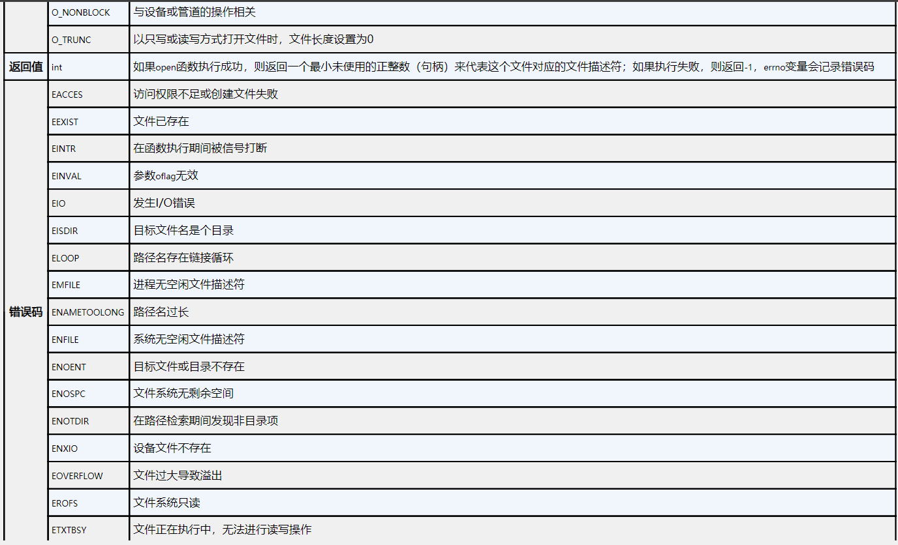

<p class="text-center">
圖一、open 函式簡介圖
</p>

在 POSIX 標準中，open 函式的前兩個參數被規定為 const char *path 和 int oflag，其餘參數則允許用戶自行定義。在此基礎上，Linux 操作系統添加了一個訪問權限參數 mode。然而，這本書的作業系統不涉及多用戶操作，因此 open 函式將維持 POSIX 的原始函式宣告，不引入 mode 參數。  

需要注意的是，系統調用時參數必須通過暫存器傳遞的，因此函式的參數必須是固定數量的。在 C 語言中，可變參數是通過將參數壓入 stack 來實現的，但在系統調用過程中，因為涉及權限級別的切換，處理器會改變 RSP 的值，這將導致函式無法從用戶層的 stack 中讀取到原先壓入的參數。  

在設計 sys_open 時並不建議直接使用 filename 所提供的路徑去目錄中搜索文件，這是因為作業系統強調核心空間與用戶空間的嚴格隔離以避免潛在的安全隱患，直接使用來自應用層的數據可能導致核心被惡意攻擊。因此 sys_open 的設計應為驗證應用層數據的合法性再將其複製到核心層內操作。  
```
kernel/sys.c

unsigned long sys_open(char *filename, int flags)
{
    char *path = NULL;
    long path_len = 0;
    long error = 0;
    struct dir_entry *dentry = NULL;
    struct file *filp = NULL;
    struct file **f = NULL;
    int fd = 0;

    color_printk(GREEN, BLACK,"sys_open\n");
    
    path = (char*)kmalloc(PAGE_4K_SIZE, 0);
    if (path == NULL)
        return -ENOMEM;

    memset(path, 0, PAGE_4K_SIZE);

    // 驗證用戶傳入的文件名長度是否超過 4KB 緩衝區
    path_len = strnlen_user(filename, PAGE_4K_SIZE);
    if (path_len <= 0) {
        kfree(path);
        return -EFAULT;
    } else if (path_len >= PAGE_4K_SIZE) {
        kfree(path);
        return -ENAMETOOLONG;
    }
    strncpy_from_user(filename, path, path_len);
    dentry = path_walk(path, 0);

    kfree(path);

    if (dentry) {
         color_printk(BLUE,
                     WHITE,
                     "Find 89AIOlejk.TXT\nDIR_FirstCluster:%#018lx\tDIR_FileSize:%#018lx\n",
                     ((struct FAT32_inode_info*)(dentry->dir_inode->private_index_info))->first_cluster,
                     dentry->dir_inode->file_size);
    } else {
        color_printk(BLUE, WHITE, "Can`t find file\n");
        return -ENOENT;
    }

    if(dentry->dir_inode->attribute == FS_ATTR_DIR)
        return -EISDIR;
    filp = (struct file*)kmalloc(sizeof(*filp), 0);
    memset(filp, 0, sizeof(*filp));

    filp->dentry = dentry;
    filp->mode = flags;
    filp->f_ops = dentry->dir_inode->f_ops;

    // 如果文件有自定義的打開操作，則調用
    if(filp->f_ops && filp->f_ops->open)
        error = filp->f_ops->open(dentry->dir_inode,filp);

    if (error != 1) {
        kfree(filp);
        return -EFAULT;
    }

    if (filp->mode & O_TRUNC) {
        filp->dentry->dir_inode->file_size = 0;
    }

    if (filp->mode & O_APPEND) {
        filp->position = filp->dentry->dir_inode->file_size;
    }

    f = current->file_struct;

    for (fd = 0; fd < TASK_FILE_MAX && f[fd]; fd++);
    if (fd == TASK_FILE_MAX) {
        kfree(filp);
        return -EMFILE;
    }
    
    f[fd] = filp;

    return fd;
}
```
函式 sys_open 根據 filename 和 flags 以開啟文件並返回文件描述符。首先檢查文件名是否不超過緩衝區大小，接著複製文件名到核心層空間(注意目前尚未實現應用層的封裝函式，操作暫時放在核心層中處理)，並通過 path_walk 函式查找對應的目錄項 dentry，如果文件有效且不是附錄則分配 file 結構體並依據 flags 添加文件的屬性，如截斷（O_TRUNC）或追加（O_APPEND）。然後查找可用文件描述符並返回。  

```
kernel/task.c

#define TASK_FILE_MAX   10

struct task_struct {
    ...
    struct file *file_struct[TASK_FILE_MAX];
};
```
印象中在 Linux 中 PCB 可以擁有的文件描述符上限為 1024。書上說 Linux 核心在文件數量少時會使用數組管理，超過一個範圍時則改用動態指針數組管理。我們這裡預先假定文件描述符上限為10個。  

```
kernel task.c

void user_level_function()
{
    int errno = 0;
    char string[]="JIOL123Llliwos/89AIOlejk.TXT";

    __asm__ __volatile__ ("pushq    %%r10           \n\t"
                          "pushq    %%r11           \n\t"
                          "leaq   sysexit_return_address(%%rip),  %%r10   \n\t"
                          "movq     %%rsp,  %%r11   \n\t"
                          "sysenter                 \n\t"
                          "sysexit_return_address:  \n\t"
                          "xchgq    %%rdx,  %%r10   \n\t"
                          "xchgq    %%rcx,  %%r11   \n\t"
                          "popq     %%r11           \n\t"
                          "popq     %%r10           \n\t"
                          :"=a"(errno)
                          :"0"(__NR_open),"D"(string),"S"(0)
                          :"memory");
    // "=a"表示此暫存器同時用於輸入輸出，輸入約束"0"指定rax暫存器
    while (1);
}
```
改寫應用層函式。目前尚未封裝給應用層時用的函式用這種比較迂迴的方式調用，如果要讓測試成功執行必須先取消函式 strnlen_user 判斷輸入地址的設定。  

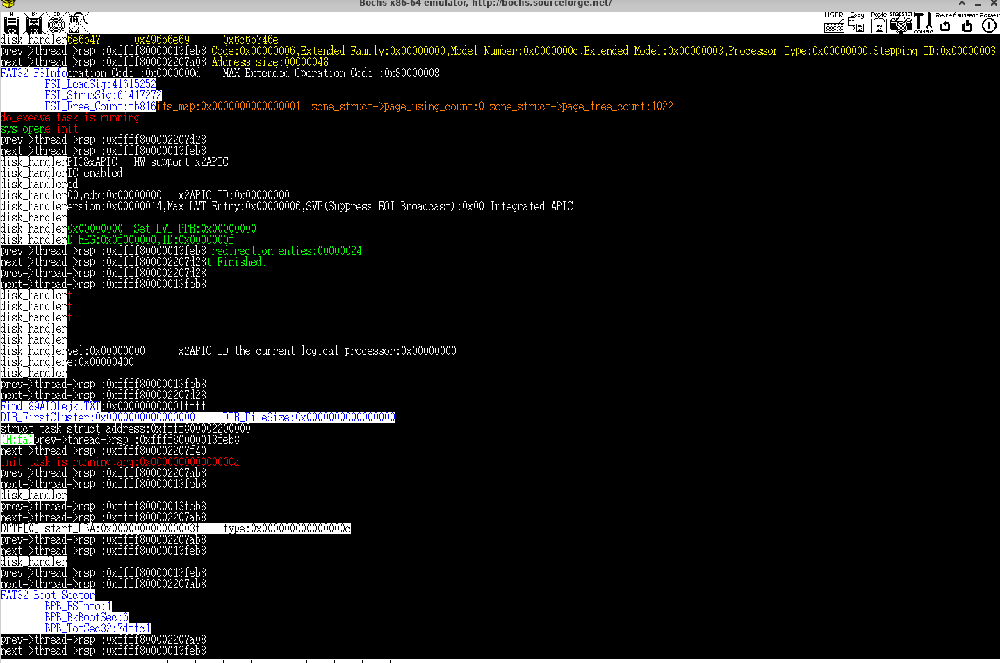

<p class="text-center">
圖二、bochs 虛擬機測試
</p>

### 文件關閉

以下為 POSIX 對 close 函式的規範:  
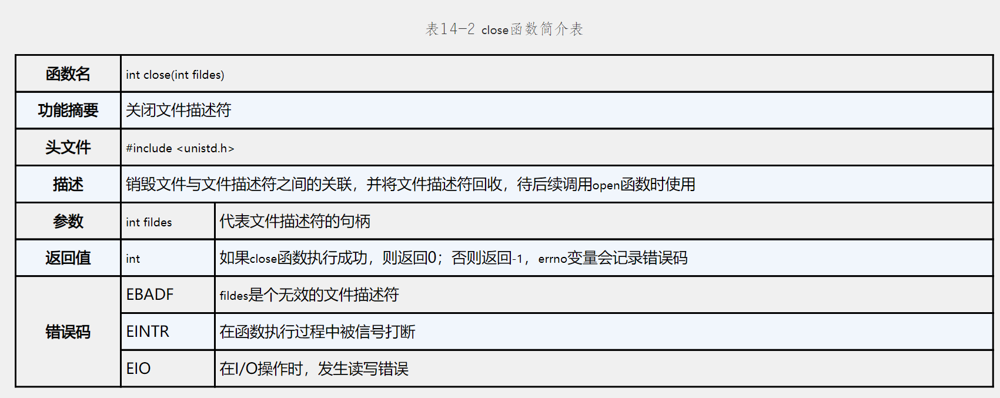

<p class="text-center">
圖三、close函式簡介
</p>

函式 close 用於銷毀文件與文件描述符的關聯，因此他的輸入為文件描述符透過銷毀文件與描述符的聯繫而關閉文件。  
```
kernel/sys.c

unsigned long sys_close(int fd)
{
    struct file *filp = NULL;

    color_printk(GREEN, BLACK, "sys_close:%d\n",fd);
    if(fd < 0 || fd >= TASK_FILE_MAX)
        return -EBADF;

    filp = current->file_struct[fd]; // 從文件描述符找到目標文件

    if(filp && filp->f_ops && filp->f_ops->close)
        filp->f_ops->close(filp->dentry->dir_inode, filp);

    kfree(filp);
    current->file_struct[fd] = NULL; // 釋放文件描述符

    return 0;
}
```
函式會先檢查文件描述符是否合法，如果合法則調用操作方法 close 關閉文件，並釋放文件描述符。  

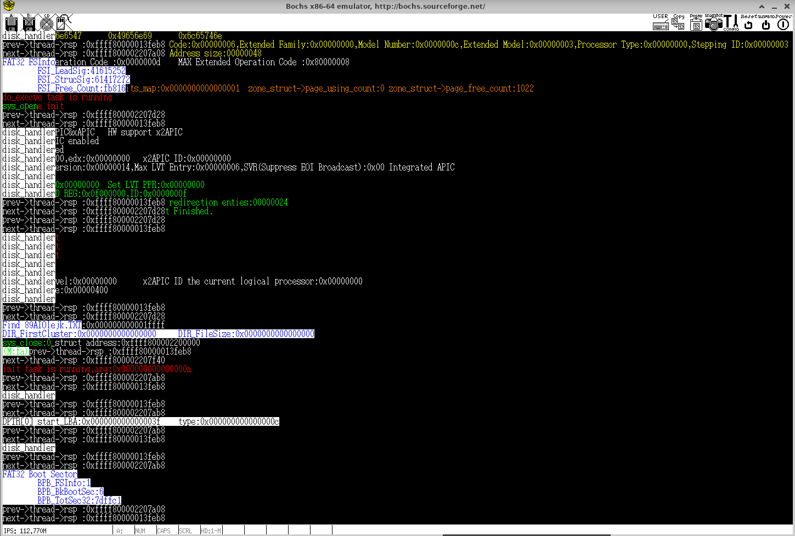

<p class="text-center">
圖四、bochs 虛擬機測試
</p>
根據日誌信息可看到文件描述符正確關閉。  

### 文件讀取

以下為 POSIX 對 read 函式的規範: 

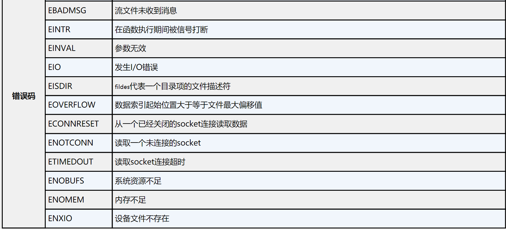

<p class="text-center">
圖五、read 函式簡介圖
</p>

read函式不僅可以操作文件同時也可操作設備等其他資源。在 unix 作業系統有一個概念 Everything is a file，在 Linux 中也承襲此概念。  
```
kernel/sys.c
unsigned long sys_read(int fd, void *buf, long count)
{
    struct file *filp = NULL;
    unsigned long ret = 0;

    color_printk(GREEN, BLACK, "sys_read:%d\n", fd);
    if(fd < 0 || fd >= TASK_FILE_MAX)
        return -EBADF;
    if(count < 0)
        return -EINVAL;

    filp = current->file_struct[fd];
    if(filp && filp->f_ops && filp->f_ops->read)
        ret = filp->f_ops->read(filp, buf, count, &filp->position);
    return ret;
}
```
此函式在確定文件描述符合法，並且讀取資料大小 count 合法時，將調用文件操作方法 read 讀取文件。參數 buf 為緩衝區，filp 與 filp->position 將幫助函式 read 計算讀取的硬碟扇區。  
```
kernel/fat32.c

long FAT32_read(struct file *filp, char *buf, unsigned long count, long *position)
{
    
    struct FAT32_inode_info *finode = filp->dentry->dir_inode->private_index_info;
    struct FAT32_sb_info *fsbi = filp->dentry->dir_inode->sb->private_sb_info;
    unsigned long cluster = finode->first_cluster; // 文件的起始叢集號
    unsigned long sector = 0;
    int i, length = 0;
    long retval = 0;  // 返回值，記錄成功讀取的數據量或錯誤代碼

    // 計算當前讀取的位置的叢集號（index）和偏移量（offset）
    int index = *position / fsbi->bytes_per_cluster;
    long offset = *position % fsbi->bytes_per_cluster;

    // 如果文件的起始簇為 0，返回錯誤，這表示文件無效
    if(!cluster)
        return -EFAULT;
    char *buffer = (char *)kmalloc(fsbi->bytes_per_cluster, 0);

    for (i = 0; i < index; i++)
        cluster = DISK1_FAT32_read_FAT_Entry(fsbi, cluster);

    // 如果當前讀取位置超過了文件大小，調整讀取範圍。
    if(*position + count > filp->dentry->dir_inode->file_size)
        count = filp->dentry->dir_inode->file_size - *position;
    
    index = count;

    color_printk(GREEN,
                 BLACK,
                 "FAT32_read first_cluster:%d,size:%d,preempt_count:%d\n",
                 finode->first_cluster,
                 filp->dentry->dir_inode->file_size,
                 current->preempt_count);

    for (; index && cluster; cluster = DISK1_FAT32_read_FAT_Entry(fsbi, cluster)) {

        memset(buffer, 0, fsbi->bytes_per_cluster);

        // 計算扇區號
        sector = fsbi->Data_firstsector + (cluster - 2) * fsbi->sector_per_cluster;
        
        if(!IDE_device_operation.transfer(ATA_READ_CMD, sector, fsbi->sector_per_cluster, (unsigned char*)buffer)) {
            color_printk(RED, BLACK, "FAT32 FS(read) read disk ERROR!!!!!!!!!!\n");
            retval = -EIO;
            break;
        }

        length = index <= fsbi->bytes_per_cluster - offset ? index : fsbi->bytes_per_cluster - offset;

        if((unsigned long)buf < TASK_SIZE)
            copy_to_user(buffer + offset, buf, length);
        else
            memcpy(buffer + offset, buf, length);

        index -= length;
        buf += length;
    
        offset = 0; // 只有第一次操作需要考慮偏移量
        *position += length;
    }

    kfree(buffer);
    if(!index)
        retval = count;
    return retval;
}
```
position 為文件最後被修改的位置，可以是文件的任何一個位置。函是將根據 position 計算對應的叢集號和偏移量並查找 FAT 表找到對應的叢集鏈，每次從磁碟讀取一個簇的數據，並加載到緩衝區，然後複製數據到用戶的緩衝區中。如果讀取位置超過文件大小，則自動調整讀取範圍。  

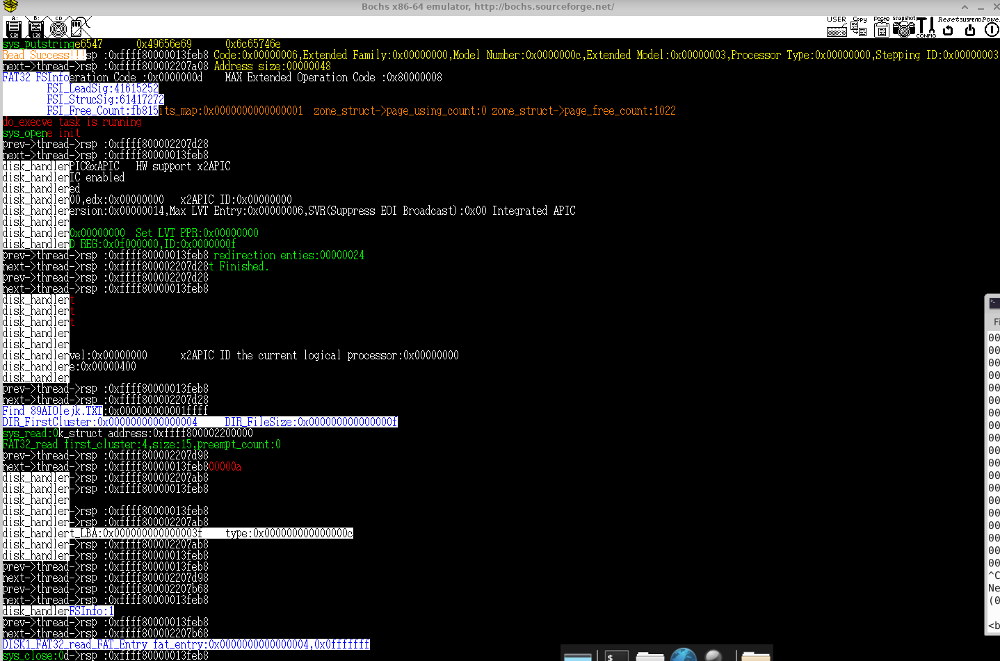

<p class="text-center">
圖六、bochs 運行結果
</p>

我在測試文件中寫入 Read Success，從螢幕輸出畫面可確定文件被正確讀取。  

### 文件寫入

以下為 POSIX 對 write 函式的規範: 
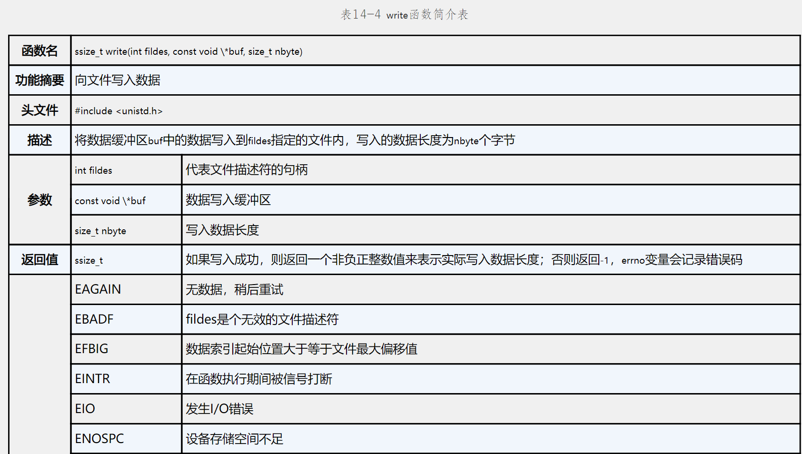
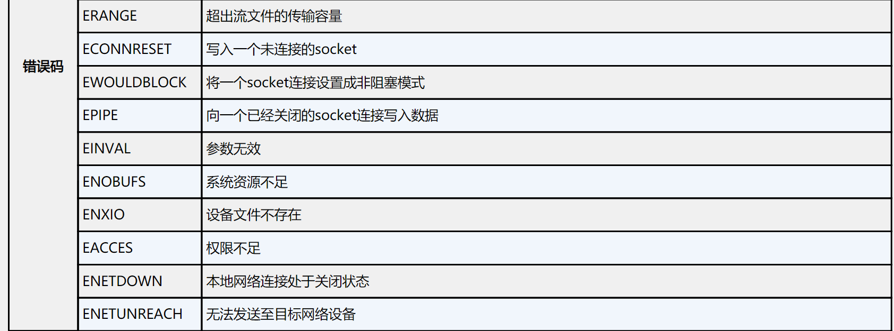

<p class="text-center">
圖七、write 函式簡介圖
</p>

```
kernel/sys.c

unsigned long sys_write(int fd,void * buf,long count)
{
    struct file *filp = NULL;
    unsigned long ret = 0;

    color_printk(GREEN, BLACK, "sys_write:%d\n", fd);
    if(fd < 0 || fd >= TASK_FILE_MAX)
        return -EBADF;
    if(count < 0)
        return -EINVAL;

    filp = current->file_struct[fd];
    if(filp && filp->f_ops && filp->f_ops->write)
        ret = filp->f_ops->write(filp, buf, count, &filp->position);
    return ret;
}
```
寫法基本與 sys_read 相同區別在於調用的操作函式。  

```
kernel/fat32.c

unsigned int FAT32_find_available_cluster(struct FAT32_sb_info *fsbi)
{
    int i,j;
    int fat_entry;
    unsigned long sector_per_fat = fsbi->sector_per_FAT;
    unsigned int buf[128]; // 一個扇區有 128 個 FAT 表項

    for (i = 0;i < sector_per_fat;i++) {
        // 遍例 FAT 表所有叢集直至找到空閒叢集

        memset(buf, 0, 512);
        IDE_device_operation.transfer(ATA_READ_CMD, fsbi->FAT1_firstsector + i, 1, (unsigned char*)buf);

        for (j = 0;j < 128; ++j) {
            if((buf[j] & 0x0fffffff) == 0)
                return (i << 7) + j;
        }
    }
    return 0;
}
```
函式 FAT32_find_available_cluster 用於查找空閒的叢集。  
```
kernel/fat32.h

long FAT32_write(struct file *filp, char *buf, unsigned long count, long *position)
{
    struct FAT32_inode_info *finode = filp->dentry->dir_inode->private_index_info;
    struct FAT32_sb_info *fsbi = filp->dentry->dir_inode->sb->private_sb_info;

    unsigned long cluster = finode->first_cluster;
    unsigned long next_cluster = 0;
    unsigned long sector = 0;
    int i, length = 0;
    long retval = 0;
    long flags = 0;
    int index = *position / fsbi->bytes_per_cluster;
    long offset = *position % fsbi->bytes_per_cluster;
    char *buffer = (char*)kmalloc(fsbi->bytes_per_cluster, 0);

    if (cluster == 0) {
        // 這是空文件的狀況
        cluster = FAT32_find_available_cluster(fsbi); // 查找可用的叢集
        flags = 1;
    } else {
        for(i = 0; i < index; i++)
            cluster = DISK1_FAT32_read_FAT_Entry(fsbi, cluster);
    }

    if (cluster == NULL) {
        kfree(buffer);
        return -ENOSPC;
    }

    if (flags) {
        finode->first_cluster = cluster;
        filp->dentry->dir_inode->sb->sb_ops->write_inode(filp->dentry->dir_inode);
        DISK1_FAT32_write_FAT_Entry(fsbi, cluster, 0x0ffffff8);
        // 標記為文件結束叢集
    }

    index = count; // 剩餘寫入資料量

    for (; index;) {
        if (!flags) {
            memset(buffer, 0, fsbi->bytes_per_cluster);
            sector = fsbi->Data_firstsector + (cluster - 2) * fsbi->sector_per_cluster;
            if (!IDE_device_operation.transfer(ATA_READ_CMD, sector, fsbi->sector_per_cluster, (unsigned char*)buffer)) {
                color_printk(RED, BLACK, "FAT32 FS(write) read disk ERROR!!!!!!!!!!\n");
                retval = -EIO;
                break;
            }
        }

        length = index <= fsbi->bytes_per_cluster - offset ? index : fsbi->bytes_per_cluster - offset;

        if ((unsigned long)buf < TASK_SIZE)
            copy_from_user(buf, buffer + offset, length);
        else
            memcpy(buf, buffer + offset, length);

        if (!IDE_device_operation.transfer(ATA_WRITE_CMD, sector, fsbi->sector_per_cluster, (unsigned char*)buffer)) {
            color_printk(RED, BLACK, "FAT32 FS(write) write disk ERROR!!!!!!!!!!\n");
            retval = -EIO;
            break;
        }

        index -= length;
        buf += length;
        offset = 0;
        *position += length;

        if (index == NULL)
            break;

        next_cluster = DISK1_FAT32_read_FAT_Entry(fsbi, cluster);

        if (next_cluster >= 0x0ffffff8) {
            next_cluster = FAT32_find_available_cluster(fsbi);
            if (next_cluster == NULL) {
                kfree(buffer);
                return -ENOSPC;
            }			

            DISK1_FAT32_write_FAT_Entry(fsbi, cluster, next_cluster);
            DISK1_FAT32_write_FAT_Entry(fsbi, next_cluster, 0x0ffffff8);
            cluster = next_cluster;
            flags = 1;
        }
    }


    if (*position > filp->dentry->dir_inode->file_size) {
        filp->dentry->dir_inode->file_size = *position;
        filp->dentry->dir_inode->sb->sb_ops->write_inode(filp->dentry->dir_inode);
    }

    kfree(buffer);
    if (!index)
        retval = count;
    return retval;
}
```
函式的開頭會先判斷該文件的起始叢集編號是否為 0，若為 0 表示文件是空的，需要調用 FAT32_find_available_cluster 來分配新的叢集並更新 FAT 表。另外，叢集是文件數據存儲的基本單位。如果訪問的位置位於已有的叢集中，則需要保留該叢集中未被覆蓋的數據。函式中使用 flags 來判斷是否為新分配的叢集。如果是新分配的叢集，則直接將資料寫入；若不是新分配的叢集，則需要先將叢集中的原有資料讀入緩衝區，再將欲寫入的資料覆蓋上去。  

由於 FAT 表採用鏈式結構，資料的讀寫通常需要多次訪問硬碟來尋找目標扇區或叢集，這會影響訪問速度。為了縮短查找過程中的等待時間，可以考慮將 FAT 表載入內存中作為索引，這樣訪問硬碟時可以直接定位目標扇區，而不需要反覆訪問硬碟來解析鏈式結構。  


<p class="text-center">
圖八、bochs 運行結果
</p>

### 文件位置索引  
以下為 POSIX 對 lseek 函式的規範:  

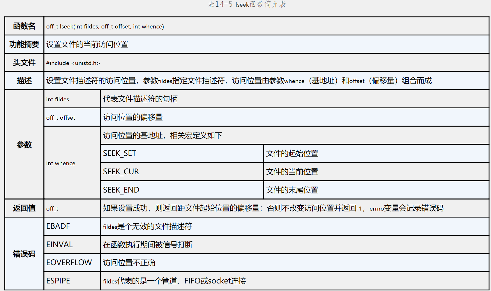

<p class="text-center">
圖九、lseek 函式簡介圖
</p>

```
kernel/sys.c

long sys_lseek(int filds, long offset, int whence)
{
    struct file *filp = NULL;
    unsigned long ret = 0;

    color_printk(GREEN, BLACK, "sys_leek:%d\n", filds); // 打印文件描述符

    // 無效的文件描述符
    if (filds < 0 || filds >= TASK_FILE_MAX)
        return -EBADF;
    // 無效的訪問基地址
    if (whence < 0 || whence >= SEEK_MAX)
        return -EINVAL;

    filp = current->file_struct[filds];
    if (filp && filp->f_ops && filp->f_ops->lseek)
        ret = filp->f_ops->lseek(filp, offset, whence);
    return ret;
}
```
sys_lseek 函式用於調整文件指針，根據傳入的 offset 和 whence 值來改變文件的讀寫位置。whence 將指定參考點，可以是 SEEK_SET（從文件開始）、SEEK_CUR（從當前指針位置）或 SEEK_END（從文件末尾）。  

```
kernel/sys.c

long FAT32_lseek(struct file *filp, long offset, int origin)
{
    long pos = 0;

    switch (origin) {
        case SEEK_SET:
            pos = offset;  // 從文件的起始位置進行偏移
            break;

        case SEEK_CUR:
            pos = filp->position + offset;  // 從當前文件指針位置進行偏移
            break;

        case SEEK_END:
            pos = filp->dentry->dir_inode->file_size + offset;  // 從文件末尾進行偏移
            break;

        default:
            return -EINVAL;  // origin 無效
            break;        
    }

    // 檢查文件指針位置是否合法，不可超出文件大小或為負數
    if (pos < 0 || pos > filp->dentry->dir_inode->file_size)
        return -EOVERFLOW;

    filp->position = pos;

    color_printk(GREEN, BLACK, "FAT32 FS(lseek) alert position:%d\n", filp->position);

    return pos;
}
```
函式 lseek 用於調整文件的讀寫指針位置。它可以根據文件的開始、當前指針位置或結尾進行位置調整，並確保新位置不會超出文件的有效範圍。  

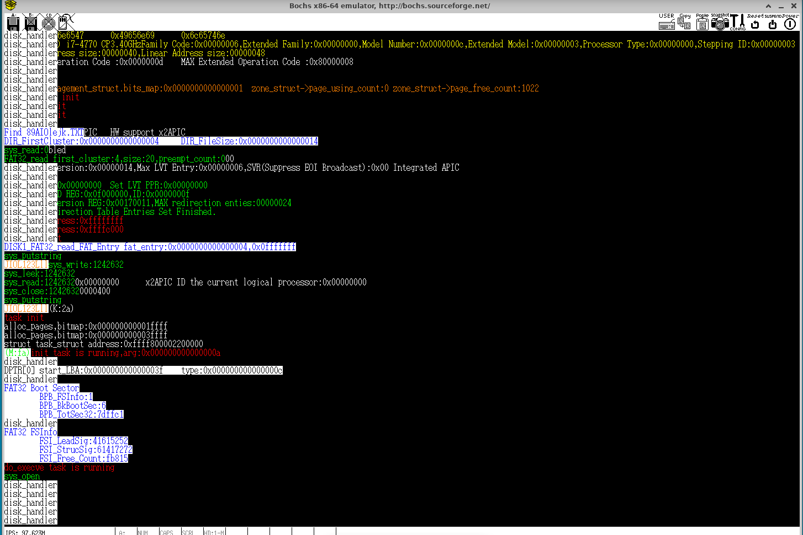

<p class="text-center">
圖十、bochs 運行結果
</p>

## 行程創建的系統調用 API 實現

POSIX 規範中提供了兩個行程創建函式：fork 和 vfork，相信讀者已經有所了解。fork 函式將完整複製父行程的所有信息；而 vfork 函式僅複製父行程的主要內容，其他部分則與父行程共享，無法獨立運行，因此常與 exec 類函式結合使用。雖然新版 POSIX 規範已經移除了 vfork 函式，但為了保持兼容性，Linux 內核依然提供了 vfork 的功能。  


<p class="text-center">
圖十一、fork 函式簡介圖
</p>


### 準備工作

```
kernel/task.h

struct task_struct {
    ...
    struct file *file_struct[TASK_FILE_MAX];
    struct task_struct *next;
    struct task_struct *parent;
};

kernel/task.c

long global_pid;

struct task_struct *get_task(long pid)
{
    struct task_struct *tsk = NULL;
    // pid 的關係為線性
    for (tsk = init_task_union.task.next; tsk!= &init_task_union.task; tsk = tsk->next) {
        if (tsk->pid == pid)
            return tsk;
    }
    return NULL;
}
```
為確保 pid 的唯一性，最簡單的搜索方法是透過單向鍊表結構串接所有行程，並一一比對。如果行程數量較多可考慮使用二叉搜索樹或是哈希表等數據結構加快查找。  

```
kernel/sys.c

unsigned long sys_fork()
{
    struct pt_regs *regs = (struct pt_regs*)current->thread->rsp0 - 1; // 核心層 rsp
    color_printk(GREEN, BLACK, "sys_fork\n");
    return do_fork(regs, 0, regs->rsp, 0);	    
}

unsigned long sys_vfork()
{
    struct pt_regs *regs = (struct pt_regs*)current->thread->rsp0 - 1;
    color_printk(GREEN, BLACK, "sys_Vfork\n");
    return do_fork(regs, CLONE_VM | CLONE_FS | CLONE_SIGNAL, regs->rsp, 0);      
}

```
rsp0 對應核心層的 rsp 執行 fork 前會將所有暫存器壓入 stack 上保存。  
```
kernel/task.c

unsigned long do_fork(struct pt_regs *regs, unsigned long clone_flags, unsigned long stack_start, unsigned long stack_size)
{
    int retval = 0;
    struct task_struct *tsk = NULL;

    // alloc & copy task struct

    tsk = (struct task_struct*)kmalloc(STACK_SIZE, 0); // 分配 stack 空間。
    
    if (tsk == NULL) {
        retval = -EAGAIN;
        goto alloc_copy_task_fail;        
    }
    
    color_printk(WHITE, BLACK, "struct task_struct address:%#018lx\n", (unsigned long)tsk);
    memset(tsk, 0, sizeof(*tsk));
    memcpy(current, tsk, sizeof(struct task_struct)); // 複製父行程信息

    list_init(&tsk->list);
    tsk->priority = 2;
    tsk->pid = global_pid++;
    tsk->preempt_count = 0;
    tsk->cpu_id = SMP_cpu_id();
    tsk->state = TASK_UNINTERRUPTIBLE;
    tsk->next = init_task_union.task.next;
    init_task_union.task.next = tsk;
    tsk->parent = current;

    retval = -ENOMEM;

    // copy flags
    if (copy_flags(clone_flags, tsk))
        goto copy_flags_fail; // 複製失敗釋放資源

    // copy mm struct
    if (copy_mm(clone_flags, tsk))
        goto copy_mm_fail;

    // copy file struct
    if (copy_files(clone_flags, tsk))
        goto copy_files_fail;

    // copy thread struct
    if (copy_thread(clone_flags, stack_start, stack_size, tsk,regs))
        goto copy_thread_fail;
    
    retval = tsk->pid;
    wakeup_process(tsk);

fork_ok:
    return retval;

copy_thread_fail:
    exit_thread(tsk);

copy_files_fail:
    exit_files(tsk);

copy_mm_fail:
    exit_mm(tsk);

copy_flags_fail:
alloc_copy_task_fail:
    kfree(tsk);

    return retval;
}
```
我們將父行程的複製工作拆分成多個函式執行， exit_thread 用於複製執行緒的資源(目前一個行程就是一個執行緒)， exit_files 用於複製文件資源， exit_mm 則用於複製記憶體信息。如果其中一個環節複製失敗，則跳轉到對應的處理區域釋放資源並返回錯誤碼。如果複製成功則調用 wakeup_process 將執行緒插入 ready queue 中並返回子行程的 id 號。  
```
kernel/task.c

static inline void wakeup_process(struct task_struct *tsk)
{
    tsk->state = TASK_RUNNING;
    insert_task_queue(tsk);
}

unsigned long copy_flags(unsigned long clone_flags, struct task_struct *tsk)
{
    if(clone_flags & CLONE_VM)
        tsk->flags |= PF_VFORK;
    return 0;
}

unsigned long copy_files(unsigned long clone_flags, struct task_struct *tsk)
{
    int error = 0;
    int i = 0;
    struct task_struct *current_tsk = current;
    if(clone_flags & CLONE_FS)
        goto out;

    for (i = 0; i < TASK_FILE_MAX; i++) {
        if (current_tsk->file_struct[i]) {
            tsk->file_struct[i] = (struct file*)kmalloc(sizeof(struct file),0);
            memcpy(current_tsk->file_struct[i], tsk->file_struct[i], sizeof(struct file)); 
        }
    }
out:
    return error;
}

void exit_files(struct task_struct *tsk)
{
    int i = 0;
    if (!(tsk->flags & PF_VFORK)) {
        for (i = 0; i < TASK_FILE_MAX; i++) {
            if (tsk->file_struct[i]) {
                kfree(tsk->file_struct[i]);
            }
        }
    }
    memset(tsk->file_struct, 0, sizeof(struct file*) * TASK_FILE_MAX);
}

```
這四個函式都相當直觀，這裡簡述他們的作用。  
wakeup_process :用於喚醒行程，使其進入運行狀態（TASK_RUNNING）。  
copy_flags :根據輸入參數 clone_flags 設定行程的標誌位。  
copy_files :複製父行程的檔案描述符，若檔案描述符為共享資源則直接返回不複製。  
exit_files :釋放行程檔案描述符資源。

```
kernel/task.c

unsigned long copy_mm(unsigned long clone_flags, struct task_struct *tsk)
{
    int error = 0;
    struct mm_struct *newmm = NULL;
    unsigned long code_start_addr = 0x800000; // 程式碼段的起始位址
    unsigned long stack_start_addr = 0xa00000; // stack 的起始地址
    unsigned long *tmp;
    unsigned long *virtual = NULL;
    struct Page *p = NULL;

    if (clone_flags & CLONE_VM) {
        // 若設置 CLONE_VM，則表示新行程將與父行程共用記憶體空間
        newmm = current->mm;
        goto out; // 跳到 out，不再執行記憶體分配操作
    }

    newmm = (struct mm_struct*)kmalloc(sizeof(*newmm), 0);
    memcpy(current->mm, newmm, sizeof(*newmm));

    newmm->pgd = (pml4t_t*)(Virt_To_Phy(kmalloc(PAGE_4K_SIZE, 0)));

    memcpy(Phy_To_Virt(init_task[SMP_cpu_id()]->mm->pgd) + 256,
           Phy_To_Virt(newmm->pgd)+ 256,
           PAGE_4K_SIZE / 2);
    // 複複製 PML4 頁表的後半部分（從第 256 項開始)也就是核心層空間

    memset(Phy_To_Virt(newmm->pgd), 0, PAGE_4K_SIZE / 2);
    // 清空前 256 項的頁表，這些頁表指向應用層空間

    // 接下來將為新行程配置頁表，這裡假設行程使用的空間小於 2 MB

    // 根據程式碼段地址訪問頁表，並設置頁表條目
    tmp = Phy_To_Virt((unsigned long*)((unsigned long)newmm->pgd & (~0xfffUL)) +
                      ((code_start_addr >> PAGE_GDT_SHIFT) & 0x1ff));
    virtual = kmalloc(PAGE_4K_SIZE, 0);
    memset(virtual, 0, PAGE_4K_SIZE);
    set_mpl4t(tmp, mk_mpl4t(Virt_To_Phy(virtual), PAGE_USER_GDT));

    tmp = Phy_To_Virt((unsigned long*)(*tmp & (~0xfffUL)) +
                      ((code_start_addr >> PAGE_1G_SHIFT) & 0x1ff));
    virtual = kmalloc(PAGE_4K_SIZE, 0);
    memset(virtual, 0, PAGE_4K_SIZE);
    set_pdpt(tmp, mk_pdpt(Virt_To_Phy(virtual), PAGE_USER_Dir));

    tmp = Phy_To_Virt((unsigned long*)(*tmp & (~0xfffUL)) +
                     ((code_start_addr >> PAGE_2M_SHIFT) & 0x1ff));
    p = alloc_pages(ZONE_NORMAL, 1, PG_PTable_Maped);
    set_pdt(tmp, mk_pdt(p->PHY_address, PAGE_USER_Page));	
    
    // 將當前行程的程式碼段從間複製到新頁中
    memcpy((void*)code_start_addr,
           Phy_To_Virt(p->PHY_address),
           stack_start_addr - code_start_addr);
out:
    tsk->mm = newmm;
    return error;
}
```
函式 copy_mm 根據 clone_flags 決定新行程是否與父行程共用記憶體空間（如設置了 CLONE_VM）。如果需要為新行程創建獨立的記憶體空間，它會為新行程分配新的頁表。在這個過程中，由於所有行程共用核心程式碼，因此新行程的一級頁表的後 256 項（對應核心空間）將直接複製父行程的部分，而應用層的記憶體則從指定的 code_start_addr 開始，複製至 stack_start_addr，確保新行程具有獨立的代碼段和堆疊空間。目前為所有應用程式配給 2 MB的空間。  
由於 fork 通常與 exec 一同使用，可考慮增加 copt on write 的機制，所有的頁表分配複製將等待到需要時再執行。  
```
kernel/task.c

unsigned long copy_thread(unsigned long clone_flags,
                          unsigned long stack_start,
                          unsigned long stack_size,
                          struct task_struct *tsk,
                          struct pt_regs * regs)
{
    struct thread_struct *thd = NULL;
    struct pt_regs *child_regs = NULL;

    thd = (struct thread_struct*)(tsk + 1);
    memset(thd, 0, sizeof(*thd));
    tsk->thread = thd;
    child_regs = (struct pt_regs*)((unsigned long)tsk + STACK_SIZE) - 1;
    memcpy(regs, child_regs, sizeof(*child_regs));
    child_regs->rax = 0;
    child_regs->rsp = stack_start;
    thd->rsp0 = (unsigned long)tsk + STACK_SIZE;
    thd->rsp = (unsigned long)child_regs;
    thd->fs = current->thread->fs;
    thd->gs = current->thread->gs;

    if(tsk->flags & PF_KTHREAD)
        thd->rip = (unsigned long)kernel_thread_func;
    else
        thd->rip = (unsigned long)ret_system_call;

    color_printk(WHITE,
                 BLACK,
                 "current user ret addr:%#018lx,rsp:%#018lx\n",
                 regs->r10,
                 regs->r11);
    
    color_printk(WHITE,
                 BLACK,
                 "new user ret addr:%#018lx,rsp:%#018lx\n",
                 child_regs->r10,
                 child_regs->r11);

    return 0;
}
```
函式 copy_thread 將父行程的暫存器內容複製到新行程的 stack 頂部，這些暫存器將在任務切換時被還原以繼續執行新行程。此外，該函式不負責記憶體空間的分配，stack 需要從外部傳入並手動設置。  

### 實現應用程式加載功能

```
kernel/task.c

unsigned lon頁表映射(struct pt_regs *regs, char *name)
{
    // 執行此函式後行程將獨立於父行程
    unsigned long code_start_addr = 0x800000;
    unsigned long stack_start_addr = 0xa00000;
    unsigned long brk_start_addr = 0xc00000;
    unsigned long *tmp;
    unsigned long *virtual = NULL;
    struct Page *p = NULL;
    struct file *filp = NULL;
    unsigned long retval = 0;
    long pos = 0;

    // 設置用戶態的段寄存器，準備執行用戶態程式
    regs->ds = USER_DS;
    regs->es = USER_DS;
    regs->ss = USER_DS;
    regs->cs = USER_CS;

    // 設置用戶態程序的指令指針和堆疊指針
    regs->r10 = 0x800000; // RIP 指向代碼起始地址
    regs->r11 = 0xa00000; // RSP 指向堆疊起始地址
    regs->rax = 1;

    color_printk(RED, BLACK, task is running\n");

    if (current->flags & PF_VFORK) {
        // 如果行程經由 vfork 創建，則必須創建新的記憶體空間。
        current->mm = (struct mm_struct*)kmalloc(sizeof(struct mm_struct), 0);
        memset(current->mm, 0, sizeof(struct mm_struct));
        current->mm->pgd = (pml4t_t*)Virt_To_Phy(kmalloc(PAGE_4K_SIZE, 0));  // 分配新的 PML4 表
        color_printk(RED, BLACK, "load_binary_file malloc new pgd:%#018lx\n", current->mm->pgd);
        memset(Phy_To_Virt(current->mm->pgd), 0, PAGE_4K_SIZE / 2);  // 清空應用層空間的頁表

        // 複製父行程的內核空間頁表，內核空間記憶體共用
        memcpy(Phy_To_Virt(init_task[SMP_cpu_id()]->mm->pgd) + 256,
               Phy_To_Virt(current->mm->pgd) + 256,
               PAGE_4K_SIZE / 2);
    }

    // 設置頁表條目，建立用戶程式的虛擬地址空間
    tmp = Phy_To_Virt((unsigned long*)((unsigned long)current->mm->pgd & (~0xfffUL)) +
                     ((code_start_addr >> PAGE_GDT_SHIFT) & 0x1ff));
    if (*tmp == NULL) {
        virtual = kmalloc(PAGE_4K_SIZE, 0);
        memset(virtual, 0, PAGE_4K_SIZE);
        set_mpl4t(tmp, mk_mpl4t(Virt_To_Phy(virtual), PAGE_USER_GDT));
    }

    tmp = Phy_To_Virt((unsigned long*)(*tmp & (~0xfffUL)) +
                     ((code_start_addr >> PAGE_1G_SHIFT) & 0x1ff));
    if (*tmp == NULL) {
        virtual = kmalloc(PAGE_4K_SIZE, 0);
        memset(virtual, 0, PAGE_4K_SIZE);
        set_pdpt(tmp, mk_pdpt(Virt_To_Phy(virtual), PAGE_USER_Dir));
    }

    tmp = Phy_To_Virt((unsigned long*)(*tmp & (~0xfffUL)) +
                     ((code_start_addr >> PAGE_2M_SHIFT) & 0x1ff));
    if (*tmp == NULL)
    {
        p = alloc_pages(ZONE_NORMAL, 1, PG_PTable_Maped);
        set_pdt(tmp, mk_pdt(p->PHY_address, PAGE_USER_Page));
    }

    // 刷新頁表快取
    __asm__ __volatile__ ("mfence           \n\t"
                          "movq %0, %%cr3   \n\t"
                          ::"r"(current->mm->pgd):"memory");
    // 如果當前行程不是核心執行緒，設置其記憶體訪問限制
    if (!(current->flags & PF_KTHREAD))
        current->addr_limit = TASK_SIZE;
    
    // 配置記憶體管理結構的程式段、數據段等範圍
    current->mm->start_code = code_start_addr;
    current->mm->end_code = 0;
    current->mm->start_data = 0;
    current->mm->end_data = 0;
    current->mm->start_rodata = 0;
    current->mm->end_rodata = 0;
    current->mm->start_bss = 0;
    current->mm->end_bss = 0;
    current->mm->start_brk = brk_start_addr;
    current->mm->end_brk = brk_start_addr;
    current->mm->start_stack = stack_start_addr;

    exit_files(current);

    // 清除 PF_VFORK 標誌
    current->flags &= ~PF_VFORK;

    // 開啟並讀取指定的可執行檔案
    filp = open_exec_file(name);

    if ((unsigned long)filp > -0x1000UL)
        return (unsigned long)filp;
    
    
    memset((void *)0x800000, 0, PAGE_2M_SIZE);
    // 清空程式碼段
    // 從可執行檔案中讀取程式碼，載入到記憶體中

    retval = filp->f_ops->read(filp,
                               (void *)0x800000,
                               filp->dentry->dir_inode->file_size,
                               &pos);
    
    return retval;
}
```
do_execve 函式的執行代表當前由 fork 複製的行程正式脫離父行程，獨立執行。此函式將負責為新行程配置頁表、段暫存器及虛擬地址空間。若行程是透過 vfork 建立，函式會額外分配記憶體空間，確保硬體資源獨立於父行程。此外，該函式會清理現有的文件描述符、載入新的可執行文件，並將其內容寫入到新行程的記憶體空間中，準備執行新程式。  

```
unsigned long init(unsigned long arg)
{
    DISK1_FAT32_FS_init();
    color_printk(RED, BLACK, "init task is running,arg:%#018lx\n", arg);

    current->thread->rip = (unsigned long)ret_system_call;
    current->thread->rsp = (unsigned long)current + STACK_SIZE - sizeof(struct pt_regs);
	current->thread->gs = USER_DS;
	current->thread->fs = USER_DS;
	current->flags &= ~PF_KTHREAD;

    __asm__ __volatile__ ("movq    %1, %%rsp   \n\t"
                          "pushq   %2          \n\t"
                          "jmp     do_execve   \n\t"
                          :
                          :"D"(current->thread->rsp),"m"(current->thread->rsp),"m"(current->thread->rip),"S"("/init.bin")
                          :"memory");
    return 1;
}
```
在 init 的執行過程中，它會主動放棄核心執行緒的身份，轉換為用戶態執行緒。接著，init 將調用 do_execve 來執行 init.bin，從而作為一個全新個體在作業系統中獨立運行。  

### 應用層測試程式
這裡我們需要準備一套 API 作用系統調用 API 的入口程式。  
```
user/lib.c
#include "syscall.h"

#define SYSFUNC_DEF(name)   _SYSFUNC_DEF_(name, __NR_##name)
#define _SYSFUNC_DEF_(name, nr) __SYSFUNC_DEF__(name, nr)
#define __SYSFUNC_DEF__(name, nr)         \
__asm__	(".global "#name"           \n\t" \
".type  "#name", @function \n\t" 
         #name":                    \n\t" \
         "movq  $"#nr", %rax        \n\t" \
         "jmp   LABEL_SYSCALL       \n\t");

SYSFUNC_DEF(putstring)
SYSFUNC_DEF(open)
SYSFUNC_DEF(close)
SYSFUNC_DEF(read)
SYSFUNC_DEF(write)
SYSFUNC_DEF(lseek)
SYSFUNC_DEF(fork)
SYSFUNC_DEF(vfork)
SYSFUNC_DEF(brk)

__asm__("LABEL_SYSCALL:     \n\t"
        "pushq  %r10        \n\t"
        "pushq  %r11        \n\t"
        "leaq   sysexit_return_address(%rip), %r10 \n\t"
        "movq   %rsp, %r11  \n\t"
        "sysenter           \n\t"
        "sysexit_return_address:  \n\t"
        "xchgq  %rdx, %r10  \n\t"
        "xchgq  %rcx, %r11  \n\t"
        "popq   %r11        \n\t"
        "popq   %r10        \n\t"
        "cmpq   $-0x1000, %rax    \n\t"
        "jb     LABEL_SYSCALL_RET \n\t"
        "movq   %rax, errno(%rip) \n\t"
        "orq    $-1,  %rax        \n\t"
        "LABEL_SYSCALL_RET: \n\t"
        "retq               \n\t");
```
這段程式碼使用嵌套的巨集來宣告系統調用函式，並透過內嵌彙編來實現系統調用。例如，SYSFUNC_DEF(open) 這個巨集將會展開為 _SYSFUNC_DEF_(open, __NR_open)，其中 __NR_open 定義在 syscall.h 中，對應系統調用號。進一步展開後，這個巨集最終轉換為內嵌組合語言程式碼。  
在展開的內嵌組合語言程式碼中， .global 將系統調用函式定義為全局符號，使系統調用變得全局可見，接著，.type "#name", @function 指令告訴編譯器和鏈接器，這個符號是函式而不是數據或其他類型的符號，這可以生成正確的符號表。  
函式的入口則通過 #name":" 來定義。最後，通過 jmp LABEL_SYSCALL 跳轉到標籤 LABEL_SYSCALL，這是所有系統調用的統一入口，實際處理系統調用的邏輯在此進行。完成以上處理就可以撰寫程式使用這些系統調用。  

為了讓程式碼的地址能與核心層配給的記憶體空間對齊，這裡撰寫了一份鏈結腳本 user/User.lds，其作用是指定程式的起始地址和各個段的內存佈局。腳本中指定了 .text 段、.data 段、.rodata 段和 .bss 段的位置。  
```
user/User.lds

OUTPUT_FORMAT("elf64-x86-64","elf64-x86-64","elf64-x86-64")
OUTPUT_ARCH(i386:x86-64)
ENTRY(main)
SECTIONS
{
    . = 0x800000;
    .text :
    {
        _text = .;
        init.o(.text);
        *(.text)
        _etext = .;
    }

    . = ALIGN(8);

    .data :
    {
        _data = .;
        *(.data)		
        _edata = .;
    }

    .rodata : 
    {
        _rodata = .;	
        *(.rodata)
        _erodata = .;
    }

    .bss :
    {
        _bss = .;
        *(.bss)
        _ebss = .;
    }

    _end = .;
}
```
透過鏈結腳本，最終生成的可執行文件將從地址 0x800000 開始，這與核心層配給的起始地址 0x800000 完全匹配，可以避免地址不一致導致的函數調用錯誤等問題。  

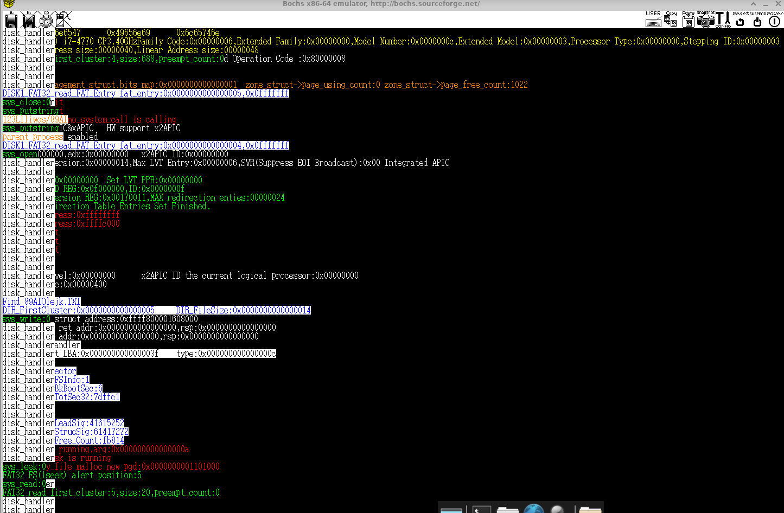

<p class="text-center">
圖十二、bochs 運行結果
</p>

從圖十二打印的信息可以判斷核心層成功開啟 init.bin 並執行他。另外如果在 bochs 模擬基中定時器中斷觸發的次數太高可考慮調整 .bochsrc 文件中的 ips 。我目前設定為 ips=20000000。  

### 內存管理基礎調用 API
目前的記憶體空基僅能由 stack 分配，但是 stack 的空間有限只能用於儲存臨時數據，因此最理想的方式是從 heap 中申請空間，這在這一節中我們將實現簡單的 malloc 與 free 函式。  

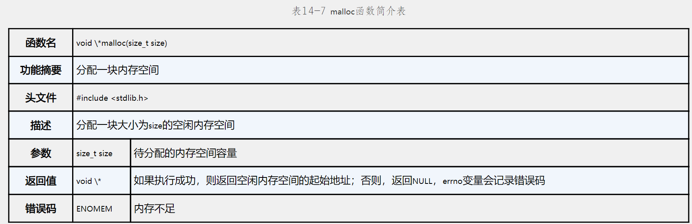

<p class="text-center">
圖十三、malloc
</p>

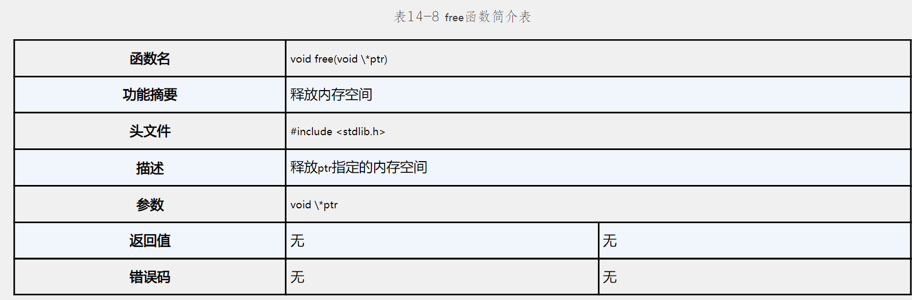

<p class="text-center">
圖十四、free
</p>

heap 的地址空間是動態且連續的，只能從低地址向高地址增長。malloc 和 free 函數依賴於系統調用 sys_brk 來調整 heap 的結束地址。sys_brk 完成後，malloc 和 free 才會進行具體的內存分配和釋放。動態內存的管理主要依靠應用程序自身。請注意我們要實現的 malloc 並不考慮申請大空間的 mmap 僅討論 brk 並操作 heap 而已。  

```
kernel/main.c
void Start_Kernel(void)
{
    ...
    memory_management_struct.start_code = (unsigned long)& _text;
    memory_management_struct.end_code   = (unsigned long)& _etext;
    memory_management_struct.end_data   = (unsigned long)& _edata;
    memory_management_struct.end_rodata = (unsigned long)& _erodata;
    memory_management_struct.start_brk  = (unsigned long)& _end;
    ...
}
```
請注意之前的 end_brk 已經替換為 start_brk 做為 heap 的起始地址。  
```
unsigned long copy_mm(unsigned long clone_flags, struct task_struct *tsk)
{
    ...
    unsigned long stack_start_addr = 0xa00000; // stack 的起始地址
    unsigned long brk_start_addr = 0xc00000;
    ...
    if (current->mm->end_brk != current->mm->start_brk) {
        tmp = Phy_To_Virt((unsigned long*)((unsigned long)newmm->pgd & (~0xfffUL)) +
                         ((brk_start_addr >> PAGE_GDT_SHIFT) & 0x1ff));
		
        tmp = Phy_To_Virt((unsigned long*)(*tmp & (~0xfffUL)) +
                         ((brk_start_addr >> PAGE_1G_SHIFT) & 0x1ff));
		
        tmp = Phy_To_Virt((unsigned long*)(*tmp & (~0xfffUL)) +
                         ((brk_start_addr >> PAGE_2M_SHIFT) & 0x1ff));

        p = alloc_pages(ZONE_NORMAL, 1, PG_PTable_Maped);
        set_pdt(tmp, mk_pdt(p->PHY_address, PAGE_USER_Page));
        // 複製 parent 的 heap
        memcpy((void*)brk_start_addr, Phy_To_Virt(p->PHY_address), PAGE_2M_SIZE);
    }
    ...
}
```
這裡為應用程式加入了 2 MB 空間的 heap。  
```
kernel/sys.c

unsigned long sys_brk(unsigned long brk)
{
    unsigned long new_brk = PAGE_2M_ALIGN(brk); // 每次修改 brk 以頁為單位
    
    color_printk(GREEN, BLACK, "sys_brk:%#018lx\n", brk);
    
    color_printk(RED,
                 BLACK,
                 "brk:%#018lx,new_brk:%#018lx,current->mm->end_brk:%#018lx\n",
                 brk,
                 new_brk,
                 current->mm->end_brk);

    if(new_brk == 0)
        return current->mm->start_brk; // 如果傳入的 brk 為 0 就不做任何更改。

    if(new_brk < current->mm->end_brk) // 目前尚不支援縮小 heap 空間的操作
        return 0;

    new_brk = do_brk(current->mm->end_brk, new_brk - current->mm->end_brk); // 擴展 heap 邊界

    current->mm->end_brk = new_brk;

    return new_brk;
}
```
函式 sys_brk 用於調整行程的堆空間大小。先將傳入的 brk 值對齊到 2MB 邊界，然後判斷 brk 是否為 0，若為 0 則返回當前堆的起始位置。目前我們的程式並不支援縮小 heap 的操作，遇到此類操作就返回 0。當擴展 heap 時，通過 do_brk 分配記憶體並更新 end_brk。  
```
kernel/memory.c

unsigned long do_brk(unsigned long addr, unsigned long len)
{
    unsigned long *tmp = NULL;
    unsigned long *virtual = NULL;
    struct Page *p = NULL;
    unsigned long i = 0;
    for (i = addr; i < addr + len; i += PAGE_2M_SIZE) {
        tmp = Phy_To_Virt((unsigned long*)((unsigned long)current->mm->pgd & (~0xfffUL)) +
                         ((i >> PAGE_GDT_SHIFT) & 0x1ff));
        if (*tmp == NULL) {
            virtual = kmalloc(PAGE_4K_SIZE, 0);
            memset(virtual, 0, PAGE_4K_SIZE);
            set_mpl4t(tmp, mk_mpl4t(Virt_To_Phy(virtual), PAGE_USER_GDT));
        }

        tmp = Phy_To_Virt((unsigned long*)(*tmp & (~0xfffUL)) + ((i >> PAGE_1G_SHIFT) & 0x1ff));
        if (*tmp == NULL) {
            virtual = kmalloc(PAGE_4K_SIZE, 0);
            memset(virtual, 0, PAGE_4K_SIZE);
            set_pdpt(tmp, mk_pdpt(Virt_To_Phy(virtual), PAGE_USER_Dir));
        }

        tmp = Phy_To_Virt((unsigned long*)(*tmp & (~0xfffUL)) + ((i >> PAGE_2M_SHIFT) & 0x1ff));
        if (*tmp == NULL) {
            p = alloc_pages(ZONE_NORMAL, 1, PG_PTable_Maped);
            if (p == NULL)
                return -ENOMEM;
            set_pdt(tmp, mk_pdt(p->PHY_address, PAGE_USER_Page));
        }        
    }

    current->mm->end_brk = i;
    flush_tlb(); // 刷新快取
    return i;
}
```
函式 do_brk 將遍歷將入的地址範圍，每次遍更將以一個 2 MB 為單位向頁表分配新的物理頁。完成所有頁表更新後，更新 end_brk 並刷新 TLB，返回 end_brk。  
```
user/malloc.c

void *malloc(unsigned long size)
{
    unsigned long address = 0;
    if (brk_start_address == 0)
        brk_start_address = brk_used_address = brk_end_address  = brk(0); // 返回 heap 起始地址

    brk_end_address = brk(brk_end_address + 
                         ((size + SIZE_ALIGN + PAGE_SIZE - 1) &
                         ~(PAGE_SIZE - 1)));

    address = brk_used_address;
    brk_used_address += size + SIZE_ALIGN;
    return (void*)address;
}

void free(void *address)
{
}
```
在改進 malloc 的設計時，我們可以加入 metadata 來管理已分配的內存區塊。在每次分配內存時，會在內存塊的頭部添加一個 metadata 結構體，用來儲存塊的大小和狀態，並在頭尾插入特定值如 0xdeadbeef 檢查越界讀寫。此外，使用類似 slab 分配器的思想，將內存分為多個大小分類的區塊，例如 fast bin、small bin 和 large bin 等，以便快速匹配內存申請需求。這樣可以有效減少內存碎片，並提升分配和釋放的效率。  

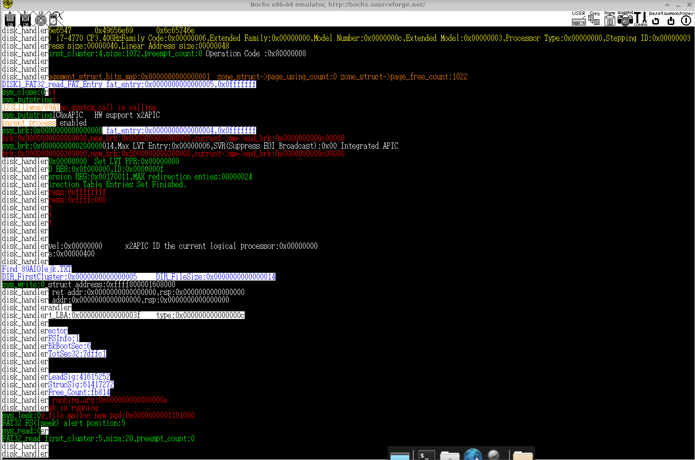

<p class="text-center">
圖十五、bochs 運行結果
</p>

## 踩坑紀錄
### 執行 init.bin 的 page fault 問題  
執行 init.bin 時出現 page fault 問題，反組譯 system_API_lib 可得以下結論:  
```
0000000000800000 <main>:
    ...
    800023:	64 48 8b 04 25 28 00 	mov    %fs:0x28,%rax
```
正是因為讀取 %fs:0x28 這個地址出錯，在函式 do_exceve 中我們並沒有為 fs 暫存器的基地址的頁表提供虛擬地址的映射關係從而發生錯誤。實際上地址 %fs:0x28 的值是 canary 用於防止 stack overflow 攻擊的，為解決這個問題需要在編譯 init.bin 相關文件時添加 -fno-stack-protector選項。  
