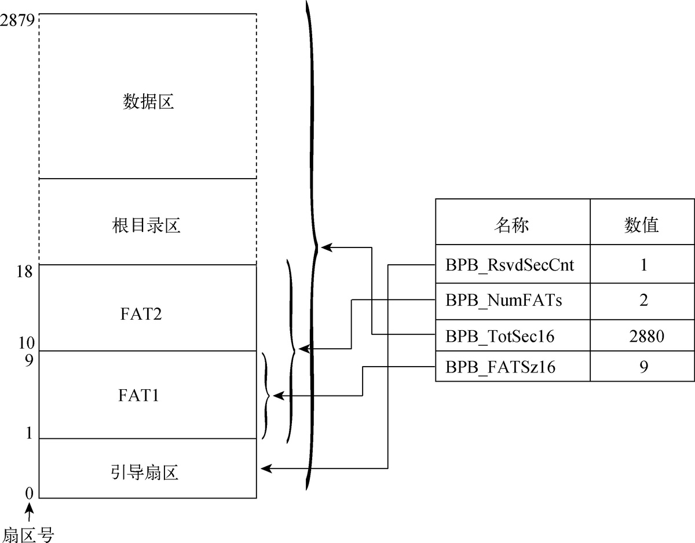
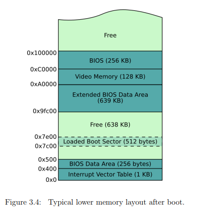
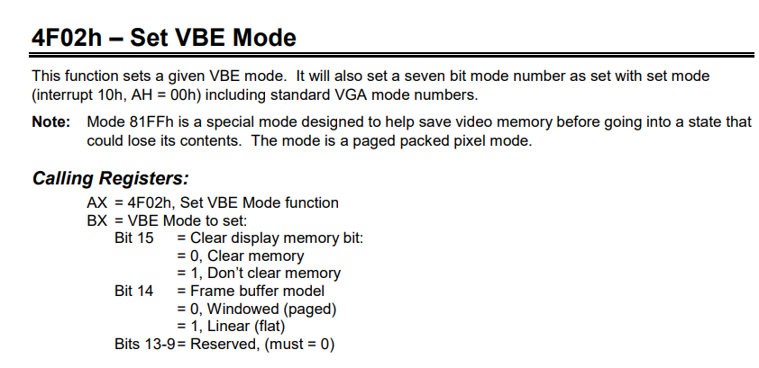
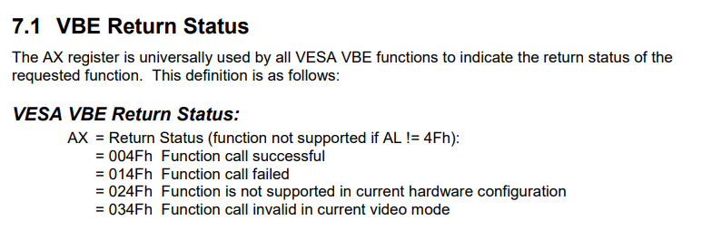
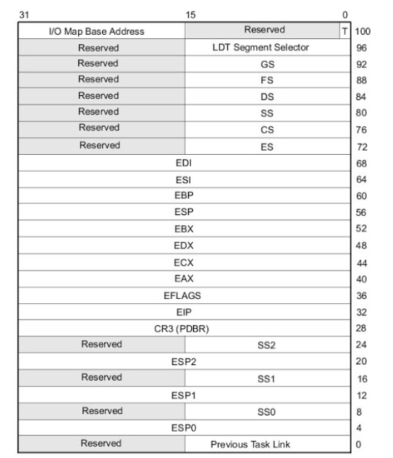
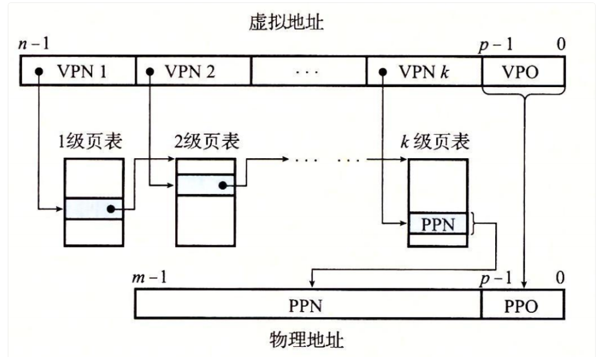
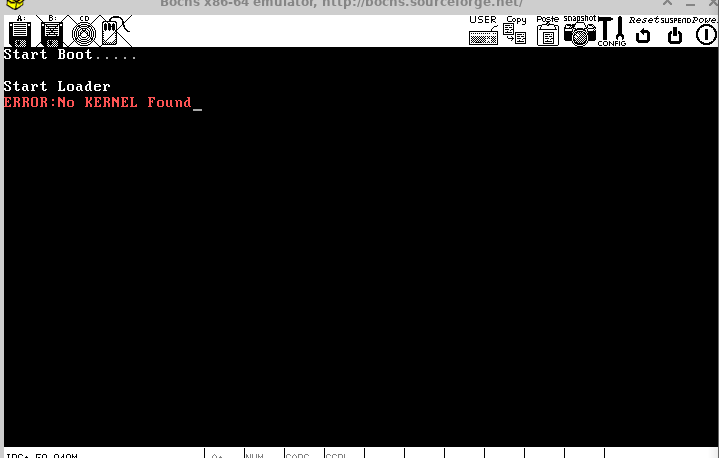

# <<一個64位操作系統的設計與實現>> 第三章 Bootloader 學習筆記
## Boot引導程式
當計算機啟動後，首先由 BIOS 進行自檢，它會檢查硬體設備是否正常工作。如果所有檢測都無誤，BIOS 會根據預設的啟動項配置來選擇引導設備。目前，BIOS 支持的引導設備包括軟碟、USB、硬碟以及網絡啟動。在大多數情況下，BIOS 會默認選擇硬碟作為引導設備。但這裡我們先以軟碟為例。   

當 BIOS 檢測到軟碟的第 0 磁頭、第 0 磁道的第一扇區以 0x55 和 0xAA 作為結尾時，會認定該扇區是引導扇區（Boot Sector），並將該扇區的數據加載到內存的 0x7C00 地址處（只需確保該地址不是內存空洞、設備映射區域或 BIOS 程式碼區域）。隨後，處理器的控制權將交給這段程序。由於一個扇區的容量為 512 字節，而 BIOS 只會加載一個扇區，因此引導程序（Bootloader）需要在此有限的空間內運行。引導程序的主要作用是作為初級加載器，將功能更強大的 Loader 加載到內存中，完成硬體控制權到軟體控制權的轉交。當 Loader 開始執行後，所有控制將交由軟體管理。  

在 BIOS 將控制權移交給引導程序之前，它會對處理器進行初步初始化，比如將 CS 設置為 0x0000，並將 IP 設置為 0x7C00。這時處理器仍處於實模式（Real Mode），內存訪問是基於物理地址，需通過段暫存器與通用暫存器尋址比如 CS : IP 的組合來計算實際地址，具體的計算方式為 (CS << 4) + IP。在實模式下，最多可以訪問的物理內存為 $2^{20}$ byte，即 1 MiB。

由於引導扇區最後的 2 個字節（0x55 和 0xAA）是固定標記，真正可用來儲存引導代碼的空間只有 510 字節。因此，如何在這有限的空間內儲存並加載 Loader 是一個挑戰。如果採用將 Loader 寫入固定扇區的方式，則後續的核心程序也需要指定固定的扇區進行加載。這種方法的好處是引導程序的代碼相對簡單，只需要指定 Loader 所在的磁頭、磁道、扇區和扇區數量等參數，就能夠成功將代碼加載到內存中，即使這些扇區是不連續的。然而，隨著代碼量的增長，這種方法變得不方便，因為每次寫入 Loader 或核心時，都需要重新計算起始扇區和佔用的扇區數量，並修改引導程序和 Loader 的代碼。  

創建文件系統可以解決這一問題，如 FAT12，可以更靈活地管理 Loader 和後續的加載過程。在這裡，我們將使用 FAT12 作為軟碟的文件系統。  

```
boot.asm
    org    0x7c00

BaseOfStack    equ    0x7c00

Label_Start:
    mov    ax,    cs
    mov    ds,    ax
    mov    es,    ax
    mov    ss,    ax
    mov    sp,    BaseOfStack

```
這段程式將依照慣例加載到地址 0x7c00 處，這是 BIOS 通常加載引導程序的位置。 org 指令來明確告訴編譯器這段代碼將從 0x7c00 開始執行。此外，NASM 編譯器支援不同的 16 進制表示法，例如 0x0000 和 0000h 都是合法的 16 進制寫法。  
通過 equ 指令，我們定義了標示符 BaseOfStack 為 0x7c00，這是一個常量，用來表示 stack 的起始地址。在需要注意的是，標示符不可以與其他符號同名。此外，equ 不僅可以用來定義常量，還可以用來表示表達式、字符串和註記符號等。  
另外段暫存器（如 ds、es 和 ss）無法直接賦值，所以必須先通過通用暫存器（如 ax），然後再使用 mov 指令來賦值。  
```
boot.asm

;=======    clear screen

    mov    ax,    0600h
    mov    bx,    0700h
    mov    cx,    0
    mov    dx,    0184fh
    int    10h
;=======    set focus

    mov    ax,    0200h
    mov    bx,    0000h
    mov    dx,    0000h
    int    10h
;=======    display on screen: Start Booting

    mov    ax,    1301h
    mov    bx,    000fh
    mov    dx,    0000h
    mov    cx,    10
    push   ax
    mov    ax,    ds
    mov    es,    ax
    pop    ax
    mov    bp,    StartBootMessage
    INT    10h
```
這裡使用BIOS中斷服務調用INT 10h的主功能編號 06h、02h、13h。  
呼叫BIOS中斷服務前必須設置齊功能編號讓處理器知道要做什麼功能，會設置在AH暫存器，在這裡作者使用`mov ax, 0200h`就是在設定AH=02h，也可以直接設定`mov ah, 02h`。以下為一些功能號的說明。  

INT 10h AH=02h的功能為設定游標位置。  
DH = 游標的列數。  
DL = 游標的行數。  
BH = 頁碼。  
在這裡我們設定DH = DL = 00h 表示將游標顯示在螢幕左上角(0,0)位置。  

INT 10h AH=06h可實現依照指定範圍滾動窗口的功能，同時也具備清屏功能。  
AL = 滾動的列數，設為0則清屏  
BH = 滾動後空出位置放入的屬性  
CH = 滾動範圍的左上角座標列號  
CL = 滾動範圍的左上角座標行號  
DH = 滾動範圍的右上角座標列號  
DL = 滾動範圍的右上角座標行號  
BH = 顏色屬性  
bit 0 - 2表示8種(0 - 7)字體顏色，依序為黑、藍、綠、青、紅、紫、棕、白  
bit 3為字體亮度(0:正常，1:高亮度)  
bit 4-6表示背景顏色，依序為黑、藍、綠、青、紅、紫、棕、白  
bit 7字體閃爍(0:不閃爍，1:閃爍)  

假設AL設為0時則自動視為清屏，其他BX、CX、DX暫存器都不起作用。  

INT 10h AH=13h的功能可以顯示字符串。  
AL表示寫入模式。  
AL = 00h 字符串屬性由BL提供，CX則提供字符串常度(以byte為單位)，不改變顯示游標位置。  
AL = 01h 同AL = 00h，但是移動游標位置到字符串尾端。  
AL = 02h 字符串屬性由每個紫符後緊跟的byte提供，cx所提供的字符串常度改以word為單位，不改變顯示游標位置。  
AL = 03h 同AL = 02h，但是移動游標位置到字符串尾端。  
CX = 字符串常度。  
DH = 游標的座標行號。  
DL = 游標的座標列號。  
ES:BP = 顯示自符串的內存起始地址。  
BH = 頁碼。  
BL = 字符屬性與顏色屬性。  
bit 0-2表示8種(0-7)字體顏色，依序為黑、藍、綠、青、紅、紫、棕、白。  
bit 3為字體亮度(0:正常，1:高亮度)。  
bit 4-6表示背景顏色，依序為黑、藍、綠、青、紅、紫、棕、白。  
bit 7字體閃爍(0:不閃爍，1:閃爍)。  

上述程式完成了引導程式的log信息顯示工作，接著要讓BIOS中斷服務程式操作磁碟驅動器。  
```
boot.asm
;=======    reset floppy
    xor    ah,    ah
    xor    dl,    dl
    int    13h

    jmp    $
```
這裡用`xor ah, ah`代替`mov ah, 0h`是因為xor指令較mov短且值值速度也快，可以減少開銷。  

INT 13h AH=00h的功能為重置磁碟驅動器，為下一次讀寫作準備。  
DL = 驅動器號碼，00H-7FH:軟碟，80H-FFH為硬碟。  
DL = 00h表示第一個軟碟驅動器(drive A)。  
DL = 01h表示第二個軟碟驅動器(drive B)。  
DL = 80h表示第一個硬碟驅動器。  
DL = 81h表示第二個硬碟驅動器。  

```
StartBootMessage:    db    "Start Boot"

;=======    fill zero until whole sector

    times    510 - ($ - $$)    db    0
    dw    0xaa55
```
這裡的功能很簡單就是把第1個扇區剩下的部分填充0並在最尾端的結束位置填上0xaa55作為結尾，用於標示這是引導扇區。  

## 建立虛擬軟碟鏡像文件

bximage可用於建立虛擬磁碟鏡像文件。  
於命令行輸入'apt install bximage'即可安裝，根據指示建立鏡像文件完成後會顯示以下提示。  
```
floppya: image="boot.img", status=inserted
```
這一行提示信息告訴用戶如何把鏡像文件加入虛擬基環境配置信息中，STATUS表示虛擬軟碟鏡像的狀態，inserted表示已插入。  

以下為我們建立的鏡像文件信息。   
```
disk image mode = 'flat'
hd_size: 1474560
geometry = 2/16/63 (1 MB)
```
所建立的磁碟映像文件類型為軟碟（flat），其文件大小為 1474540 byte。這個數字與常見的 1.44 MB（1.44 MiB）存在差異。儘管預期文件大小為 1.44 MB（即 1440000 byte）或 1.44 MiB（即 1509949 byte），實際大小為 1474540 byte。這種差異通常與文件系統配置和其他元數據相關。實際的磁碟容量是由兩個磁頭、80 個磁道及每磁道 18 個扇區組成，總大小為：  
512 byte/扇區 * 18 扇區/磁道 * 80 磁道 * 2 磁頭 = 1474560 byte  
由於工具 bximage 可能基於 1 MB 單位進行解析，因此顯示的容量與實際略有出入。完成映像文件後，可以使用 NASM 編譯 boot.asm。編譯命令格式如下：  
nasm -f <格式> <檔案名> [-o <輸出名>]  
其中，-f 指定生成目標文件格式（例如 bin 或 elf），-o 指定生成目標文件的名稱。  
```
nasm boot.asm -o boot.bin
```
接下來，需要將二進制文件寫入虛擬軟碟映像。在 Linux 上可以使用 dd 指令將引導程式直接寫入虛擬軟碟映像文件。這種方法能夠繞過文件系統的管理，直接對磁碟扇區進行操作。命令格式如下：   
```
dd if=boot.bin of=boot.img bs=512 count=1 conv=notrunc
```
將 boot.bin 寫入 boot.img 時，使用 dd 指令完成二進制文件的寫入操作。if 代表輸入源文件名，of 代表輸出目標文件名，bs 指定傳輸的塊大小為 512 byte（即一個扇區），count=1 表示只寫入一個塊，conv=notrunc 則確保在寫入後不會截斷或改變文件的大小。  
接下來，根據書籍指示，使用 FAT12 文件系統來加載 loader 和核心程式。FAT 文件系統會對軟碟的扇區進行結構化處理，並將其分為四個主要部分：引導扇區、FAT 表、根目錄和數據區。下表為引導扇區的結構：  


| 名稱              | 偏移  | 長度 | 內容                 | 本系統引導程序數據        |
| ---------------- | ---- | ---- | -------------------- | ------------------------- |
| BS_jmpBoot       | 0    | 3    | 跳轉指令              | jmp short Label_Start nop |
| BS_OEMName       | 3    | 8    | 生產廠商名            | MINEboot                  |
| BPB_BytesPerSec  | 11   | 2    | 扇區容量              | 512 Byte                  |
| BPB_BytesPerClus | 13   | 1    | 每簇扇區數量          | 1                         |
| BPB_RsvdSecCnt   | 14   | 2    | 保留扇區數量          | 1                         |
| BPB_NumFATs      | 16   | 1    | FAT表的份數          | 2                         |
| BPB_RootEntCnt   | 17   | 2    | 根目錄可容納目錄項數   | 224                       |
| BPB_RootEntCnt   | 19   | 2    | 總扇區數             | 2880                      |
| BPB_Media        | 21   | 1    | 介質描述符           |  0xF0                      |
| BPB_FATSz16      | 22   | 2    | 每FAT扇區數          | 9                         |
| BPB_SecPerTrk    | 24   | 2    | 每磁道扇區數量        |      18                   |
| BPB_NumHeads     | 26   | 2    | 磁頭數               |   2                       |
| BPB_HiddSec      | 28   | 4    | 隱藏扇區數            |   0                        |
| BPB_TotSec32     | 32   | 4    | 若BPB_TotSec16=0，則由這裡紀錄扇區數量| 0             |
| BS_DrvNum        | 36   | 1    | int 13h的驅動器號      |  0                        |
| BS_Reserved      | 37   | 1    | 未使用                |  0                        |
| BS_BootSig       | 38   | 1    | 擴展引導標記(29h)      |  0x29                     |
| BS_VollD         | 39   | 4    | 捲序列號              |  0                        |
| BS_VolLab        | 43   | 11   | 捲標                  | boot loader              |
| BS_FileSysType   | 54   | 8    | 文件系統類型           | FAT12                     |
| 引導程式碼         | 62   | 448  | 引導程式碼、數據與其他信息|                           |
| 結束標誌           | 510 | 2    | 結束標誌 0xAA55        | 0xAA55                    |

在這裡，偏移量（offset）指的是引導扇區中每個字段相對於扇區起始位置的偏移量，而長度則定義了每個字段所佔用的容量。在引導扇區的起始位置，為跳轉程式碼 BS_jmpBoot，這是因為緊接在後面的是 FAT12 的文件信息，而非可執行程式碼。這個跳轉指令通常是 jmp short Label_Start，用於跳轉到組合語言程式中的 Label_Start 標籤。該指令佔用 2 byte，後面的 nop 指令佔用 1 byte。  
BPB_SecPerClus 記錄每個叢集（cluster）所包含的扇區數量。每個扇區的容量為 512 byte，雖然磁碟控制器可以一次讀取單個扇區，但 FAT 文件系統使用叢集作為最小的分配單元來提升讀寫效率。叢集的大小必須為 2 的冪，一個叢集可以包含多個扇區。  
另外硬碟的讀取次數會影響性能，這主要是因為大部分時間花在尋道和旋轉等待上，而不是實際的數據傳輸。一般磁碟的尋道時間為 3-9 ms，而 7500 RPM 的磁碟在隨機存取時，每次查找一個扇區大約需要 8 ms，讀取一個扇區的時間約為 1 ms。

BPB_RsvdSecCnt 表示保留扇區的數量，該值必須大於 0。在 FAT12 文件系統中，這個值通常為 1，因為引導扇區位於保留扇區內，FAT 表從第二個扇區開始。  
BPB_NumFATs 表示 FAT 表的數量。FAT 文件系統中建議設置兩個相同的 FAT 表作為備份，增強數據的可靠性。  
BPB_RootEntCnt 定義了根目錄所能容納的目錄項數量。該值必須為 32 的倍數，且其乘積應為扇區大小（512 byte）的偶數倍。  
BPB_TotSec16 記錄了總的扇區數量。如果這個值為 0，則總扇區數會記錄在 BPB_TotSec32 中。  
BPB_Media 描述了儲存介質的類型。例如，對於不可移動的設備，通常使用 0xF8，而可移動的設備則常用 0xF0。合法值範圍包括 0xF0 和 0xF8-0xFF，並且這個值也會寫入 FAT 表的第一個項目（FAT[0]）的低位。  
BPB_FATSz16 表示 FAT 表所佔用的扇區數，這個值同時表示兩個相同 FAT 表的大小。  
BS_VolLab 是磁碟的卷標名稱，這個名稱會在 Windows 或 Linux 系統中顯示。  
BS_FileSysType 描述文件系統的類型，這是一個指示字串，用於顯示 FAT 文件系統的版本（例如 FAT12）。作業系統並不依賴這個值來判斷 FAT 的類型。  



<p class="text-center">
軟碟文件系統分配圖  
</p>

由於 FAT 文件系統將叢集作為最小的操作單位，即使文件僅佔用 1 byte，系統仍會分配一整個叢集的空間。這樣的設計使磁碟空間能夠按固定大小的單元進行管理，並允許根據文件的偏移量分段訪問內容，而不需要一次讀取整個文件。  
FAT 表的位寬取決於文件系統的類型。例如，FAT12 使用 12 bit 的位寬，FAT16 使用 16 bit，FAT32 則使用 32 bit。當文件體積增大時，數據往往無法保存在連續的空間中，系統會將文件分散儲存於多個叢集中。FAT 表負責記錄這些不連續的叢集編號，並將它們串接成完整的文件。  
接著，根據 FAT 引導扇區表中的內容，我們將數據填入 boot.asm 以完成引導扇區的配置。使用組合語言的 db、dw 和 dd 指令來對應填入數據。例如，BPB_BytesPerSec 的長度為 2 byte，使用 dw 填入；BPB_BytesPerClus 的長度為 1 byte，使用 db 填入；而 BPB_HiddSec 的長度為 4 byte，則使用 dd 指令。  

| FAT項  | 實例值 | 描述                                                      |
| ------ | ------ | ------------------------------------------------------- |
| 0      | 0xFF0  | 磁碟標示字，尾端F0表示為可移動儲存介質                        |
| 1      | 0xFFF  | 第一個cluster以被佔用                                     |
| 2      | 0x003  | 0x000可用cluster                                         |
| 3      | 0x004  | 0x002 - 0xFEF，為以使用的cluster，標示文件的下一個cluster編號 |
| ...... | ...... | FF0-FF6為保留cluster                                     |
| N      | 0xFFF  | 0xFF7損壞的cluster                                       |
| N      |        | 0xFF8-0xFFF表是文件結尾                                   |

FAT 表中的 FAT[0] 的最低 byte 與 BPB_Media 字段保持一致，其餘位元則全部設為 1。此外，FAT[0] 和 FAT[1] 並不參與數據區的叢集索引。系統在初始化過程中會將 FAT[1] 設置為 0xFFF（在 FAT12 中表示結束標記）。目前大多數作業系統在訪問 FAT 表時，會直接跳過這兩項，使它們不被納入文件數據的叢集索引計算。  
### 根目錄與數據區  
根目錄區僅存放目錄項信息，而數據區則可以存放目錄項信息和文件數據。每個目錄項都是一個 32 byte 的結構體，表示文件或目錄，並記錄文件名稱、文件大小、起始叢集（cluster）編號等信息。目錄項的結構可以使用以下結構體來表示：  
```
struct Dir_Entry {
    char     DIR_Name[11];   // 文件名（8 byte 文件名 + 3 byte 擴展名）
    uint8_t  DIR_Attr;       // 文件屬性
    uint8_t  Reserved[10];   // 保留位
    uint16_t DIR_WrtTime;    // 最後一次寫入時間
    uint16_t DIR_WrtDate;    // 最後一次寫入日期
    uint16_t DIR_FstClus;    // 文件起始 cluster 編號
    uint32_t DIR_FileSize;   // 文件大小
};
```

| 名稱          | 偏移  | 長度 |           描述           |
| ------------ | ---- | ---- |:-----------------------:|
| DIR_Name     | 0x00 | 11   | 文件名 8 byte，擴展名 3 byte |
| DIR_Attr     | 0x0B | 1    |          文件屬性         |
| 保留位        | 0x0C | 10   |           保留位          |
| DIR_WrtTime  | 0x16 | 2    |      最後一次寫入時間      |
| DIR_WrtDate  | 0x18 | 2    |      最後一次寫入日期      |
| DIR_FstClus  | 0x1A | 2    |    文件起始cluster編號    |
| DIR_FileSize | 0x1C | 4    |          文件大小        |

該格式由微軟定義，目錄項中的 DIR_WrtTime、DIR_WrtDate 和 DIR_FstClus 等字段需要通過特定公式轉換來解讀。此外，DIR_Attr 用於存儲文件屬性，並且最低 5 個位元具有特定含義：  
第 0 位（0x01）：只讀文件  
第 1 位（0x02）：隱藏文件  
第 2 位（0x04）：系統文件  
第 3 位（0x08）：非文件信息（如磁碟名稱）  
第 4 位（0x10）：目錄   
這些屬性可以透過或運算來添加。  

```
    org    0x7c00

BaseOfStack        equ    0x7c00
BaseOfLoader       equ    0x1000
OffsetOfLoader     equ    0x00

RootDirSectors             equ    14
SectorNumOfRootDirStart    equ    19
SectorNumOfFAT1StarT       equ    1
SectorBalance              equ    17

    jmp    short    Label_Start
    nop
    BS_OEMName            db    'MINEboot'
    BPB_BytesPerSec       dw    512
    BPB_SecPerClus        db    1
    BPB_RsvdSecCnt        dw    1
    BPB_NumFATs           db    2
    bpb_rOOTeNTcNT        dw    224
    BPB_TotSec16          dw    2880
    BPB_Media             db    0xf0
    BPB_FATSz16           dw    9
    BPB_SecPerTrk         dw    18
    BPB_NumHeads          dw    2
    BPB_hiddSec           dd    0
    BPB_TotSec32          dd    0
    BS_DrvNum             db    0
    BS_Reserved1          db    0
    BS_BootSig            db    29h
    BS_VolID              dd    0
    BS_VolLab             db    'boot loader'
    BS_FileSysType        db    'FAT12   '
```
在 BIOS 模式下，系統處於實模式（Real Mode），此時使用 16 位的 CS（段暫存器）和 IP（指令指標）來訪問程式碼的實體地址。實體地址的計算公式為：  
實體地址 = (CS << 4) + IP  
這樣的架構最多可以表示 20 bit 的地址，因此系統在實模式下可訪問的內存上限為 1 MB。根據此限制，Loader 程式的起始地址為：
Loader 起始地址 = (BaseOfLoader << 4) + OffsetOfLoader = 0x10000  
接下來，RootDirSectors equ 14 表示根目錄區佔用 14 個扇區，其計算方式為：  
根目錄區扇區數 = (BPB_RootEntCnt * 32 + BPB_BytesPerSec - 1) / BPB_BytesPerSec  
其中，BPB_RootEntCnt 表示根目錄區可容納的目錄項數量，BPB_BytesPerSec 為每扇區的大小。加上 BPB_BytesPerSec - 1 是為了進行向上取整。  
SectorNumOfRootDirStart equ 19 表示根目錄區的起始扇區號，其計算方法為：  
根目錄起始扇區 = 保留扇區數量 + FAT 扇區數量 * FAT 副本數  
              = 1 + 2 * 9 = 19  
其中，FAT 文件系統的第一個扇區為保留扇區，接著是兩個 FAT 表（FAT1 和 FAT2），每個 FAT 表佔用 9 個扇區。  

SectorNumOfFAT1 表示 FAT1 表的起始扇區，從第 1 扇區開始，因為第 0 扇區為保留扇區。  

SectorBalance equ 17 用於平衡文件的起始 cluster 編號。由於 FAT[0] 和 FAT[1] 不參與數據區的索引，實際從 FAT[2] 開始才是有效的數據區。為了使索引值從 0 開始，計算方法如下：  
SectorBalance = 根目錄起始扇區號 - 2 = 19 - 2 = 17  
這樣可以讓索引與 cluster 編號對應，並假設每個 cluster 對應一個扇區。  
```
boot.asm

;=======       read one sector from floppy
Func_ReadOneSector:

    push    bp                            ; 保存bp以便後須恢復
    mov     bp,     sp
    sub     esp,    2                     ; 增加stack 2 byte空間
    mov     byte    [bp - 2],   cl        ; 將cl 存入 [bp-2]這個位置
    push    bx
    mov     bl,     [BPB_SecPerTrk]       ; 將磁道扇區數量輸入bl暫存器
    div     bl                            ; 除法(被除數為ax除數為bl) al放商，ah放餘數
    inc     ah                            ; ah += 1磁道內的扇區從1號開始
    mov     cl,     ah                    ; 目標磁道的起始扇區編號
    mov     dh,     al                    ; 
    shr     al,     1                     ; 磁頭有正反兩個方向，所以右移一位
    mov     ch,     al                    ; 確認在第幾個磁道
    and     dh,     1                     ; 讀取磁頭方向
    pop     bx
    mov     dl,     [BS_DrvNum]           ; 把驅動器號碼存入dl

Label_Go_On_Reading:

    mov     ah,     2
    mov     al,    byte    [bp - 2]        ; 讀入[bp - 2]個扇區
    int     13h                            ; 讀取磁碟扇區
    jc Label_Go_On_Reading
    add esp,    2                          ; 平衡stack指針
    pop bp
    ret
```
上面這段程式碼用來完成讀取軟碟功能。  
INT 13h, AH=02h 讀取磁碟扇區。  
AL=讀入的扇區數(不可為0)  
CH=磁道號(柱面號)的低8位  
CL=扇區號1-63用5個bit表示，磁道號碼(柱面號)的高兩位(bit 6-7，只對硬碟有效)。  
DH=磁頭號。  
DL=驅動器號，如果操作硬碟驅動器，bit 7要置位。  
ES:BX=數據緩衝區。  

此程式碼用於透過 BIOS 中斷 INT 13h, AH=02h 來讀取軟碟扇區，該中斷提供了讀取磁碟扇區的功能。參數配置包括：AL 表示要讀取的扇區數量（不可為 0），CH 為磁道號（柱面號）的低 8 位，CL 為扇區號（範圍 1-63，並包含磁道號的高兩位），DH 表示磁頭號，DL 為驅動器號（若操作硬碟驅動器，bit 7 需置位），而 ES : BX 則指定數據緩衝區的地址。  
INT 13h, AH=02h 中斷向量號僅接受 CHS（Cylinder/Head/Sector）格式，因此我們需將 LBA（Logical Block Address，邏輯區塊地址）轉換為 CHS 格式。轉換公式如下圖所示:  


首先，修改堆疊指針（SP）的值以騰出空間來存放 CL（要讀取的扇區數量）。接著，將 AX（待讀取的起始扇區號）除以 BL（每磁道的扇區數），商存入 AL 中，用於計算柱面號和磁頭號，而餘數存入 AH，用來表示目標磁道的起始扇區位置。由於扇區編號從 1 開始（而非 0），因此需要執行 inc ah 將扇區號加 1。最後，將計算結果寫入相應的暫存器，並呼叫 INT 13h 將軟碟的扇區數據讀入內存。  

```
boot.asm

;=======   search loader.bin

    mov    word    [SectorNo],    SectorNumOfRootDirStart    ; 把SectorNumOfRootDirStart放入標籤SectorNo的地址

Lable_Search_In_Root_Dir_Begin:

    cmp    word    [RootDirSizeForLoop],    0    ; 檢查標籤RootDirSizeForLoop地址的值是否為0
    jz     Label_No_LoaderBin                    ; 若為0代表根目錄扇區讀取完畢，跳轉到Label_No_LoaderBin
    dec    word    [RootDirSizeForLoop]          ; 讀取新的扇區，把未讀取的扇區數量減一
    mov    ax,     00h
    mov    es,     ax                            ; 把es段暫存器歸0
    mov    bx,     8000h
    mov    ax,     [SectorNo]                    ; 將SectorNo存放的值移到AX
    mov    cl,     1                             ; 表示讀取1個扇區(這裡用cl作為函式的入參，當調用int 13h會把值放入al)
    call   Func_ReadOneSector
    mov    si,     LoaderFileName                ; 把標籤LoaderFileName的地址放入si
    mov    di,     8000h
    cld                                          ; 清除DF，保證後續操作字串指針時自動遞增
    mov    dx,     10h                           ; 根目錄區每扇區可以存放0x10個目錄項

Label_Search_For_LoaderBin:

    cmp     dx,     0                            
    jz      Label_Goto_Next_Sector_In_Root_Dir   ; dx=0表示所有目錄項都查過了，前往下一個扇區查找
    dec     dx                                   ; 讀取新目錄項，dx--
    mov     cx,     11                           ; 設定cx = 11是因為文件名 + 擴展名 = 8 + 3 = 11 byte

Label_Cmp_FileName:

    cmp	    cx,	    0
    jz	    Label_FileName_Found                 ; cx = 0時所有字符成功配對，找到檔案。
    dec	    cx
    lodsb                                        ; 將si所指向地址的字符取出放入al (cld保證向地址高位遞增)
    cmp     al,     byte    [es:di]              ; 將al值與[es:di]比較
    jz	    Label_Go_On
    jmp     Label_Different                      ; 不同時跳轉Label_Different，比較下一個目錄項
                  
Label_Go_On:
	
	inc	    di
	jmp	    Label_Cmp_FileName

Label_Different:

    and	    di,	    0ffe0h                       ; 因為一個目錄項 32 byte 這裡需要對齊回目錄項的起始地址
    add	    di,	    20h                          ; 移動到下一個目錄項
    mov	    si,	    LoaderFileName               ; 重新設置配對地址
    jmp	    Label_Search_For_LoaderBin

Label_Goto_Next_Sector_In_Root_Dir:

    add	    word    [SectorNo],  1               ; 移動到下個扇區
    jmp	    Lable_Search_In_Root_Dir_Begin       ; 開始查找
```

程式碼首先將根目錄區的扇區讀入內存，並逐一比較目錄項，直到找到與 LoaderFileName 對應的文件名為止。查找過程中，每次讀取一個扇區，每個扇區包含 16 個目錄項。在載入字符時，使用指令 lodsb，該指令將 ds:di 地址處的 1 byte 數據放入 al 中，並根據 DF（方向標誌位）的值自動調整 di，以確保地址往高位遞增。為此，使用 cld 指令將 DF 設為 0，以保證 di 地址自動遞增。  
需要注意的是，FAT12 文件系統的文件名只有大寫字母，因此即使將小寫命名的文件複製到 FAT12 文件系統中，文件名也會被轉換為大寫。例如，loader.bin 在 FAT12 中會被存儲為 "LOADER BIN"。  
如果找不到 loader 文件，程式將透過 int 10h 中斷顯示錯誤信息 "ERROR: No LOADER Found"，並將該字串顯示在螢幕的第 1 行第 0 列。  
```
boot.asm
;=======	display on screen : ERROR:No LOADER Found

Label_No_LoaderBin:

    mov	    ax,     1301h                ; ah=13h表示顯示字串，al=01h表示寫入字串後將由標移到字串尾端
    mov	    bx,     008ch                ; bh=00h表示頁碼(0為當前頁面)，bl=8ch表示字串顯示為紅色
    mov	    dx,     0100h                ; dh=01表示游標在第1列，dl=00表示第0列
    mov	    cx,	    21                   ; 寫入字符串長度
    push    ax
    mov	    ax,	    ds
    mov	    es,	    ax
    pop	    ax
    mov	    bp,	    NoLoaderMessage      ; 將bp用作字串的指針。
    int	    10h
    jmp	    $

```
在找到 loader.bin 的目錄項後，程式將根據 FAT 表中記錄的叢集編號（cluster number）來將 loader.bin 加載到內存中。需要注意的是，FAT12 用於記錄文件分段信息的 FAT 項並不直接存儲下一個叢集編號，而是需要經過轉換才能指向實際的叢集編號。FAT 項以 3 byte 為一組進行編碼，轉換後會產生兩個數字，每個數字分別代表當前文件下一個銜接的叢集編號。  
假設我們有一個 24 位元的 16 進位數字，其轉換過程如下：  
>這 3 byte 分別為 vw Zu XY（小端序）。  
>取前 2 byte (vw Zu)，可得到數字 0xZuvw，右移 4 位後得到數字 uvw。  
>取後 2 byte (Zu XY)，可得到數字 0xXYZu，右移 4 位後得到數字 0xXYZ。  

這樣的轉換說明，假設這 3 byte 分別表示 FAT 表中 0 和 1 號叢集，那麼 0 號叢集之後銜接的是叢集 0xuvw，而 1 號叢集銜接的是叢集 0xXYZ。  

需要注意的是，FAT 表中的 FAT[0] 和 FAT[1] 是保留區，不與其他叢集相關，這裡的例子只是用來說明 FAT 項的轉換過程。

以下是作者給出的轉換程式碼：  
```
boot.asm
;=======	get FAT Entry

Func_GetFATEntry:

    push    es
    push    bx
    push    ax                    ; 把FAT項的索引存到STACK上
    mov	    ax,	    00            ; 段暫存器必須透過ax賦值 
    mov	    es,	    ax
    pop	    ax
    mov	    byte    [Odd],    0   ; 將標籤odd的值設為0
    mov	    bx,	    3
    mul	    bx                    ; ax *= 3
    mov	    bx,	    2
    div	    bx                    ; ax /= 2 一個FAT項佔據 12bit 共計1.5 byte
    cmp	    dx,	    0             ; 餘數放在ax，餘數為0代表在偶數項的FAT中
    jz	    Label_Even
    mov	    byte    [Odd],    1   ; 將標籤odd的值設為1

Label_Even:

    xor	    dx,	    dx            ; 將dx歸零
    mov	    bx,	    [BPB_BytesPerSec]
    div     bx                    ; ax /= 512 這是因為要找到目標FAT表項是哪個扇區和偏移量
    push    dx                    ; dx為餘數表示偏移量
    mov	    bx,	    8000h         ; 這裡用來定義讀入的扇區要放在內存的哪個位置 (es:bx)
    add	    ax,	    SectorNumOfFAT1Start    ; 計算在哪個扇區。
    mov	    cl,	    2             ; 讀取2個扇區
    call    Func_ReadOneSector    ; 讀取從ax和ax+1兩個扇區

    pop	    dx                    ; 恢復dx(偏移量)
    add	    bx,	    dx            ; 此時es:bx指向要讀取的FAT表項
    mov	    ax,	    [es:bx]       ; 從[es:bx]開始讀取 2byte 數據 (因為FAT表項有12bit)
    cmp	    byte    [Odd],	1     ; 檢查FAT表項的索引值的奇偶性決定解讀方式
    jnz	    Label_Even_2
    shr	    ax,	    4             ; 如果是奇數右移四位

Label_Even_2:

    and	    ax, 	0fffh         ; 偶數就取最右邊12位
    pop	    bx
    pop	    es
    ret
```
Func_GetFATEntry 的功能是根據輸入的 FAT 表項，查找下一個 FAT 表項（即當前叢集之後的叢集編號）。由於每個 FAT 表項佔用 1.5 byte，因此需要將叢集的索引值乘以 1.5 來確定目標 FAT 表項的偏移量。為了處理 FAT 表項可能跨越扇區邊界的情況，首先將偏移量除以 512（每個扇區的大小）來確定需要讀取哪個扇區。此外，考慮到 FAT 表項可能恰好跨越兩個扇區，因此一次讀取兩個扇區以保證數據完整性。  
在解讀 FAT 表項數據時，需根據索引值的奇偶性來決定如何處理：  
>如果索引值為偶數，數據存放在 bit0 到 bit11，可直接對其與 0xfff 進行與運算以提取有效數據。  
>如果索引值為奇數，數據存放在 bit4 到 bit15，需要先右移 4 位再提取數據。  
最後，通過 Func_GetFATEntry 和 Func_ReadOneSector 函數將 loader 文件的內容從 FAT12 文件系統中讀入內存。  
```
boot.asm

;=======    found loader.bin name in root director struct

Label_FileName_Found:

    mov	    ax,	    RootDirSectors
    and     di,     0ffe0h                  ; 根目錄所有目錄項的長度都是32byte這裡確保di可以對齊目標目錄項的開頭
    add     di,     01ah                    ; 在根目錄下文件起始cluster號碼的偏移量為0x1a
    mov	    cx,     word    [es:di]         ; 這裡用di是因為這個暫存器用於指針操作，而bx是默認用於向內存傳輸數據時用。
    push	cx
    add	    cx,	    ax                      ; cluster編號只是代表文件內容的相對位置，需加上起始扇區、FAT表項與根目錄所占去的扇區
    add	    cx,	    SectorBalance
    mov	    ax,	    BaseOfLoader
    mov	    es,	    ax
    mov	    bx,     OffsetOfLoader
    mov	    ax,     cx

Label_Go_On_Loading_File:

    push	ax
    push	bx
    mov	    ah,	    0eh
    mov	    al,	    '.'                     ; 這裡的.只是用來顯示在畫面上表示進度而已
    mov	    bl,	    0fh
    int	    10h                             ; int 10h ah = 0xe 這個功能號就是在螢幕輸出一個字符
    pop	    bx
    pop	    ax

    mov	    cl,	    1
    call	Func_ReadOneSector
    pop	    ax                              ; 第一次pop的值來自於push cx剩下的來自於puah ax指令
    call    Func_GetFATEntry
    cmp	    ax,	    0fffh                   ; 0xfff代表文件的結尾
    jz	    Label_File_Loaded
    push	ax                              ; 把Func_GetFATEntry返回的FAT表項存放到stack
    mov	    dx,	    RootDirSectors
    add	    ax,	    dx
    add	    ax,	    SectorBalance
    add	    bx,	    [BPB_BytesPerSec]       ; 加上512byte避免資料被覆蓋。
    jmp	    Label_Go_On_Loading_File

Label_File_Loaded:

    jmp	$                                   ; 由於此時尚未撰寫loader程式以$代替

```
在這段程式碼中，我們首先從根目錄項取得 loader.bin 文件的起始叢集編號，然後使用 Func_GetFATEntry 和 Func_ReadOneSector 函數將 loader.bin 文件依次讀入內存。數據讀取時會存放到 es:bx 所指定的內存地址，每次讀入一個扇區後，會將 bx 增加 512 byte 以指向下一個內存位置。當 Func_GetFATEntry 返回的 FAT 表項數據為 0xfff 時，表示文件已讀取到結尾，此時可開始執行 loader.bin 程式。   

```
boot.asm

;=======    tmp variable

RootDirSizeForLoop      dw      RootDirSectors
SectorNo                dw      0
Odd                     db      0

;=======    display messages

StartBootMessage:   db      "Start Boot"
NoLoaderMessage:    db      "ERROR:No LOADER Found"
LoaderFileName:	    db      "LOADER  BIN",0
```
這裡用於存放一些被定義的臨時數據。另外在nasm中""字符串操作並不會加上'\0'，如有需要必須自己手動加上。  

## Loader
```
boot.asm

Label_File_Loaded:

    jmp     BaseOfLoader:OffsetOfLoader     ; 跳轉至loader。
```
loader 被放置在 BaseOfLoader:OffsetOfLoader 的內存位置，執行指令後會將 cs 設置為 BaseOfLoader，ip 設置為 OffsetOfLoader。在實模式（real mode）下，寄存器只能使用 16 bit，每個段可訪問的地址空間為 64 KB。如果要訪問超過此範圍的空間，必須調整段暫存器。  
loader 的主要職責包括：檢測硬體信息、處理處理器模式切換（從實模式到保護模式，再到長模式），並向核心傳遞參數。由於大部分 BIOS 自檢信息只能在實模式下獲取，因此在進入核心之前，必須收集這些硬體信息並將其作為參數傳遞給核心使用。其中最重要的是物理地址空間信息，通過解析物理地址，系統可以識別 ROM、RAM、設備寄存器空間和內存空洞等物理地址範圍，這些信息由內存管理單元進行維護。  
為了執行核心，loader 必須將 CPU 模式從實模式切換到 64 位作業系統的 IA-32e 模式（長模式）。在切換過程中，loader 必須創建各模式下運行所需的臨時數據，並按標準流程進行模式跳轉。此外，loader 將兩類關鍵參數傳遞給核心：控制信息和硬體數據。控制信息指導核心的執行流程或限制某些功能，例如啟動模式；硬體數據則包括系統內存佈局和硬體設備信息等。  
```
loader.asm

org     10000h
    jmp     Label_Start

%include    "fat12.inc"

BaseOfKernelFile            equ    0x00
OffsetOfKernelFile          equ    0x100000
BaseTmpOfKernelAddr         equ    0x00
OffsetTmpOfKernelFile       equ    0x7E00
MemoryStructBufferAddr      equ    0x7E00
```
核心程式的起始位置被定義在 0x100000（1MB處），這是因為 1MB 以下的空間並不全是可用的內存空間。這些空間被劃分為多個區域，並有各自的用途。例如，0xF0000 到 0xFFFFF 是 BIOS ROM 的區域。0x7E00 被定義為核心程式的臨時轉存空間，原因在於核心程式的讀取是通過 BIOS 中斷 INT 13h 從磁碟讀取實現的，而在實模式下只能使用 1MB（20 位地址）以下的內存空間。  
因此，核心程式必須先被讀入這個臨時轉存空間，然後再搬運到 1MB 以上的內存空間，避免與低地址區域中的其他用途衝突。當核心程式被移動到最終位置後，這個轉存空間可供其他數據結構使用。  



```
loader.asm

[SECTION .s16]
[BITS 16]
Label_Start:
    ……
    mov bp,    StartLoaderMessage    int 10h
```
此處定義了 .s16 段，並使用 BITS 16 告知 NASM 生成的指令將運行在 16 位處理器模式下。當 NASM 編譯處於 BITS 16 狀態時，使用 32 位數據指令時需要添加前綴 0x66，而使用 32 位地址指令則需添加 0x67 前綴。同樣地，在 32 位模式下使用 16 位指令也需要添加相應的前綴。  
在實模式下，正常情況下只能使用 1MB 以內的地址空間。為了突破這一限制，必須啟用 A20 gate，這將允許實模式下訪問最多 4 GB 的地址空間。  
**A20 gate**  
A20 gate 是為了兼容性的歷史遺留產物。在 8088 處理器時代，只有 20 條地址線，物理尋址能力僅限於 1MB。任何超過 1MB 的尋址都會回繞到 0 處重新計算。而在 80286 處理器時代，引入了 24 條地址線。為了兼容 8088，IBM 在鍵盤控制器中加入了 AND 邏輯門，來控制是否允許訪問超過 1MB 的地址，這就是 A20 gate，這個概念一直沿用至今。  

開啟 A20 gate 來增加尋址能力的技術被稱為 Big Real Mode。這種模式在實模式下，通過間接利用保護模式的尋址功能，將實模式的線性尋址能力從 1MB 提升至 4GB。由於 Big Real Mode 涉及保護模式的性能，因此在開啟 A20 gate 前，需要準備保護模式運行所需的段描述符（包括程式碼段和數據段）。隨後，開啟 A20 gate 並控制 CR0 暫存器以啟用保護模式。此時，處理器在加載段選擇子的同時會將對應的段描述符加載到段暫存器中。  
接著，切回實模式後，段暫存器仍暫時保持保護模式的尋址能力，允許訪問 4GB 的地址空間。需要注意的是，一旦重新加載段暫存器，將失去這一尋址能力，回到 1MB 限制。  

```
;=======	open address A20
    push    ax
    in      al,     92h            ; 從端口 0x92 讀取值
    or      al,     00000010b      ; 端口 0x92的bit1可控制A20 gate (0為關閉，1為開啟)，早期需透過鍵盤控制器激活
    out     92h,    al             ; 開啟A20 gate
    pop     ax

    cli                            ; 禁用CPU中斷，防止進入保護模式實受到干擾

    db      0x66                   ; 表示接下來指令是32位操作
    lgdt    [GdtPtr]               ; 加載GDT

    mov     eax,    cr0
    or      eax,    1              ; 將cr0的bit0設為1代表要切換到保護模式
    mov     cr0,    eax

    mov     ax,     SelectorData32
    mov     fs,     ax
    mov     eax,    cr0
    and     al,     11111110b
    mov     cr0,    eax
    sti                            ; 恢復中斷
```

在 CR0 暫存器中，第一個位元的置位和復位分別用來進入和退出保護模式。這一操作的目的是讓暫存器在實模式下暫時具備保護模式的 4GB 尋址能力。需要在實模式下擁有 4GB 的尋址空間是因為我們需要調用 BIOS 中斷服務程式來將核心加載到內存，而這些中斷服務只能在實模式下執行。  
接著，根據書中的指示，我們將 boot.bin 中用於尋找 loader.bin 的程式碼移植過來，但需要將要匹配的文件名稱從 "LOADER BIN" 改為 "KERNEL BIN"。  
```
loader.asm

;=======    search kernel.bin
    mov     word    [SectorNo],    SectorNumOfRootDirStart

    Lable_Search_In_Root_Dir_Begin:
    ……
 
    mov	    bp,	    NoLoaderMessage
    int	    10h
    jmp	    $
```
隨後，我們將 kernel.bin 的內容轉存到內存位置 0x7E00。為了避免轉存過程中出現錯誤，使用 LOOP 指令逐 byte 進行複製。由於核心程式較大，橫跨多個叢集，因此在每次轉存核心程式片段時，需要保存當前的偏移量。使用 edi 暫存器來存儲臨時變數 OffsetOfKernelFileCount，以追蹤當前的核心程式讀取位置。    
```
Label_FileName_Found:
    mov     ax,    RootDirSectors
    and	    di,    0FFE0h                ; 這裡用於對齊FAT表項
    add     di,    01Ah                  ; 偏移量0x1A紀錄文件的起始cluster編號。
    mov     cx,    word     [es:di]      ; 把cluster編號放入cx暫存器中
    push    cx
    add     cx,    ax
    add	    cx,    SectorBalance         ; 加上根目錄、FAT表項、保留扇區後得到正確的扇區位置
    mov     eax,   BaseTmpOfKernelAddr
    mov     es,    eax
    mov     bx,    OffsetTmpOfKernelFile ; 定義kernel文件轉存的內存位置在0x7E00每次讀入一個cluster時都先放在這裡
    mov     ax,    cx

Label_Go_On_Loading_File:
    push    ax
    push    bx
    mov 	ah,	   0Eh
    mov	    al,    '.'                   ; 有幾個.代表讀取了多少cluster
    mov	    bl,	   0Fh
    int     10h                          ; 用int 10h ah=0eh把文字印到螢幕上
    pop     bx
    pop     ax

    mov     cl,    1
    call    Func_ReadOneSector           ; 讀取一個扇區
    pop     ax

;=======
    push    cx
    push    eax
    push    fs
    push    edi
    push    ds
    push    esi

    mov     cx,    200h                                ; 一個扇區大小為512 = 0x200 使用loop指令時用cx指定循環次數
    mov     ax,    BaseOfKernelFile
    mov     fs,    ax
    mov     edi,   dword    [OffsetOfKernelFileCount]  ; OffsetOfKernelFileCount用來表示讀取文件應放入內存的哪個位置

    mov     ax,    BaseTmpOfKernelAddr
    mov     ds,    ax
    mov     esi,   OffsetTmpOfKernelFile               ; 這裡是轉存的地址

Label_Mov_Kernel:

    mov     al,    byte     [ds:esi]                   ; esi 為 source index
	mov     byte   [fs:edi],    al                     ; edi 為 destination index
    ; 上面兩行的作用為將[ds:esi]的內容移動到[fs:edi]，開啟A20 gate後只讓fs暫存器可訪問0-4GB的內存空間，訪問地址超過0x100000就要用fs
    inc     esi
    inc     edi

    loop    Label_Mov_Kernel                           ; 用loop指令重複操作 (操作次數存在cx暫存器，每經過一次循環cx-=1)

    mov     eax,    0x1000
    mov     ds,     eax

    mov     dword   [OffsetOfKernelFileCount],  edi    ; 把偏移量存回OffsetOfKernelFileCount

    pop     esi
    pop     ds
    pop     edi
    pop     fs
    pop     eax
    pop     cx
    
    call    Func_GetFATEntry
    ......
    jmp	    Label_Go_On_Loading_File
```
此部分程式首先將核心文件存放到轉存地址 0x7E00，隨後利用 fs 暫存器將核心文件移動到 1MB 以上的物理地址空間。在開啟 A20 後，只有 fs 暫存器可以訪問 0 到 0xFFFFFFFF 的 4GB 內存空間。每次讀取一個叢集（這裡定義的叢集大小與一個扇區相同）的核心文件，讀取方法與 boot.asm 中的 Func_GetFATEntry 相同。  
為了避免轉存過程中出現錯誤，使用 mov byte 指令每次搬運 1 byte，並使用 loop 指令（cx 暫存器定義重複操作次數）重複操作，直到該叢集被完全複製。edi 暫存器用於保存臨時變數 OffsetOfKernelFileCount，該值用於指定核心文件要存放的位置。  
另外，作者指出，關於 fs 暫存器的操作，在 Bochs 虛擬機中可以正常工作，但移植到實體平台時可能會出現問題。這是因為在實體平台中，重新向 fs 賦值會導致 32 位尋址能力恢復到實模式的 20 位尋址範圍。這個問題會在本書第 7 章得到解決。  

```
loader.asm

Label_File_Loaded:
		
    mov     ax,     0B800h
    mov     gs,     ax
    mov     ah,     0Fh				; 0000: 黑底    1111: 白字
    mov     al,     'G'
    mov     [gs:((80 * 0 + 39) * 2)],   ax	; 螢幕第0行第39列。
```
這段程式碼的具體作用是將字符 'G' 放置到內存空間中，並在螢幕上顯示。地址 0xB8000 是文本模式下顯示卡內存的起始地址，改變這段內存中的內容就能改變螢幕顯示。在這個內存空間中，每個字符佔用 2 byte，低位用於存放字符，高位用於存放字符的顏色。這裡設置 ah = 0Fh，表示白字黑底的顏色。  
80 * 0 + 39 的計算表示將字符放在螢幕的第 0 行第 39 列（每行有 80 個字符）。當 loader 加載完核心程式後，就不再需要使用軟碟，此時可以關閉軟碟設備。  
```
KillMotor:

    push    dx
    mov	    dx,	    03F2h
    mov	    al,	    0	
    out	    dx,	    al
    pop	    dx
```
通過向 I/O 端口 0x3F2 寫入 0 可以關閉軟碟驅動器馬達。寫入 0 代表關閉所有軟碟驅動器。  
另外 out 指令可根據端口的位寬選用AL/AX/EAX暫存器，目的操作數可以是立即數或是 DX 暫存器，立即數位寬是 8 位(0-0xFF)，而 DX 則可使用 16 位(0-0xFFFF)。  

| 位  | 名稱     | 說明                                          |
| --- | -------- | ------------------------------------------- |
| 7   | MOT_EN3  | 控制軟驅馬達D 1:啟動 0:關閉                   |
| 6   | MOT_EN2  | 控制軟驅馬達C 1:啟動 0:關閉                   |
| 5   | MOT_EN1  | 控制軟驅馬達B 1:啟動 0:關閉                   |
| 4   | MOT_EN0  | 控制軟驅馬達A 1:啟動 0:關閉                   |
| 3   | DMA_INT  | DMA與中斷請求 1:允許 0:禁止                   |
| 2   | RESET    | 1:允許軟碟控制器發送控制信息 0:復位軟碟驅動器     |
| 1   | DRV_SEL1 | 00-11用於選擇軟碟驅動器A-D                    |
| 0   | DRV_SEL0 |                                            |

由於核心文件已全部搬運完成，物理地址 0x7E00 將被用來保存物理地址空間信息。接下來的程式碼將負責保存這些物理地址空間的相關信息。   

```
loader.asm 
;=======    get memory address size type

    mov	    ax,     1301h
    mov	    bx,	    000Fh       ; 黑底白字
    mov	    dx,	    0400h		; row 4
    mov	    cx,	    24          ; 顯示24個字符
    push	ax                  ; 我很好奇作者位何不先設定sreg的值在做功能號的設定，這樣可以省下push pop操作。
    mov	    ax,	    ds
    mov	    es,	    ax
    pop	    ax
    mov	    bp,	    StartGetMemStructMessage
    int	    10h                ; 這一段用於顯示StartGetMemStructMessage

    mov	    ebx,    0          ; 歸零暫存器，使用int 15h E820時，第一次調用時必須把這個值設為0
    mov	    ax,	    0x00       ;
    mov	    es,	    ax
    mov	    di,	    MemoryStructBufferAddr ; 地址為0x7E00

Label_Get_Mem_Struct:

    mov	    eax,    0x0E820    ; 在int 15h中ah=E8h al=20h表示查詢系統地址對應,可獲得內存布局
    mov	    ecx,    20         ; buffer的大小。返回的結構體大小為20 byte。
    mov	    edx,    0x534D4150 ; 這一串數字由ascii表轉換可得到字串"SMAP"。BIOS用這個驗證是否請求system map資訊
    int	    15h
    jc      Label_Get_Mem_Fail
    add	    di,     20         ; +20是因為填入了20 byte的結構體。

    cmp	    ebx,    0          ; 第一次呼叫或是內存掃描完畢這個值為0，如果不是就放入上次調用後的計數值。
    jne	    Label_Get_Mem_Struct ; ebx不為0代表記憶體結構的條目尚未讀取完畢。
    jmp	    Label_Get_Mem_OK

Label_Get_Mem_Fail:            ; 如果讀取失敗時才會填入信息

    mov	    ax,	    1301h
    mov	    bx,	    008Ch
    mov	    dx,	    0500h		;row 5
    mov	    cx,	    23
    push    ax
    mov	    ax,	    ds
    mov	    es,	    ax
    pop	    ax
    mov	    bp,	    GetMemStructErrMessage
    int	    10h
    jmp	    $

Label_Get_Mem_OK:              ; 成功讀取時
	
    mov	    ax,	    1301h
    mov	    bx,	    000Fh
    mov	    dx,	    0600h		;row 6
    mov     cx,	    29
    push    ax
    mov	    ax,	    ds
    mov	    es,	    ax
    pop	    ax
    mov	    bp,	    GetMemStructOKMessage
    int	    10h	

;=======	get SVGA information

    mov	    ax,	    1301h
    mov	    bx,	    000Fh
    mov	    dx,	    0800h		;row 8
    mov	    cx,	    23
    push    ax
    mov	    ax,	    ds
    mov	    es,	    ax
    pop	    ax
    mov	    bp,     StartGetSVGAVBEInfoMessage
    int	    10h

    mov	    ax,	    0x00
    mov	    es,	    ax
    mov	    di,	    0x8000
    mov	    ax,	    4F00h

    int	    10h

    cmp	    ax,	    004Fh

    jz      .KO
	
;=======    Fail

    mov 	ax,	    1301h
    mov	    bx,	    008Ch
    mov	    dx,	    0900h		;row 9
    mov	    cx,	    23
    push    ax
    mov	    ax,	    ds
    mov	    es,	    ax
    pop	    ax
    mov	    bp,	    GetSVGAVBEInfoErrMessage
    int	    10h

    jmp	    $

.KO:

    mov	    ax,	    1301h
    mov	    bx,	    000Fh
    mov	    dx,	    0A00h       ;row 10
    mov	    cx,	    29
    push    ax
    mov	    ax,	    ds
    mov	    es,	    ax
    pop	    ax
    mov	    bp,	    GetSVGAVBEInfoOKMessage
    int	    10h
```
物理地址空間由一個結構數組組成，計算機的地址空間劃分可以通過查找這個結構體來獲取。該結構體記錄了不同的空間類型，包括可用物理內存、設備寄存器地址、內存空洞等。這部分內容將在本書第 7 章詳細解釋。此段程式通過 BIOS 中斷 INT 15h 的 E820h 功能來獲取物理地址空間信息，並將其保存到 0x7E00。作業系統在初始化內存管理時會解析這些信息。下表為 BIOS 中斷 INT 15h E820h 的輸入參數說明。詳細資料可參考此連結 [x86 Memory Map](https://waynestalk.com/x86-memory-map/)  

| 暫存器 | 功能           | 描述                                              |
| ------ | -------------- | ------------------------------------------------- |
| EAX    | Function Code  | E820h                                             |
| EBX    | Continuation   | 用於指向內存區域，第一次讀取或是讀取完成這個值為0 |
| ES:DI  | Buffer Pointer | Address Range Descriptor 會填到這個地址            |
| ECX    | Buffer Size    | Buffer 大小                                        |
| EDX    | Signature      | ‘SMAP’（0x534D4150）這表示請求 system map 信息     |

下表則是BIOS int 15h E820h的輸出。  

| 暫存器 | 功能           | 描述                                                             |
| ------ | -------------- | ---------------------------------------------------------------- |
| CF     | Carry Flag     | 沒有發生錯誤時 CF = 0，若有 CF = 1                                 |
| EAX    | Signature      | ‘SMAP’（0x534D4150）。                                           |
| ES:DI  | Buffer Pointer | Address Range Descriptor 的回傳地址                               |
| ECX    | Buffer Size    | BIOS 回傳填入的 Buffer 大小                                         |
| EBX    | Continuation   | 以此值取得下一個 Address Range Descriptor。若為0表示這是最後一個 |

下表顯示了 Address Range Descriptor（地址範圍描述符）的信息。該描述符的大小可能為 20 byte 或 24 byte，具體大小取決於是否包含 Extended Attribute（擴展屬性）。  

| offset | 名稱                | 描述           |
|:------ |:------------------- |:-------------- |
| 0      | BaseAddrLow         | 基地址的低32位 |
| 4      | BaseAddrHigh        | 基地址的高32位 |
| 8      | LengthLow           | 長度的低32位   |
| 12     | LengthHigh          | 長度的高32位   |
| 16     | Type                | 內存區域的類型 |
| 20     | Extended Attributes |              |

下表為關於type的描述。  

| 值  | 名稱                  | 是否可被OS使用 | 描述                                        |
| --- | --------------------- |:-------------- | ----------------------------------------- |
| 1   | AddressRangeMemory    | 是             | 可用的RAM                                   |
| 2   | AddressRangeReserved  | 否             | 保留給系統用，OS不可使用                    |
| 3   | AddressRangeACPI      | 是             | ACPI Reclaim Memory，讀取ACPI table後OS可用 |
| 4   | AddressRangeNVS       | 否             | ACPI NVS Memory，保留給系統，OS不可使用     |
| 5   | AddressRange Unusable | 否             | 包含偵測到壞掉的記憶體                      |

接著我們希望可以調出SVGA晶片的顯示模式。    
```
loader.asm

;=======    set the SVGA mode(VESA VBE)

    mov	    ax,	    4F02h ; 設定VBE mode
    mov	    bx,     4180h ; mode : 0x180 or 0x143
    int     10h

    cmp	    ax,     004Fh ; 確認操作是否成功
    jnz     Label_SET_SVGA_Mode_VESA_VBE_FAIL
```
我們可調用INT 10h 並設置AX = 4F02h以設置SVGA顯示晶片的顯示模式。  





這幾張圖是手冊上有關INT 10h AX = 4F02h的說明。AX = 4F02h這個功能號用於設定VBE模式。  
因此設定bx = 4180h 實際上就是指 don't clear display memory bit， windowed frame buffer model，而模式號為0x180。接著確認 ax 暫存器的返回值是否為 004Fh 來判斷是否操作成功。下表為 Bochs 虛擬平台 SVGA 顯示晶片的信息。  


| 模式  | 列   | 行  | 物理地址  | 相素點位寬 |
| ----- | ---- | --- | --------- |:---------- |
| 0x180 | 1440 | 900 | e0000000h | 32 bit     |
| 0x143 | 800  | 600 | e0000000h | 32 bit     |

## 從實模式進入保護模式在到IA-32e模式  
在保護模式下，處理器將程式的執行權限劃分為 4 個等級，從最高的 ring 0 到最低的 ring 3。ring 0 應由系統核心使用，而 ring 3 則提供給應用程式使用（Linux 目前只使用 ring 0 和 ring 3）。ring 1 和 ring 2 通常保留給系統應用服務程式。  
保護模式除了引入程序權限控制，還增添了分頁功能，將龐大的地址空間劃分為固定大小的頁面，方便管理並減少內存浪費。然而，由於段結構的複雜性及段間權限檢測的繁瑣性，這些機制在某些情況下顯得笨重，並限制了程式的靈活性。隨著頁管理單元的引入，段保護逐漸變得多餘。  
為應對硬體速度提升和大容量內存需求，IA-32e 模式應運而生。IA-32e 模式簡化了段保護的複雜性，提升了內存尋址能力，擴展了頁管理單元的結構和頁面大小，並引入了新的系統調用方式和高級可編程中斷控制器（APIC）。  

### 進入保護模式  
為了進入保護模式，處理器在切換模式前必須在內存中建立可供保護模式執行的程式碼和數據結構。這些數據結構包括全域描述符表（GDT）、區域描述符表（LDT，可選）、任務狀態段（TSS）、至少一個頁目錄和頁表（如果啟用了分頁機制），以及至少一個異常/中斷處理模組。  
在切換到保護模式前，還需要初始化以下暫存器：  
> GDTR（全域描述符表暫存器）  
> IDTR（中斷描述符表暫存器），可以推遲到進入保護模式後，但必須在第一個中斷發生前完成。  
> 控制暫存器 CR1-CR4，其中 CR0 的位元 0 需要置位以啟用保護模式。  
> MTTR（內存範圍類型暫存器），用於內存類型設置。  

**系統數據結構**  
進入保護模式前，需要建立一個包含程式碼段和數據段的全域描述符表（GDT）。GDT 是一個全局數據結構，用於定義系統中各段的屬性和邊界。建立 GDT 後，必須使用 LGDT 指令將其載入 GDTR 暫存器中。LGDT 指令接受一個內存操作數，該操作數指向包含 GDT 基地址和長度的結構體。加載後，CPU 就能根據 GDT 來選擇段選擇子，從而在保護模式下控制段的訪問。  
GDT 最多可以存儲 8192 個描述符，其中前三個描述符具有特殊定義。GDT 的第一項必須是 NULL 描述符，用於觸發通用保護異常（general protection exception），防止訪問無效的段。  
根據 Intel 的《System Programming Guide》（卷 3A，第 3.4.2 節）所述：  

>The first entry of the GDT is not used by the processor. A segment selector that points to this entry of the GDT (that is, a segment selector with an index of 0 and the TI flag set to 0) is used as a “null segment selector.” The processor does not generate an exception when a segment register (other than the CS or SS registers) is loaded with a null selector. It does, however, generate an exception when a segment register holding a null selector is used to access memory. A null selector can be used to initialize unused segment registers. Loading the CS or SS register with a null segment selector causes a general-protection exception (#GP) to be generated.  

GDT 中的第 2 和第 3 項用來定義作業系統的數據段和程式碼段。在保護模式下，SS（堆疊段）只需使用可讀寫的數據段，無需專門為堆疊建立描述符。此外，應用程式的段可以使用區域描述符表（LDT）進行管理，LDT 與 GDT 類似，但專門為特定任務服務，無法在其他段中直接訪問 LDT。LDT 的描述符必須保存在 GDT 中。如果希望開啟分頁功能，則還需準備頁目錄和頁表項。  

**中斷和異常**  
在保護模式下，中斷和異常處理由中斷描述符表（IDT）管理。IDT 由多個門描述符組成，使用中斷門或陷阱門描述符時，可以直接指向異常處理程序；而使用任務門描述符時，則需要為該程序準備 TSS（任務狀態段）描述符、程式碼段、數據段和任務段描述符等結構。如果處理器允許接收外部中斷請求，則需要為每個中斷處理程序在 IDT 中建立對應的門描述符。  
在使用 IDT 前，必須通過 LIDT 指令將其加載到 IDTR 暫存器中。通常，這個步驟在切換到保護模式之前進行。IDT 最多可以包含 256 個描述符。  
**分頁機制**   
CR0控制暫存器的PG標誌位用於控制分頁機制的開啟和關閉，開啟PG標至位前，必須在內存至中建立一個頁目錄與頁表，並將頁目錄的物理地址載入CR3控制暫存器(也稱PDBR暫存器)。  
**多任務機制**  
為了實現多任務機制或允許改變特權級別，必須創建至少一個任務狀態段（TSS）結構及對應的 TSS 描述符。在使用 TSS 結構之前，必須通過 LTR 指令將其加載到 TR 暫存器中，這個過程只能在進入保護模式後執行。另外，TSS 描述符也必須存放在 GDT 中。  
當發生任務切換時，CPU 會自動將當前任務的暫存器值存入 TSS 結構，並在切回該任務時恢復這些值(這是硬體切換的描述)。(這裡的描述是32位元系統，到了64位元系統TSS結構體僅用於紀錄IST與RSP)。 
```
struct TSS32{
    int backlink,esp0,ss0,esp1,ss1,esp2,ss2,cr3;
    int eip,eflags,edx,ecx,edx,ebx,esp,ebp,esi,edi;
    int es,cs,ss,ds,fs,gs;
    int ldtr,iomap;
};
```


接著我們來建立一個臨時的GDT表。  
```
loader.asm

LABEL_GDT:    dd      0,    0							; 0 是因為第一個GDT描述符必須為NULL
LABEL_DESC_CODE32:    dd    0x0000FFFF,    0x00CF9A00
LABEL_DESC_DATA32:    dd    0x0000FFFF,    0x00CF9200

GdtLen    equ    $ - LABEL_GDT	; 這裡計算GDT長度
GdtPtr    dw     GdtLen - 1		; GDTR載入6 byte資料,前2 byte為limit
    dd    LABEL_GDT				; 後4 byte為GDT的起始地址

SelectorCode32    equ    LABEL_DESC_CODE32 - LABEL_GDT	
SelectorData32    equ    LABEL_DESC_DATA32 - LABEL_GDT
```
作者通過將程式碼段和數據段的基址設置為 0x00000000，段限長設置為 0xFFFFFFFF，來簡化保護模式中段結構的複雜性。這樣，段可以索引 0 到 4GB 的地址空間，從而避免了段地址計算的麻煩。  
GDTR 暫存器是一個 6 byte 的結構，必須使用 LGDT 指令來將 GDT 的基地址和長度載入 GDTR 暫存器中。GDTR 的低 2 byte 用於保存 GDT 表的長度，這限制了 GDT 最多可包含 8192 個描述符（每個描述符佔 8 byte，8192 * 8 = 2^16）。GDTR 的高 4 byte 用於保存 GDT 表的基地址，表示可達 4GB 的內存。GdtPtr 是這個結構的起始地址。  
另外，SelectorCode32 和 SelectorData32 是兩個段選擇子，用來描述 GDT 表中的索引號，分別用於程式碼段和數據段。  
```
loader.asm

;=======	tmp IDT

IDT:
    times   0x50    dq  0
IDT_END:

IDT_POINTER:
        dw  IDT_END - IDT - 1
        dd  IDT
```
在進入保護模式之前，使用 CLI 指令禁止外部中斷，這樣在切換到保護模式的過程中不會發生任何中斷和異常。因此，此時無需完整初始化 IDT，只需設置對應的結構即可。以下步驟概述了進入保護模式的過程：  
> 1.執行 CLI 指令：屏蔽外部中斷，對於不可屏蔽中斷（NMI），需依賴外部電路禁止。（切換模式時不能發生異常或中斷）  
> 2.執行 LGDT 指令：將 GDT 的基地址和長度載入 GDTR 暫存器。  
> 3.執行 MOV CR0 指令：設置控制暫存器中 PE 位以啟用保護模式，並可同時設置 PG 位以開啟分頁。  
> 4.執行 MOV CR0 後，緊隨 far JMP 或 far CALL 指令：跳轉到保護模式的程式碼段。  
> 5.通過 JMP 或 CALL 指令：更改處理器的流水線(pipeline)，使處理器加載並執行保護模式下的程式碼段。  
> 6.如果開啟分頁機制：far JMP/far CALL 與 MOV CR0 指令必須位於相同的頁映射中，跳轉後的目標地址無需相同的映射，虛擬地址不需與物理地址重合。  
> 7.使用 LDT 時：必須使用 LLDT 指令將 GDT 中的 LDT 段選擇子加載到 LDTR 暫存器。
> 8.執行 LTR 指令：將一個 TSS 段描述符的段選擇子加載到 TR 任務暫存器，TSS 必須位於可讀寫的內存區域。  
> 9.進入保護模式後：數據段暫存器仍保留實模式下的段數據，需要重新加載段選擇子，或通過 JMP/CALL 指令執行新任務來更新它們。（步驟 4 已更新 CS 暫存器為保護模式）未使用的段選擇子（例如 DS 和 SS）可設置為 NULL。  
> 10.執行 LIDT 指令：將保護模式下的 IDT 基地址和長度載入 IDTR 暫存器。  
> 11.執行 STI 指令：恢復中斷。  

```
loader.asm

;=======    init IDT GDT goto protect mode 

    cli         ;======close interrupt

    db      0x66
    lgdt    [GdtPtr]

;	db	0x66
;	lidt	[IDT_POINTER]

    mov     eax,    cr0
    or      eax,    1       ; 這裡把PE設為1表是進入保護模式
    mov     cr0,    eax	

    jmp     dword SelectorCode32:GO_TO_TMP_Protect ; 切換到保護模式的程式碼段
```
插入db 0x66是為了修飾當前指令的操作數的位寬是32位元。而SelectorCode32為跳轉後目標程式碼的段選擇子，GO_TO_TMP_Protect則為段內偏移地址。  

### 進入IA-32e模式  
開啟 IA-32e 模式後，保護模式中的描述符表暫存器（如 GDTR、LDTR、IDTR 和 TR）仍然沿用，但必須重新加載，並為 IA-32e 模式提供 64 位描述符表。這可以通過 LGDT、LLDT、LIDT 和 LTR 指令來完成。此外，在 IDTR 更新為 64 位中斷描述符表之前，不可觸發中斷或異常，否則處理器會將 32 位的中斷門誤解釋為 64 位中斷門。  
IA32_EFER 暫存器（在 MSR 暫存器組內）的 LME 標誌位控制 IA-32e 模式的開啟與關閉。IA-32e 模式引入了 4 層的頁表結構，將物理地址擴展，這與 Linux 系統的 4 層頁表結構有關。（此外，Linux 在 4.14 版本後支援 5 層頁表，這是因為新型處理器支持 5 層頁表結構。）在保護模式下，CR3 暫存器的前 32 位用於頁表定位；而開啟 IA-32e 模式後，頁表可以被重定位到物理內存的任何地方。  


圖片摘錄自CSAPP中文版圖9-18  

**IA-32e 模式的標準初始化步驟**：  
>1.復位 CR0 控制暫存器的 PG 標誌位：關閉分頁機制。之後的指令必須位於同一性地址映射的頁面中。  
>2.設置 CR4 暫存器的 PAE（Physical Address Extension）標誌位：如果 IA-32e 模式初始化過程中失敗，會觸發通用保護異常（#GP）。  
>3.將頁目錄的物理地址加載到 CR3 暫存器中。  
>4.設置 IA32_EFER 暫存器的 LME 標誌位：開啟 IA-32e 模式。  
>5.開啟 CR0 控制暫存器的 PG 標誌位：開啟分頁機制。此時，處理器會自動置位 IA32_EFER 暫存器的 LME 標誌位。進入 IA-32e 模式前，必須確保在同一性地址映射的頁面中執行。  

如果嘗試改變影響 IA-32e 模式開啟的關鍵標誌位，例如 IA32_EFER.LME、CR0.PG、CR4.PAE 等，處理器會進行 64 位一致性檢測，以確保處理器不會進入未定義的模式。如果檢測失敗，將觸發通用保護異常（#GP）。以下操作可能導致一致性檢測失敗：  
>1.沒有關閉分頁機制就開啟或是禁止IA-32e模式。  
>2.啟動IA-32e模式後，沒有開啟物理地址擴展功能PAE，就試圖開啟分頁機制。  
>3.啟動IA-32e模式後，關閉PAE功能。  
>4.當CS段暫存器的L被置位時，啟動IA-32e模式。  
>5.TR暫存器載入的是16位元TSS結構。  

```
loader.asm

[SECTION gdt64]

LABEL_GDT64:        dq    0x0000000000000000
LABEL_DESC_CODE64:  dq    0x0020980000000000
LABEL_DESC_DATA64:  dq    0x0000920000000000

GdtLen64    equ	$ - LABEL_GDT64
GdtPtr64    dw	GdtLen64 - 1
    dd      LABEL_GDT64

SelectorCode64    equ    LABEL_DESC_CODE64 - LABEL_GDT64
SelectorData64    equ    LABEL_DESC_DATA64 - LABEL_GDT64
```
書中提供了用於切換至 IA-32e 模式的臨時 GDT 表數據。IA-32e 模式簡化了保護模式的段結構，移除了冗餘的段基地址和段限長，讓段直接覆蓋整個線性地址空間，從而實現平坦地址空間。在 64 位架構下，CS、DS、ES、SS 等段寄存器將被設為 0，不再參與內存尋址工作。  
接下來，需要檢驗 CPU 是否支援 IA-32e 模式。這可以通過 cpuid 指令來檢查擴展功能項 0x80000001 的第 29 位。如果該位被設置，則表示處理器支持 IA-32e 模式。因此，必須先檢查處理器是否支持 cpuid 指令，當擴展功能號大於 0x80000000 時，才可能支持 64 位長模式。  
```
loader.asm

support_long_mode:

    mov	    eax,    0x80000000 ; 設定這個值時cpuid會返回最大的支持功能號
    cpuid
    cmp	    eax,    0x80000001 ; cmp 相當於把兩值相減。
    setnb   al				   ; set if above or equal
    jb      support_long_mode_done
    mov	    eax,    0x80000001
    cpuid
    bt      edx,    29		   ; 檢查返回值的第29位如果這一位為1表示支援IA-32e
    setc    al
support_long_mode_done:

    movzx   eax,    al
    ret
	
```
下面是書中關於轉換至IA-32e模式的設定，流程就如標準程序一般。  
```
loader.asm

;=======    init temporary page table 0x90000

    mov	    dword   [0x90000],  0x91007
    mov	    dword   [0x90800],  0x91007		

    mov	    dword   [0x91000],  0x92007

    mov	    dword   [0x92000],  0x000083

    mov	    dword   [0x92008],  0x200083

    mov	    dword   [0x92010],  0x400083

    mov	    dword   [0x92018],  0x600083

    mov	    dword   [0x92020],  0x800083

    mov	    dword   [0x92028],  0xa00083

;=======    load GDTR

    db      0x66			; 32位元指令前綴
    lgdt    [GdtPtr64]
    mov	    ax,     0x10
    mov	    ds,	    ax		; 這些暫存器會在開啟IA-32e模式後失效(全部歸0)，只有CS運行在保護模式下。
    mov	    es,	    ax
    mov	    fs,	    ax
    mov	    gs,	    ax
    mov	    ss,	    ax

    mov	    esp,    7E00h

;=======	open PAE

    mov	    eax,    cr4
    bts	    eax,    5		; 設定第5位(這一位表示PAE)
    mov	    cr4,    eax

;=======    load    cr3

    mov	    eax,    0x90000 ; 這是頁目錄的物理地址。
    mov	    cr3,    eax

;=======	enable long-mode

    mov	    ecx,    0C0000080h		; IA32_EFER (位於MSR暫存器組)的地址
    rdmsr							; 可用於訪問64位元MSR暫存器

    bts	    eax,    8
    wrmsr							; 將eax寫入MSR暫存器

;=======	open PE and paging

    mov     eax,    cr0
    bts	    eax,    0
    bts	    eax,    31				; 第31位用於控制開啟分頁功能
    mov	    cr0,    eax

    jmp	SelectorCode64:OffsetOfKernelFile
```
到這裡，處理器已經進入 IA-32e 模式，但此時處理器仍然執行的是保護模式下的 32 位程式。要真正進入 64 位架構，必須通過遠跳轉（far jump）或遠調用（far call）指令，將 CS 暫存器的值改為 IA-32e 模式下的程式碼段描述符。完成這個步驟後，處理器才會進入 64 位模式。  

下圖展示了在 Bochs 虛擬平台上執行這個過程的結果。  



    