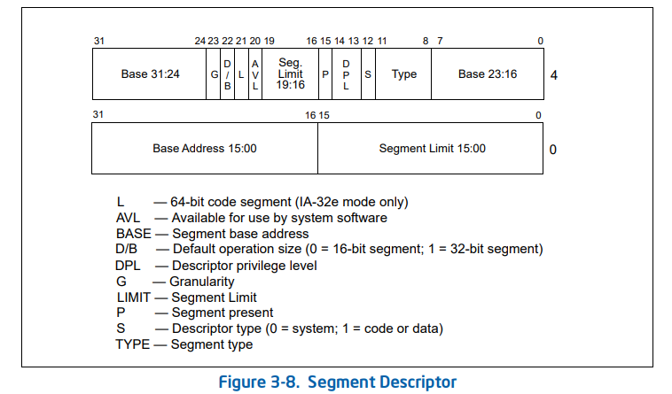
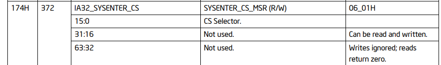
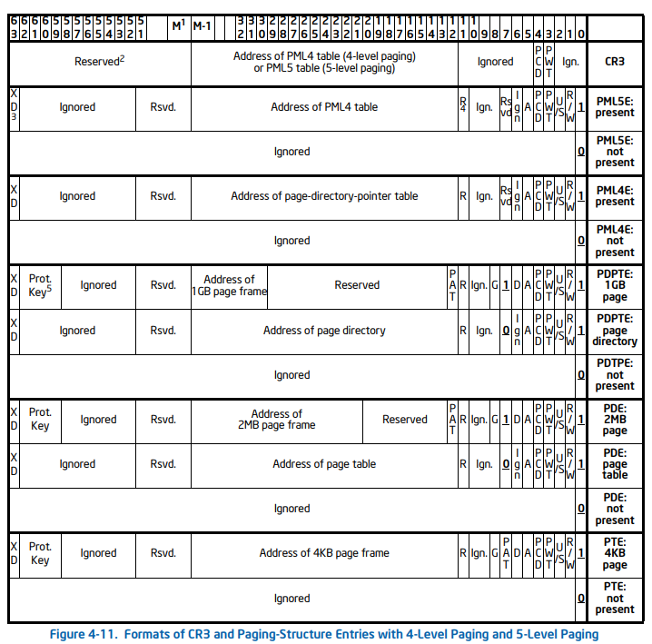
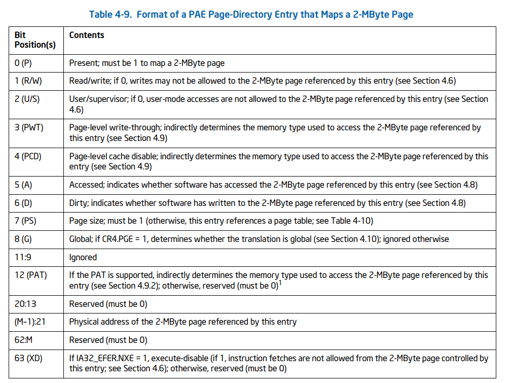
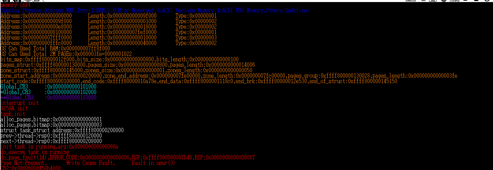
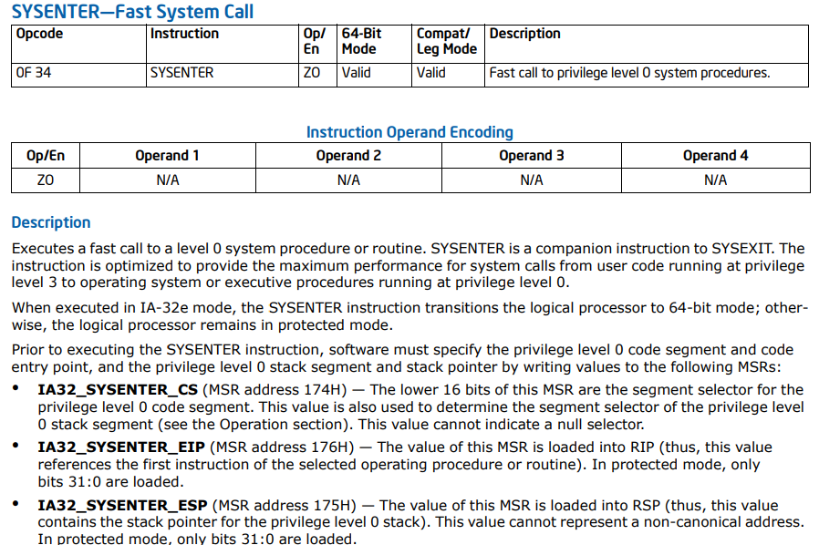
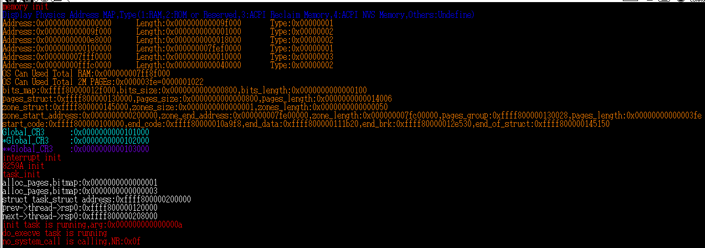
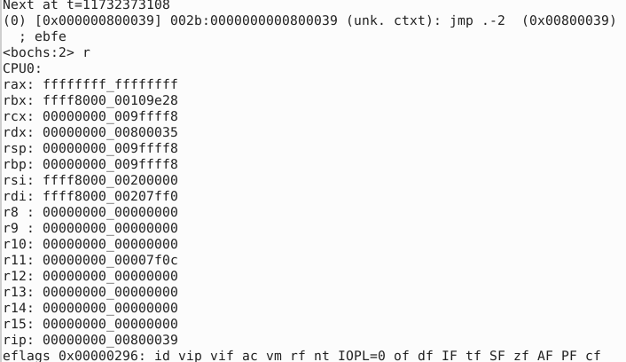
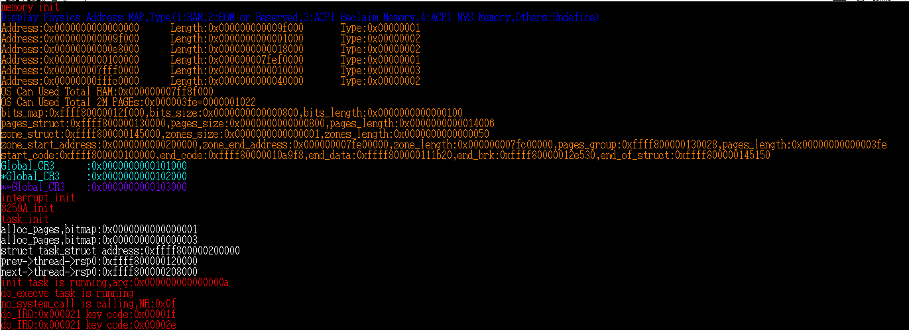
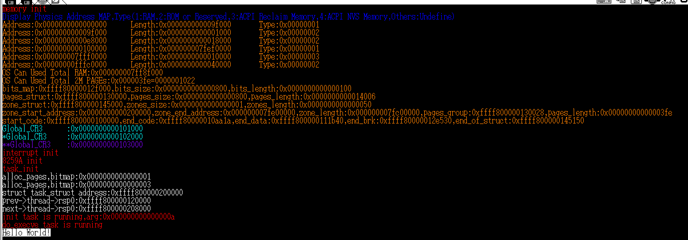

# <<一個64位操作系統的設計與實現>> 第五章 應用層 學習筆記
## 跳轉到應用層
應用層的權級為3這這是最低特權級，這使得他們無法直接的操作硬體設備也不具有配置處理器的能力，因此若想要從核心層前往應用層就必須由作業系統提供目標的程式碼段與資料段和其他跳轉信息。而為了做到這點應用程式會有統一的接口。比如在我們撰寫的c語言程式帶有`int main(){};`。
在這一章節書中先以call與RET在不同權級間的操作開始討論。

以下是書中描述程式借助call gate訪問不同權級的stack切換流程。
>1.檢測目標程式的訪問權限(針對段模式的特權權級進行檢查)。
>2.把SS、ESP、CS、EIP暫存器的值保存在處理器內部，以被調用返回時使用(為程式碼的段選擇子、RIP?)
>3.依目標程式碼的的特權權級，處理器從TSS結構取出段選擇子與stack的基地址，並更新到SS與ESP。
>4.把(2)臨時保存的SS與ESP存入目標程式的stack中
>5.根據門描述符的參數各數，從調用者空間複製參數到目標程式的stack。
>6.將(2)保存的CS、EIP壓入目標程式的stack中。
>7.將門描述符紀錄的目標程式碼段選擇子與程式的起始地址加載到CS與EIP中。
>8.處理器在目標程式碼的特權權級執行程式。

如果是權級相同的程式訪問，處理器不會切換程式的stack因五只有參數、EIP、CS會存入stack中。而對於返回時他的操作順序為
>1.檢測目標程式的訪問權限、同樣檢查段模式的特權權級。
>2.還原調用者的CS與EIP。
>3.如果指令RET帶有操作數n代表將ESP上移n byte來釋放被調用者的stack空間，假設訪問來自call gate，RET n將會同時釋放被調用者的stack空間。
>4.還原調用者的SS與ESP。
>5.如果指令RET帶有操作數n，依照(3)處理。
>6.處理器繼續執行調用者程式。

由於RET類指令的執行速度較慢，intel推出新的指令SYSENTER/SYSEXIT以實現快速的系統調用。SYSENTER/SYSEXIT執行的優點為調用過程中不會將執行數據壓入stack中，如此可以省下訪問內存的時間消耗，並且在跨權級跳轉時不會檢查段描述符。但是SYSENTER只支持權級0到權級3的跳轉，而SYSEXIT僅能從權3跳轉到權級0，兩個指令都不可在同權級或其他權級的之間跳轉。所以這類指令只可以為應用程式係供系統調用，不可以在核心層使用，另外中斷型的系統調用可以在任何權級進行。下圖為intel官方手冊中關於SYSENTER/SYSEXIT指令的描述。


圖片擷取自 Intel® 64 and IA-32 Architectures Software Developer’s Manual Vol.2b
**SYSEXIT**
這是一個用於快速返回權級3的指令，只能執行在權級0下。在執行SYSEXIT指令前，處理器必須提供權級為3的銜接程式與stack空間，這些數據會被保存在MSR暫存器與通用暫存器中。

**IA32_SYSENTER_CS**(MSR暫存器組地址174h處)。一個32位元暫存器，用於索引權級為3的程式碼段選擇子與資料段選擇子。在IA-32e模式下，程式碼的段選擇子為`IA32_SYSENTER_CS[15:0]+32`否則為`IA32_SYSENTER_CS[15:0]+16`而stack的犬則子則是將程式碼段選擇子+8。
**RDX暫存器** 此暫存器保存Canonical型地址(64位元特有地址)，執行指令時會加載到RIP(這是用戶程式的第一條指令)，如果回到非64位模式就只會取前32位。
**RCX暫存器** 保存一個Canonical型地址，紙型指令時加載到RSP中(這是權級3的stack pointer)，同樣的返回32位元模式就會只會取前32位元。

IA32_SYSENTER_CS這個暫存器可以利用RDMSR與WEMSR訪問，執行SYSEXIT時處理器就會從此暫存器中取出CS與SS並加載。但是SYSEXIT執行時並不是透過訪問GDT/LDT來加載CS與SS而是直接寫入固定值，因此這部分須由作業系統保證段描述符的正確性。當操作數為64位元時，值行SYSEXIT指令依然保持64位元，若不是64位元這條指令將進入兼容模式(運行在IA-32e模式下)或是保護模式(32位元模式下)。
```
kernel/entry.S
ENTRY(ret_system_call)						
    movq    %rax,   0x80(%rsp)		 
    popq    %r15				 
    popq    %r14				 	
    popq    %r13				 	
    popq    %r12				 	
    popq    %r11				 	
    popq    %r10				 	
    popq    %r9				 	
    popq    %r8				 	
    popq    %rbx				 	
    popq    %rcx				 	
    popq    %rdx				 	
    popq    %rsi				 	
    popq    %rdi				 	
    popq    %rbp				 	
    popq    %rax				 	
    movq    %rax,   %ds			 
    popq    %rax				 
    movq    %rax,   %es			 
    popq    %rax				 
    addq    $0x38,  %rsp	
    .byte   0x48		 
    SYSEXIT	
```
rax暫存器保存此系統調用的返回值，將這個值保存在rsp+0x80這個位置，最後一個`pop %rax`會恢復這個值，而`addq $0x38, %rsp`則是為了將其他7個參數從stack上彈出以平衡stack指針。在上一章中有提到這種切換行程的操作，考慮到統一因素，涉及儲存或還原現場的操作會與中斷/異常處理相同。這個0x38則是為了將FUNC、ERRCODE、RIP、CS、RFLGS、OLDRSP、OLDSS、從stack上彈出。另外`.byte 0x48`這個前綴則是修飾SYSEXIT指令告訴他現在使用64位元操作數(SYSEXIT默認操作數不是64位元)。另外RCX與RDX分別儲存應用程式的RIP與RSP使用SYSEXIT指令後就會者此兩個暫存器的值放到RIP與RSP中實現跳轉。
IA32_SYSENTER_CS這個暫存器將記錄0級的程式碼段，為了讓SYSEXIT可以索引到目標的段選擇子，我們需要設定GDT的段描述符。下圖為GDT描述符的結構。

我們需要在文件kernel/head.S中增添兩個段描述符分別位於GDT+3與GDT+4的位置。
```
kernel/entry.S
GDT_Table:
    .quad   0x0000000000000000          /*0	NULL descriptor               	00*/
    .quad   0x0020980000000000          /*1	KERNEL  Code    64-bit  Segment	08*/
    .quad   0x0000920000000000          /*2	KERNEL  Data    64-bit  Segment	10*/
    .quad   0x0000000000000000          /*3	USER    Code    32-bit  Segment 18*/
    .quad   0x0000000000000000          /*4	USER    Data    32-bit  Segment 20*/
    .quad   0x0020f80000000000          /*5	USER    Code    64-bit  Segment	28*/
    .quad   0x0000f20000000000          /*6	USER    Data    64-bit  Segment	30*/
    .quad   0x00cf9a000000ffff          /*7	KERNEL  Code    32-bit  Segment	38*/
    .quad   0x00cf92000000ffff          /*8	KERNEL  Data    32-bit  Segment	40*/
    .fill   10,8,0                      /*10 ~ 11 TSS (jmp one segment <9>) in long-mode 128-bit 50*/
```
在這裡新增了32位元的用戶層的程式碼段描述符與資料段描述符，我們把他安插在GDT+3這這個位置。因此所有TSS描述符需要向後順移2個段描述符大小，並且重新調整load_TR所傳入的地址。
```
kernel/entry.S
setup_TSS64:
    ...
    movq    %rax,   80(%rdi)    // 這裡設80而非72是因為對齊(TSS描述符要16byte)
    shrq    $32,    %rdx        // 取TSS描述符地址高32位
    movq    %rdx,   88(%rdi)
    ...
```
在這裡RDI儲存的是GDT_Table的地址，由於TSS描述符和IDT描述符一樣都是16byte，佔據兩個段描述符的大小，考慮到對齊我們必須跳過GDT+9把TSS放置在GDT+10的位置，因此設定`movq %rax, 80(%rdi)`，另外`shrq $32, %rdx`是為了提取TSS描述符地址的高32位元並把他寫到%rdi+88的地址。並修改在kernel/main.c寫入的TSS描述符的位置。
```
kernel/main.c
void Start_Kernel(void)
{
    ...
    load_TR(10);
    ...
}
```
在這裡我們已經完成了從權級0到權級3調轉到應用層的配置，接著我們可以修改do_fork的內容，使得利用系統調用跳轉到應用層時可以使用更快的SYSEXIT指令而非利用較慢的iretq指令。修改kernel/task.c的內容。
```
kernel/task.c
unsigned long do_fork(struct pt_regs *regs, unsigned long clone_flags, unsigned long stack_start, unsigned long stack_size)
{
    ...
    if(!(tsk->flags & PF_KTHREAD))
        thd->rip = regs->rip = (unsigned long)ret_system_call;
    ...
}
```
另外為了啟用SYSEXIT指令，必須在初始化任務時一並加載權級0的程式碼段選擇子到IA32_SYSENTER_CS暫存器，而暫存器在MSR暫存器組的地址0x174處。以下是針對kernel/tasl.c檔案的修改。另外IA32_SYSENTER_CS暫存器要寫入的值只有前16位有作用其他位必須為0，這是因為GDT描述符最多可以有8192個並且段描述符大小為8byte(8192*8=2^16)。

```
kernel/task.c
 void task_init()
{
    ...
    wrmsr(0x174,KERNEL_CS); // KERNEL_CS = 0x8表示載入第一個GDT描述符。
    ...
}

```
函式wrmsr必須以內嵌組合語言書寫，這是因為C語言無法直接讀寫暫存器。
```
kernel/lib.c
static inline void wrmsr(unsigned long address,unsigned long value)
{
    __asm__ __volatile__("wrmsr	\n\t"::"d"(value >> 32),"a"(value & 0xffffffff),"c"(address):"memory");	
}
```
接著我們修改init核心執行緒。
```
kernel/task.c
unsigned long init(unsigned long arg)
{
    struct pt_regs *regs;
    color_printk(RED,BLACK, "init task is running,arg:%#018lx\n", arg);
    current->thread->rip = (unsigned long)ret_system_call;
    current->thread->rsp = (unsigned long)current + STACK_SIZE - sizeof(struct pt_regs);
    regs = (struct pt_regs*)current->thread->rsp;
    __asm__ __volatile__ ( "movq    %1, %%rsp   \n\t"
                           "pushq   %2          \n\t"
                           "jmp     do_execve   \n\t"
                           ::"D"(regs),"m"(current->thread->rsp),"m"(current->thread->rip):"memory");
    return 1;
}
```
由於我們要使用SYSEXIT函式完成核心層到應用層的切換，因此不可以在核心層執行系統調用api(只可以0級到3級)，如果要調用這些api就必須直接調用這些api的處理函式，方法就是直接使用組合語言跳轉到對應的函式標籤上。
首先必須確定調用函數intit的地址和stack pointer，並取得行程的struct pt_regs結構體。接著利用指令PUSH將返回地址RIP壓入stack中，並透過指令`jmp do_execve`跳轉並為應用層的目標程式準備執行環境，同時將struct pt_regs結構體傳遞給do_execve函式。
```
kernel/task.c
unsigned long do_execve(struct pt_regs *regs)
{
    regs->rdx = 0x800000; //RIP
    regs->rcx = 0xa00000; //RSP
    regs->rax = 1;	
    regs->ds = 0;
    regs->es = 0;
    color_printk(RED,BLACK,"do_execve task is running\n");
    memcpy(user_level_function,(void *)0x800000,1024); // 定義與string.h的函式有區別，為memcpy(src,dst,size);
    return 0;
}
```
在init函式中定義`regs = (struct pt_regs*)current->thread->rsp;`，因此struct pt_regs結構體實際上是占據stack頂端的位置，透過do_execve函式設定struct pt_regs結構體，後續執行ret_system_call時就可以把struct pt_regs結構體恢復到對應的暫存器中。而設定RDX與RCX是因為SYSEXIT指令會從RDX暫存器中取出RIP作為應用程式的入口地址，並從rcx暫存器中取出rsp。memcpy則是將應用程式複製到rip的位置上。當執行SYSEXIT指令讓處理器切換到應用層時就會執行0x8000000的目標函式user_level_function。另外由於這裡我們設定RIP為0x800000與RSP為0xa00000，所以我們需要頁表中加入此兩個線性地址所對應的頁(在loader中開啟了IA-32e模式，所有的地址都是線性地址需要經過頁表映射處理)。由於我們尚未撰寫頁表分配的程式，這裡將直接寫入物理地址與線性地址的映射關係代替。
```
kernel/head.S
__PDPTE:
    
    .quad   0x103007    /* 0x103003 */
    .fill   511,8,0
...

__PDE:

    .quad   0x000087
    .quad   0x200087
    .quad   0x400087
    .quad   0x600087
    .quad   0x800087        /* 0x800083 */
    .quad   0xe0000087      /*0x a00000*/
    .quad   0xe0200087
    .quad   0xe0400087
    .quad   0xe0600087      /*0x1000000*/
    .quad   0xe0800087
    .quad   0xe0a00087
    .quad   0xe0c00087
    .quad   0xe0e00087
    .fill   499,8,0
```
下圖為Intel 64 and IA-32 Architectures
Software Developer’s Manual vol.3a對於頁的描述


根據書上所提供的資訊，如果我們想讓應用層的程式可以執行而不發生page fault就必須為應用程式的程式碼段與資料段的物理頁提應用層的權限，必須置位bit position=2的位元。

如果實際執行程式你會發現畫面的最後一樣彈出一個異常。這是因為在函式do_execve中，我們僅僅是粗暴的把執行函式user_level_function搬運到地址0x800000。反組譯user_level_function的結果如下所示。
```
ffff800000109b3b <user_level_function>:
...
ffff800000100166:	e8 81 45 00 00  call   ffff8000001046ec <color_printk>
...
```
由於這條指令是相對跳轉，我們將用戶程式碼複製到0x800000，而在這裡call指令是相對地址跳轉，使得程式發生錯誤。

## 實現系統調用api
在這一節會補衝系統調用api的主體框架。以SYSENTER指令完成應用層到核心層的跳轉。

圖片擷取自 Intel® 64 and IA-32 Architectures Software Developer’s Manual Vol.2b

**IA32_SYSENTER_CS**:位於MSR暫存器組的174h處，此暫存器低16位元將加載0特權級別的程式碼段選擇子，也用於索引0特權級別資料段選擇子。(IA32_SYSENTER_CS[15:0]+8)。(CS與SS對應的GDT描述符是相鄰的)。
**IA32_SYSENTER_ESP**:位於MSR暫存器組的175h處，這個值將被載入RSP中，地址必須為是Canonical型地址，在保護模式下只取前32位元。
**IA32_SYSENTER_EIP**:位於MSR暫存器組的176h處，這個值將被載入RIP中，地址必須為是Canonical型地址，在保護模式下只取前32位元。

執行SYSENTER/SYSEXIT指令時，必須依照以下規則。
> 1.指令需要的描述符表必須是相鄰的，因為IA32_SYSENTER_CS與IA32_SYSEXIT_CS需負責程式碼段與資料段的加載功能。
> 2.執行SYSENTER指令到核心層時，必須自主保存程式的運行環境(尤其是rsp與rip)，因為SYSENTER不會保存用戶態信息。

```
ENTRY(system_call)
    subq    $0x38,  %rsp;
    cld;

    pushq   %rax;
    movq    %es,    %rax;
    pushq   %rax;
    movq    %ds,    %rax;
    pushq   %rax;
    xorq    %rax,   %rax;
    pushq   %rbp;
    pushq   %rdi;
    pushq   %rsi;
    pushq   %rdx;
    pushq   %rcx;
    pushq   %rbx;
    pushq   %r8;
    pushq   %r9;
    pushq   %r10;
    pushq   %r11;
    pushq   %r12;
    pushq   %r13;
    pushq   %r14;
    pushq   %r15;
    movq    $0x10,	%rdx;
    movq    %rdx,	%ds;
    movq    %rdx,	%es;
    movq    %rsp,	%rdi

    callq   system_call_function
```
system_call是系統調用api的街口模塊，他執行執行從應用層到核心層跳轉的前置環境準備工作，接著調用system_call_function。而傳入ystem_call_function的參數分別為核心的資料段選擇子與rsp(struct pt_regs的地址)。至於為什麼在函式的開頭需要執行CLD清楚EFLAGS的方向標誌位，我認為有可能是因為系統調用有可能會使用一些LODSB這類的的字符串操作指令，所以先清除方向標誌為避免不正確的內存操作，屬於一種防禦性編程。
```
kernel/task.c
unsigned long system_call_function(struct pt_regs *regs)
{
    return system_call_table[regs->rax](regs);
}
```
```
kernel/task.h

#define MAX_SYSTEM_CALL_NR 128

typedef unsigned long (*system_call_t)(struct pt_regs *regs);
// system_call_t的_t代表這是經過typedef的型別。

unsigned long no_system_call(struct pt_regs *regs)
{
    color_printk(RED, BLACK, "no_system_call is calling,NR:%#04x\n", regs->rax);
    return -1;
}

system_call_t system_call_table[MAX_SYSTEM_CALL_NR] = {
    [0 ... MAX_SYSTEM_CALL_NR - 1] = no_system_call
};
```
在這裡定義系統調用的最大數量為128個。並且系統調用將透過system_call_table管理，由於目前尚未實作系統調用所以先設為no_system_call。透過`system_call_table[regs->rax](regs)`呼叫系統調用，其中regs->rax將紀錄使用的api向量號。
由於SYSENTER與SYSEXIT在執行系統調用將會配對出現，因此SYSEXIT指令的RCX(用戶程式的RIP)與RDX(用戶程式的RSP)兩個參數必須在執行SYSENTER前就保存在這兩個暫存器內。
```
kernel/task.c
void user_level_function()
{
    long ret = 0;
    //color_printk(RED,BLACK,"user_level_function task is running\n");
    __asm__ __volatile__ (
                    "leaq   sysexit_return_address(%%rip),  %%rdx   \n\t"
                    "movq   %%rsp,  %%rcx       \n\t"
                    "sysenter                   \n\t"
                    "sysexit_return_address:    \n\t"
                    :"=a"(ret):"0"(15):"memory");
    while(1);
}
```
在這段程式碼中首先透過LEA指令取得標幟符sysexit_return_address的地址並保存到RDX暫存器，接著將RSP保存至RCX暫存器。這兩個暫存器提供了後續執行SYSEXIT的返回條件。SYSENTER可透過儲存在IA32_SYSENTER_EIP的地址跳轉報標幟符system_call中，接著保存系統環境後將執行system_call_function已完成系統調用。

上圖為程式的執行結果，系統確實可完成系統調用。

觀察程式的執行地址為0x800039，這表示我們確實成功返回應用層的程式了。另外在intel官方手冊有提到SYSENTER指令在操作過程中會復位RFLAGS的IF標幟位，因此在處理器進到核心後必須手動置位IF標幟位使得中斷可以發生。
```
kernel/head.S
ENTRY(system_call)
    sti;
    ...
```

加上STI指令後又可以響應中斷了。

## 實現一個系統調用函式
```
kernel/task.h
unsigned long sys_printf(struct pt_regs *regs)
{
    color_printk(BLACK, WHITE, (char*)regs->rdi);
    return 1;    
}

system_call_t system_call_table[MAX_SYSTEM_CALL_NR] = {
    [0] = no_system_call,
    [1] = sys_printf,
    [2 ... MAX_SYSTEM_CALL_NR - 1] = no_system_call
};
```
這段程式建立系統調用函式sys_printf，並把他放在向量號1，內部封裝了函式color_printk，並利用RDI傳遞字符串。
```
kernel/task.c
void user_level_function()
{
    long ret = 0;
    char string[]="Hello World!\n";
    __asm__ __volatile__ (
                    "leaq   sysexit_return_address(%%rip),  %%rdx   \n\t"
                    "movq   %%rsp,  %%rcx       \n\t"
                    "sysenter                   \n\t"
                    "sysexit_return_address:    \n\t"
                    :"=a"(ret):"0"(1),"D"(string):"memory");
    while(1);
}
```

這樣就可以成功打印信息了。