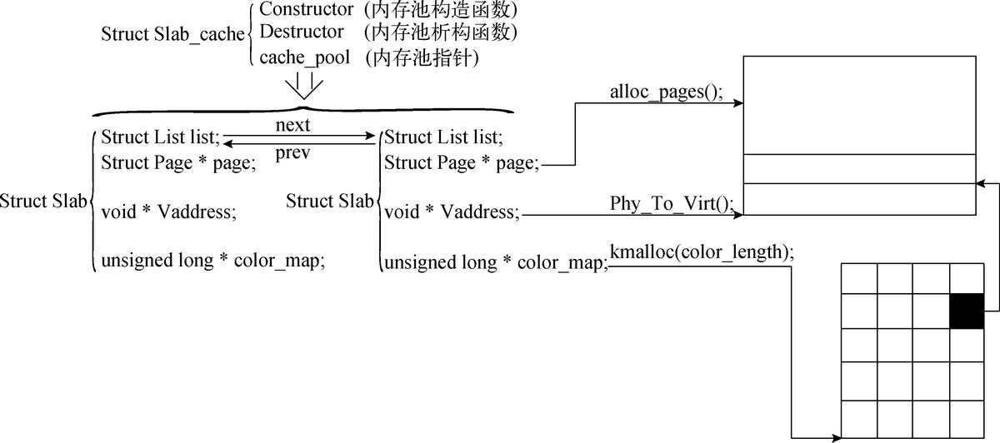
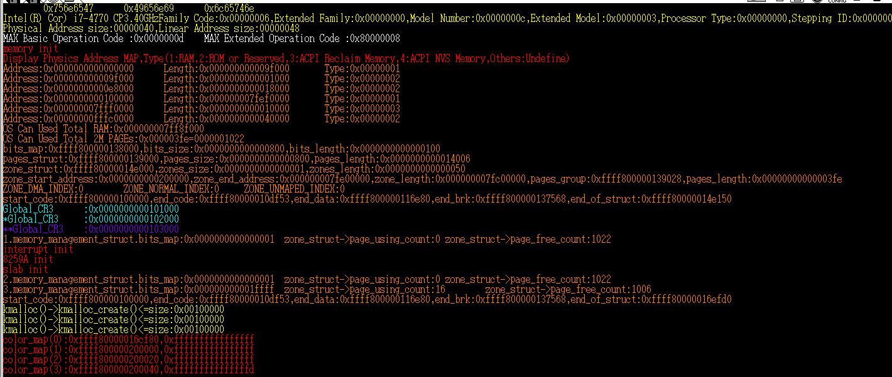
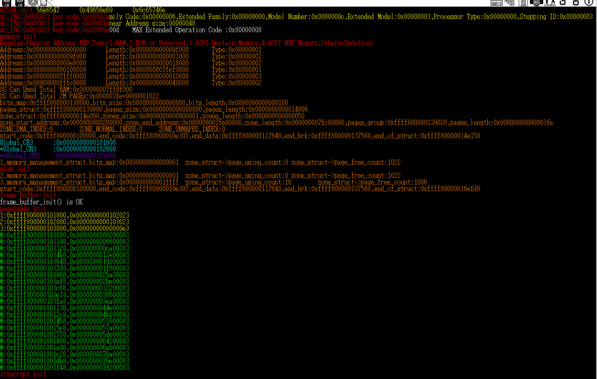

# <<一個64位操作系統的設計與實現>> 第九章 高級內存管理單元 學習筆記
在這一章完我們將完善內存分配和頁表初始化等功能，並借助SLAB分配器完成動態內存的分配器，以此解決程式長時間運行後內存破碎化的問題。
## SLAB內存池

圖一、SLAB內存池結構 圖片取自 <<一個64位操作系統的設計與實現>>
```
kernel/memory.h
struct Slab_cache {
    unsigned long size;
    unsigned long total_using;
    unsigned long total_free;
    struct Slab *cache_pool;
    struct Slab *cache_dma_pool;
    void *(*constructor)(void *Vaddress, unsigned long arg);
    void *(*destructor)(void *Vaddress, unsigned long arg);
}
```
首先我們設計一個全局的結構體Slab_cache用於管理固定尺寸內存塊的分配與回收。當調用內存分配函式時，函示將根據申請內存大小去匹配Slab_cache中的size成員，決定最後申請的內存由哪一個Slab_cache所管理。而constructor與destructor則分別對應內存對象的建立函式與銷毀函式。
```
kernel/memory.h
struct Slab {
    struct List list;
    struct Page *page;
    unsigned long using_count;
    unsigned long free_count;

    void *Vaddress;

    unsigned long color_length;
    unsigned long color_count;

    unsigned long *color_map;
};

```
這是結構體Slab的定義其中`struct List list`用於將size相同的Slab串接並交由Slab_cache管理。成員`struct Page *page`則表示這一個Slab的內存的來源。另外一個page的大小往往可以劃分成很多的固定尺寸內存塊，所以using_count與free_count用於表示有多少劃分出的內存塊被使用或閒置，color_map則用於表示內存塊的使用狀態。比如一個頁的內存大小為2MB，而當前Slab對應的size為1KB，因此這個Slab將對應2048個內存塊，color_map將對應這2048個內存塊的使用狀況。而成員Vaddress則用於紀錄當前頁對應的虛擬地址。
**SLAB內存池的建立**
```
kernel/memory.c
struct Slab_cache *slab_create(unsigned long size, void *(*constructor)(void *Vaddress, unsigned long arg) 
                              , void *(*destructor)(void *Vaddress, unsigned long arg), unsigned long arg)
{
    struct Slab_cache *slab_cache = NULL;
    slab_cache = (struct Slab_cache*)kmalloc(sizeof(struct Slab_cache), 0);
    if (slab_cache == NULL) {
        color_printk(RED, BLACK, "slab_create()->kmalloc()=>slab_cache == NULL\n");
        return NULL;
    }
    memset(slab_cache, 0, sizeof(struct Slab_cache));

    slab_cache->size = SIZEOF_LONG_ALIGN(size);
    slab_cache->total_using = 0;
    slab_cache->total_free = 0;
    slab_cache->cache_pool = (struct Slab*)kmalloc(sizeof(struct Slab), 0);
    if (slab_cache->cache_pool == NULL) {
        color_printk(RED, BLACK, "slab_create()->kmalloc()=>slab_cache->cache_pool == NULL\n");
        kfree(slab_cache);
        return NULL;
    }
    memset(slab_cache->cache_pool, 0, sizeof(struct Slab_cache));
    slab_cache->cache_dma_pool = NULL;
    slab_cache->constructor = constructor;
    slab_cache->destructor = destructor;
    list_init(&slab_cache->cache_pool->list);

    slab_cache->cache_pool->page = alloc_pages(ZONE_NORMAL, 1, 0); // 給cache_pool分配大小為2MB的頁

    if (slab_cache->cache_pool->page == NULL) {
        color_printk(RED, BLACK, "slab_create()->alloc_pages()=>slab_cache->cache_pool->page == NULL\n");
        kfree(slab_cache->cache_pool);
        kfree(slab_cache);
        return NULL;        
    }

    page_init(slab_cache->cache_pool->page, PG_Kernel); // 設置物理頁的屬性

    slab_cache->cache_pool->using_count = 0;
    slab_cache->cache_pool->free_count = PAGE_2M_SIZE / slab_cache->size; // 當前頁可使用的內存塊數量
    slab_cache->total_free = slab_cache->cache_pool->free_count; // 所有快取池的可用內存塊數量
    slab_cache->cache_pool->Vaddress = Phy_To_Virt(slab_cache->cache_pool->page->PHY_address);
    slab_cache->cache_pool->color_count = slab_cache->cache_pool->free_count;
    slab_cache->cache_pool->color_length = ((slab_cache->cache_pool->color_count + sizeof(unsigned long) * 8 - 1) >> 6) << 3;
    /** 
     * 上面的color_length用於計算需要多少空間才可以表示color_map。
     * sizeof(unsigned long) * 8 - 1用於讓color_map上對齊。
     * >>6是因為unsigned long有64位元，<<3則是因為unsigned long佔據8byte。
     */
    slab_cache->cache_pool->color_map = (unsigned long*)kmalloc(slab_cache->cache_pool->color_length, 0);

    if (slab_cache->cache_pool->color_map == NULL) {
        color_printk(RED, BLACK, "slab_create()->kmalloc()=>slab_cache->cache_pool->color_map == NULL\n");
        free_pages(slab_cache->cache_pool->page, 1);
        kfree(slab_cache->cache_pool);
        kfree(slab_cache);
        return NULL;        
    }

    memset(slab_cache->cache_pool->color_map, 0, slab_cache->cache_pool->color_length);
    return slab_cache;
}
```
以上為SLAB内存池的建立過程，在初始化的過程中將預先分配一個頁空間給slab，並將這個slab分配給cache_pool。這種做法可以讓每次向slab申請內存，省去判斷cache_pool是否為空與減少分配過程的程式碼量。

**SLAB內存池對象的銷毀**
```
kernel/memory.c
unsigned long slab_destory(struct Slab_cache *slab_cache)
{
    struct Slab *slab_p = slab_cache->cache_pool;
    struct Slab *tmp_slab = NULL;
    if (slab_cache->total_using) { // 有正在使用的內存塊不能回收。
        color_printk(RED, BLACK, "slab_cache->total_using != 0\n");
        return 0;
    }

    while (!list_is_empty(&slab_p->list)) {
        // 逐個刪除list元素直到元素為空。
        tmp_slab = slab_p;
        slab_p = container_of(list_next(&slab_p->list), struct Slab, list);
        list_del(&tmp_slab->list);
        kfree(tmp_slab->color_map);
        page_clean(tmp_slab->page);
        kfree(tmp_slab);
    }

    kfree(slab_p->color_map);
    page_clean(slab_p->page);
    free_pages(slab_p->page, 1);
    kfree(slab_p);
    kfree(slab_cache);
    return 1;

}
```
這一部分就是slab_cache的回收，只有當slab_cache管理的slab全部被釋放時，slab_cache才會被回收。

**SLAB內存池對象的建立**
```
kernel/memory.c
void *slab_malloc(struct Slab_cache *slab_cache, unsigned long arg)
{
    struct Slab *slab_p = slab_cache->cache_pool;
    struct Slab *tmp_slab = NULL;
    int j = 0;

    // 這一段程式碼用於在slab_cache內存池中查找上未使用的內存塊並返回此內存塊。
    if (slab_cache->total_free == 0) {
        // 所有的內存塊被使用完畢，需分配新的頁以填充內存塊。
        tmp_slab = (struct Slab*)kmalloc(sizeof(struct Slab), 0);
        if (tmp_slab == NULL) {
            color_printk(RED, BLACK, "slab_malloc()->kmalloc()=>tmp_slab == NULL\n");
            return NULL;          
        }

        memset(tmp_slab, 0, sizeof(struct Slab));
        list_init(&tmp_slab->list);

        tmp_slab->page = alloc_pages(ZONE_NORMAL, 1, 0); // 分配新的頁
        if (tmp_slab->page = NULL) {
            color_printk(RED, BLACK, "slab_malloc()->alloc_pages()=>tmp_slab->page == NULL\n");
            kfree(tmp_slab);
            return NULL;            
        }
        page_init(tmp_slab->page, PG_Kernel); // 設定頁的屬性。

        tmp_slab->using_count = 0;
        tmp_slab->free_count = PAGE_2M_SIZE / slab_cache->size;
        tmp_slab->Vaddress = Phy_To_Virt(tmp_slab->page->PHY_address);
        
        tmp_slab->color_count = tmp_slab->free_count;
        tmp_slab->color_length = (tmp_slab->color_count + sizeof(unsigned long) * 8 - 1 >> 6) << 3;
        tmp_slab->color_map = (unsigned long*)kmalloc(tmp_slab->color_length, 0);

        if (tmp_slab->color_map == NULL) {
            color_printk(RED, BLACK, "slab_malloc()->kmalloc()=>tmp_slab->color_map == NULL\n");
            free_pages(tmp_slab->page, 1);
            kfree(tmp_slab);
            return NULL;            
        }
        memset(tmp_slab->color_map, 0, tmp_slab->color_length); // 將color_map代表的內存塊設為閒置狀態。
        list_add_to_behind(&slab_cache->cache_pool->list, &tmp_slab->list); // 將tmp_slab插入cache_pool中統一管理。
        slab_cache->total_free += tmp_slab->color_count; // 更新slab_cache可用內存塊數量。

        for (j = 0; j < tmp_slab->color_count; ++j) {
            // 遍歷所有的內存塊，直至找到第1個閒置的內存塊。由於tmp_slab分配的是新的頁所以只會遍歷到j=0的內存塊而已。
            if( (*(tmp_slab->color_map + (j >> 6)) & (1UL << (j % 64))) == 0) {
                *(tmp_slab->color_map + (j >> 6)) |= 1UL << (j % 64);

                tmp_slab->using_count++;
                tmp_slab->free_count--;

                slab_cache->total_using++;
                slab_cache->total_free--;
                
                if (slab_cache->constructor) {
                    return slab_cache->constructor((char *)tmp_slab->Vaddress + slab_cache->size * j, arg);
                } else { // 沒有slab建構函式的情況。
                    return (void *)((char*)tmp_slab->Vaddress + slab_cache->size * j);
                }		
            }
        }           
    } else {
        // 這裡是cache_pool中有閒置未使用的內存塊的情況。
        do { // 把cache_pool中所有的slab都掃過一次，直到找到空閒的內存塊。
            if (slab_p->free_count == 0) { // 當前slab沒有足夠空間，換找下一個。
                slab_p = container_of(list_next(&slab_p->list), struct Slab, list);
                continue;
            }

            for (j = 0; j < slab_p->color_count; ++j) {
                if (*(slab_p->color_map + (j >> 6)) == 0xffffffffffffffffUL) { // 檢查color_map的第j >> 6項是否存在閒置內存塊。
                    j += 63;
                    continue;
                }
            }

            if ((*(slab_p->color_map + (j >> 6)) & (1UL << (j % 64))) == 0) {
                // slab_p所管理的第j個內存塊閒置。
                *(slab_p->color_map + (j >> 6)) |= 1UL << (j % 64);
                slab_p->using_count++;
                slab_p->free_count--;

                slab_cache->total_using++;
                slab_cache->total_free--;

                if (slab_cache->constructor) {
                    return slab_cache->constructor((char*)slab_p->Vaddress + slab_cache->size * j,arg);
                } else {
                    return (void*)((char*)slab_p->Vaddress + slab_cache->size * j);
                }
            }
        } while (slab_p != slab_cache->cache_pool);
    }

    color_printk(RED, BLACK, "slab_malloc() ERROR: can`t alloc\n");

    if (tmp_slab) {
        list_del(&tmp_slab->list);
        kfree(tmp_slab->color_map);
        page_clean(tmp_slab->page);
        free_pages(tmp_slab->page, 1);
        kfree(tmp_slab);        
    }
    return NULL;
}
```
slab_malloc函式實際上就是從slab_cache中查找是否存在一塊閒置的內存塊，如果有就返回他如果無則回報錯誤。函式的第一部分`if (slab_cache->total_free == 0)`用於檢查slab_cache是否有剩餘的內存塊，若無閒置內存塊則建立slab結構並呼叫`alloc_pages`新增一個2MB的頁。並將結構體插入slab_cache->cache_pool中交由slab_cache管理。
若slab_cache存在閒置內存塊就從cache_pool的第一個slab開始走訪，直到找到閒置的內存塊並分配他。另外如果slab_cache具有自定義的構造函式constructor，就會使用這個函式將分配的內徂對項初始化。完成初始化後內存池就會把這個對象的虛擬地址返回給調用者，如果slab_cache沒有定義constructor則直接返回虛擬地址給調用者。

**SLAB內存池對象的回收**

```
unsigned long slab_free(struct Slab_cache *slab_cache, void *address, unsigned long arg)
{
    struct Slab *slab_p = slab_cache->cache_pool;
    int index = 0;
    do { // 走訪cache_pool的所有元素，直到找到紀錄著待釋放內存塊的slab。
        if (slab_p->Vaddress <= address && address < slab_p->Vaddress + PAGE_2M_SIZE) {
            index = (address - slab_p->Vaddress) / slab_cache->size; // 檢索釋放內存塊對應的color_map的哪個bit。
            *(slab_p->color_map + (index >> 6)) ^= 1UL << index % 64;
            slab_p->free_count++;
            slab_p->using_count--;

            slab_cache->total_free++;
            slab_cache->total_using--;

            if (slab_cache->destructor) { // 如果存在內存對象的解構函式
                slab_cache->destructor((char*)slab_p->Vaddress + slab_cache->size * index, arg);
            }

            if ((slab_p->using_count == 0) && (slab_cache->total_free >= slab_p->color_count * 3 / 2)) {
                // 判斷目前的slab是否要回收，如果剩餘內存塊數量大於1.5 slab所具有的數量，則回收當前的slab。
                list_del(&slab_p->list);
                slab_cache->total_free -= slab_p->color_count;
                kfree(slab_p->color_map);
                page_clean(slab_p->page);
                free_pages(slab_p->page, 1);
                kfree(slab_p);
            }
            return 1;
        } else {
            slab_p = container_of(list_next(&slab_p->list),struct Slab,list);
            continue;
            // 如果用for (; slab_p != slab_cache->cache_pool; slab_p = container_of(list_next(&slab_p->list),struct Slab,list)) 可以少一層嵌套。
        }
    } while (slab_p != slab_cache->cache_pool);

    color_printk(RED, BLACK, "slab_free() ERROR: address not in slab\n");
    return 0;
}
```
在這段程式中將由調用者傳入的虛擬地址address來判斷它是由哪個struct Slab所管理。走訪cache_pool後將目標slab找出並執行此內存對象的回收工作。整個回收過程將依照以下順序執行。
>1.復位color_map，表示此內存對象為閒置。
>2.調整內存池的計數器，如total_using、total_free、using_count、free_count。
>3.檢查是存在自定義destructor函式，若有就調用他。
>4.如果當前slab所有內存塊都為閒置狀態，且內存池的閒置內存塊超過1.5個slab的內存塊數量，就釋放當前slab可降低內存使用率。

## 基於slab內存池技術的通用內存管理單元。
核心層的通用內存管理單元主要負責對驅動程式、文件系統、行程管理單元、數據協議包等模組提供可用內存空間。核心層的內存管理單元必須保證，個個模組經過長時間使用、頻繁的申請與釋放後，仍可以保持整個內存空間的平坦性、連續性，並保持穩定的內存分配與回收速度。
在這裡我們將實現給核心層使用kmalloc與kfree函式，這兩個函式是依照上一節的slab實現，但兩個函式所使用的內存式預先手動申請好的全局便量，以下為此全局變量的定義。
```
kernel/memory.c
struct Slab_cache kmalloc_cache_size[16] = {
    {1 << 5 , 0, 0, NULL, NULL, NULL, NULL},
    {1 << 6 , 0, 0, NULL, NULL, NULL, NULL},
    {1 << 7 , 0, 0, NULL, NULL, NULL, NULL},
    {1 << 8 , 0, 0, NULL, NULL, NULL, NULL},
    {1 << 9 , 0, 0, NULL, NULL, NULL, NULL},
    {1 << 10, 0, 0, NULL, NULL, NULL, NULL}, //1KB
    {1 << 11, 0, 0, NULL, NULL, NULL, NULL},
    {1 << 12, 0, 0, NULL, NULL, NULL, NULL}, //4KB
    {1 << 13, 0, 0, NULL, NULL, NULL, NULL},
    {1 << 14, 0, 0, NULL, NULL, NULL, NULL},
    {1 << 15, 0, 0, NULL, NULL, NULL, NULL},
    {1 << 16, 0, 0, NULL, NULL, NULL, NULL}, //64KB
    {1 << 17, 0, 0, NULL, NULL, NULL, NULL}, //128KB
    {1 << 18, 0, 0, NULL, NULL, NULL, NULL},
    {1 << 19, 0, 0, NULL, NULL, NULL, NULL},
    {1 << 20, 0, 0, NULL, NULL, NULL, NULL}, //1MB
};
```
這個全局內存池組包含16個獨立內存池，分別代表內存塊尺寸為$2^5 - 2^{20}$byte的slab內存池。在標頭檔中這個全局變量僅定義尺寸，其他的成員將在函式slab_init被初始化。

```
kernel/memory.c
/**
 * @brief 初始化16個固定大小slab_cache內存池，內存池的尺寸分布為32byte-1MB，並各自分配2MB的頁空間，函是kmalloc、kfree的內存將從這申請與釋放 
 */
unsigned long slab_init()
{
    struct Page *page = NULL;
    unsigned long *virtual = NULL; // get a free page and set to empty page table and return the virtual address
    unsigned long i, j;
    unsigned long tmp_address = memory_management_struct.end_of_struct;
    
    // 為16個Slab_cache分配Slab
    for (i = 0; i < 16; ++i) {
        // memory_management_struct.end_of_struct是一個線性變動地址，它代表了目前可用區域的起始線性地址，他會在後續的程式碼中一直被更動。
        kmalloc_cache_size[i].cache_pool = (struct Slab*)memory_management_struct.end_of_struct; // 定義結構體struct Slab的地址。
        memory_management_struct.end_of_struct += sizeof(struct Slab) + sizeof(long) * 10;
        // 這裡預保留sizeof(long) * 10的空間是為了防止訪問越界造成錯誤。
        list_init(&kmalloc_cache_size[i].cache_pool->list); // 初始化list。

        // 填入struct Slab的一些常數包括內存塊使用數量與閒置數量，有多少內存塊與表示所有內存塊狀態的數組。
        kmalloc_cache_size[i].cache_pool->using_count = 0;
        kmalloc_cache_size[i].cache_pool->free_count = PAGE_2M_SIZE / kmalloc_cache_size[i].size; // 內存塊數量

        kmalloc_cache_size[i].cache_pool->color_length = ((PAGE_2M_SIZE / kmalloc_cache_size->size) + sizeof(unsigned long) * 8 - 1 >> 6) << 3; 
        kmalloc_cache_size[i].cache_pool->color_count = kmalloc_cache_size[i].cache_pool->free_count;
        kmalloc_cache_size[i].cache_pool->color_map = (unsigned long*)memory_management_struct.end_of_struct; // 表示所有內存塊狀態。
        
        memory_management_struct.end_of_struct += (unsigned long)(kmalloc_cache_size[i].cache_pool->color_length + sizeof(long) * 10) & (~ (sizeof(long) - 1));

        memset(kmalloc_cache_size[i].cache_pool->color_map,0xff,kmalloc_cache_size[i].cache_pool->color_length); // 把所有狀態內存塊設為1。
        for (j = 0; j < kmalloc_cache_size[i].cache_pool->color_count; ++j) {
            // 存在的內存塊設為0，表示閒置可以使用。
            *(kmalloc_cache_size[i].cache_pool->color_map + (j >> 6)) ^= 1UL << j % 64; // >> 6是因為color_map一項為64位元。
        }
        kmalloc_cache_size[i].total_free = kmalloc_cache_size[i].cache_pool->color_count;
        kmalloc_cache_size[i].total_using = 0;
    }
    
    // init page for kernel code and memory management struct
    i = Virt_To_Phy(memory_management_struct.end_of_struct) >> PAGE_2M_SHIFT;
    for (j = PAGE_2M_ALIGN(Virt_To_Phy(tmp_address)) >> PAGE_2M_SHIFT; j <= i; ++j) {
        // PAGE_2M_ALIGN將以地址的上邊界對齊。j <= i的比較可以標示出那些已經使用而尚未記錄的頁。
        page = memory_management_struct.end_of_struct + j;
        *(memory_management_struct.bits_map + ((page->PHY_address >> PAGE_2M_SHIFT) >> 6)) |= 1UL << (page->PHY_address >> PAGE_2M_SHIFT) % 64;
        page->zones_struct->page_using_count++;
        page->zones_struct->page_free_count--;
        page_init(page, PG_PTable_Maped | PG_Kernel_Init | PG_Kernel);
    }
    color_printk(ORANGE ,BLACK, "2.memory_management_struct.bits_map:%#018lx\tzones_struct->page_using_count:%d\tzones_struct->page_free_count:%d\n"
                , *memory_management_struct.bits_map, memory_management_struct.zones_struct->page_using_count, memory_management_struct.zones_struct->page_free_count);

    for (i = 0; i < 16; ++i) {
        // 連續分配16個頁給內存池。
        virtual = (unsigned long*)((memory_management_struct.end_of_struct + PAGE_2M_SIZE * i + PAGE_2M_SIZE - 1) & PAGE_2M_MASK);
        // 上對齊確保分配給變數virtual的必定為新的頁。
        page = Virt_To_2M_Page(virtual); // 根據線性地址virtual轉換成相對於pages_struct的地址。
        *(memory_management_struct.bits_map + ((page->PHY_address >> PAGE_2M_SHIFT) >> 6)) |= 1UL << (page->PHY_address >> PAGE_2M_SHIFT) % 64;
        page->zones_struct->page_using_count++;
        page->zones_struct->page_free_count--;

        // 初始化頁的狀態。
        page_init(page, PG_PTable_Maped | PG_Kernel_Init | PG_Kernel);
        kmalloc_cache_size[i].cache_pool->page = page;
        kmalloc_cache_size[i].cache_pool->Vaddress = virtual;
    }
	color_printk(ORANGE, BLACK,"3.memory_management_struct.bits_map:%#018lx\tzone_struct->page_using_count:%d\tzone_struct->page_free_count:%d\n",
                 *memory_management_struct.bits_map, memory_management_struct.zones_struct->page_using_count, memory_management_struct.zones_struct->page_free_count);
	color_printk(ORANGE, BLACK,"start_code:%#018lx,end_code:%#018lx,end_data:%#018lx,end_brk:%#018lx,end_of_struct:%#018lx\n"
                , memory_management_struct.start_code, memory_management_struct.end_code, memory_management_struct.end_data
                , memory_management_struct.end_brk, memory_management_struct.end_of_struct);
	return 1;
}

```
此函式用於初始化kmalloc_cache_size的16個內存池，並且提供16個內存池各2MB的頁空間，提供kmalloc、kfree做內存申請與釋放，另外此空間僅提供核心層使用，不提供應用層使用。另外這裡在申請頁空間時並沒有使用alloc_pages函式，這是因為我們希望被分配的物理頁的地址空間被放置在end_of_struct之後，並且是連續的，而alloc_pages是查找地址低處的可使用空間，他不一定能保證申請到的地址如期望的那般，因此採取手動初始化。

由於當前操作大量分配物理頁，使得系統目前可使用的物理頁不足，需要修改head.S中物理頁的條目。
```
kernel/head.S
__PDE:

    .quad	0x000087
    .quad	0x200087
    .quad	0x400087
    .quad	0x600087
    .quad	0x800087 /* 0x800083 */
    .quad	0xa00087
    .quad	0xc00087
    .quad	0xe00087
    .quad	0x1000087
    .quad	0x1200087
    .quad	0x1400087
    .quad	0x1600087
    .quad	0x1800087
    .quad	0x1a00087
    .quad	0x1c00087
    .quad	0x1e00087
    .quad	0x2000087
    .quad	0x2200087
    .quad	0x2400087
    .quad	0x2600087
    .quad	0x2800087
    .quad	0x2a00087
    .quad	0x2c00087
    .quad	0x2e00087

    .quad	0xe0000087 /*0x 3000000*/
    .quad	0xe0200087
    .quad	0xe0400087
    .quad	0xe0600087
    .quad	0xe0800087
    .quad	0xe0a00087
    .quad	0xe0c00087
    .quad	0xe0e00087
    .fill	480,8,0
```

**核心層通用內存分配函式kmalloc**
```
kernel/memory.c
void *kmalloc(unsigned long size, unsigned long gfp_flags)
{
    int i, j;
    struct Slab *slab = NULL;
    if (size > (1 << 20)) {
        /* 假設申請大小超過1MB，將因找不到合適大小的內存塊而無法申請 */
        color_printk(RED, BLACK, "kmalloc() ERROR: kmalloc size too long:%08d\n", size);
        return NULL;        
    }

    for (i = 0; i < 16 && kmalloc_cache_size[i].size < size; i++); // i<16可以省略，因為i>16的情況必須是申請內存塊大於1MB，但不可能出現。

    slab = kmalloc_cache_size[i].cache_pool;

    if (kmalloc_cache_size[i].total_free) {
        // 內存塊尚未使用完畢的狀況。
        do {
            // 走訪cache_pool中所有的slab，直到找到空閒內存塊。
            if (slab->free_count == 0)
                slab = container_of(list_next(&slab->list), struct Slab, list);
            else
                break;
        } while (slab != kmalloc_cache_size[i].cache_pool);
    } else {
        // 內存池已滿的狀況。
        slab = kmalloc_create(kmalloc_cache_size[i].size); // 建立新的slab並分配2MB頁空間。

        if (slab == NULL) {
            color_printk(YELLOW, BLACK, "kmalloc()->kmalloc_create()=>slab == NULL\n");
            return NULL;            
        }

        kmalloc_cache_size[i].total_free += slab->color_count;
        color_printk(YELLOW, BLACK, "kmalloc()->kmalloc_create()<=size:%#010x\n", kmalloc_cache_size[i].size);
        list_add_to_before(&kmalloc_cache_size[i].cache_pool->list, &slab->list); // 把新的slab加入list尾端。       
    }

    
    for (j = 0; j < slab->color_count; j++) {

        if (*(slab->color_map + (j >> 6)) == 0xffffffffffffffffUL) {
            // 從起始地址以64個內存塊為單位開始掃描，如果掃描到的數字其64位元接為1，表示此64內存塊接被占用，則改掃描下一個位置。
            j += 63;
            continue;
        }
        if ((*(slab->color_map + (j >> 6)) & (1UL << (j % 64))) == 0) {
            *(slab->color_map + (j >> 6)) |= 1UL << (j % 64);
            slab->using_count++;
            slab->free_count--;

            kmalloc_cache_size[i].total_free--;
            kmalloc_cache_size[i].total_using++;
            return (void *)((char *)slab->Vaddress + kmalloc_cache_size[i].size * j);
        }
    }

    color_printk(RED, BLACK, "kmalloc() ERROR: no memory can alloc\n");
    return NULL;
}
```
kmalloc是一個用於核心層的內存分配函式，他根據slab架構分配內存，根據申請內存大小分配最接近的2的冪($2^5-2^{20}$)內存空間，舉例:申請30byte返回32byte空間。以下是這個函式的流程。
>1.參數檢查: 檢查請求的內存大小是否超過1MB。若超過則打印錯誤信息並返回NULL。
>2.選擇合適的內存池: 遍歷`kmalloc_cache_size`，找到第一個大小大於或等於請求大小的內存池。
>3.分配內存: 若內存池仍有空閒內存塊，則遍歷內存池中的Slab結構，直到找到地一個有空閒內存塊的Slab，如果沒有空閒內存塊，則調用kmalloc_create建立新的slab，並添加到內存池中。
>4.分配具體的內存塊: 遍歷slab->color_map，找到一塊未使用的內存塊，標記為已使用，並返回此內存塊的地址。

kmalloc_create函式用在cache_pool中無可用的內存塊時，建立新的struct Slab結構體。
```
kernel/memory.c
struct Slab *kmalloc_create(unsigned long size)
{
    int i;
    struct Slab *slab = NULL;
    struct Page *page = NULL;
    unsigned long *vaddress = NULL;
    long structsize = 0;

    page = alloc_pages(ZONE_NORMAL, 1, 0);

    if (page == NULL) {
        color_printk(RED, BLACK, "kmalloc_create()->alloc_pages()=>page == NULL\n");
        return NULL;
    }

    page_init(page, PG_Kernel);

    switch (size) {
        case 32:
        case 64:
        case 128:
        case 256:
        case 512:

            vaddress = Phy_To_Virt(page->PHY_address);
            structsize = sizeof(struct Slab) + PAGE_2M_SIZE / size / 8;

            slab = (struct Slab*)((unsigned char*)vaddress + PAGE_2M_SHIFT - structsize); // 申請頁的最尾端用來放置struct Slab與color_map數組。
            slab->color_map = (unsigned long*)((unsigned char*)slab + sizeof(struct Slab));
            
            slab->free_count = (PAGE_2M_SIZE - structsize) / size;
            slab->using_count = 0;
            slab->color_count = slab->free_count;
            slab->page = page;
            list_init(&slab->list);

            slab->color_length = (slab->color_count + sizeof(unsigned long) * 8 - 1 >> 6) << 3;
            memset(slab->color_map, 0xff, slab->color_length);
            
            for (i = 0; i < slab->color_count; ++i) {
                *(slab->color_map + (i >> 6)) ^= 1UL << i % 64;
            }
            break;
        
        // kmalloc slab and map,not in 2M page anymore
        case 1024:
        case 2048:
        case 4096: // 4KB
        case 8192:
        // color_map is a very short buffer.
        case 16384:
        case 32768:
        case 65536:
        case 131072: // 128KB
        case 262144:
        case 524288:
        case 1048576: // 1MB
        // 由於size太大，把slab與struct Slab放置在頁的末尾，會浪費太多空間，不如轉用kmalloc分配。
            slab = (struct Slab*)kmalloc(sizeof(struct Slab), 0);
            slab->free_count = PAGE_2M_SIZE / size;
            slab->using_count = 0;
            slab->color_count = slab->free_count;
            slab->color_length = (slab->color_count + sizeof(unsigned long) * 8 - 1 >> 6) << 3;
            slab->color_map = (unsigned long*)kmalloc(slab->color_length, 0);
            memset(slab->color_map, 0xff, slab->color_length);

            slab->Vaddress = Phy_To_Virt(page->PHY_address);
            slab->page = page;
            list_init(&slab->list);
            for (i = 0; i < slab->color_count; ++i) {
                *(slab->color_map + (i >> 6)) ^= 1UL << i % 64;
            }
            
            break;
        default:
            color_printk(RED, BLACK, "kmalloc_create() ERROR: wrong size:%08d\n", size);
            free_pages(page, 1);
            return NULL;
    }
    return slab;
}
```
kmalloc_create將針對輸入參數做3種處理。
> 1.32byte-512byte: 直接在新分配的2MB結構體的尾端放入struct Slab與 color_map，並初始化struct Slab。
> 2.1KB-1MB: 使用kmalloc函式分配Slab與Color_map，並初始化struct Slab。
> 3.不在範圍內或size不為2的冪:打印錯誤信息，並釋放以分配的頁，返回NULL。

```
unsigned long kfree(void *address)
{
    int i, index;
    struct Slab *slab = NULL;
    void *page_base_address = (void*)((unsigned long)address & PAGE_2M_MASK); // 取得該內存塊所在的頁的基地址。

    for (i = 0; i < 16; ++i) {
        slab = kmalloc_cache_size[i].cache_pool;
        for (; slab != kmalloc_cache_size[i].cache_pool; slab = container_of(list_next(&slab->list), struct Slab, list)) {
            if (slab->Vaddress != page_base_address)
                continue;

            index = (address - slab->Vaddress) / kmalloc_cache_size[i].size;
            slab->free_count++;
            slab->using_count--;
            kmalloc_cache_size[i].total_free++;
            kmalloc_cache_size[i].total_using--;

            if (slab->using_count == 0 && kmalloc_cache_size[i].total_free >= slab->color_count * 3 / 2
                && kmalloc_cache_size[i].cache_pool != slab) {
                switch(kmalloc_cache_size[i].size) {
                    // slab + struct Slab 放置在頁末尾的狀況。
                    case 32:
                    case 64:
                    case 128:
                    case 256:
                    case 512:
                        list_del(&slab->list);
                        kmalloc_cache_size[i].total_free -= slab->color_count;
                        page_clean(slab->page);
                        free_pages(slab->page, 1);
                        break;
                    default:
                        list_del(&slab->list);
                        kmalloc_cache_size[i].total_free -= slab->color_count;
                        kfree(slab->color_map);
                        page_clean(slab->page);
                        free_pages(slab->page, 1);
                        kfree(slab);
                        break;
                }
            }
        }    
    }
 	color_printk(RED, BLACK, "kfree() ERROR: can`t free memory\n");
	return 0;   
}
```
kfree每次釋放內存塊都需要遍歷kmalloc_cache_size中的頁，直到找到目標頁，時間複雜度為O(n)，對於那些需要經常釋放的內存塊很不友好。
接著根據書上的指示在Start_Kernek中添加kmalloc申請內存塊的程式碼，用以測試kmalloc、kmalloc_create函式與slab分配器是否可正常工作。

圖二、slab分配器測試結果。
上圖為在bochs平台中的執行結果，在這裡我一次申請的7個1MB的頁，因此調用了kmalloc_create函式3次以取得page。

**調整物理頁管理功能**
在第四章中引用了很多屬性來描述頁的狀態，實際上已現在的系統並不需要那麼多的屬性便可以描述，書中在這裡先將頁的屬性崇禧定義成以下5個，並針對這些屬性修改程式碼。

| 屬性            | 位  | 置位(1)         | 復位(0)        |
| --------------- | --- | ------------- | --------------|
| PG_PTable_Maped | 0   | 已在頁表中映射  | 未在頁表中映射   |
| PG_Kernel_Init  | 1   | 核心初始化程式  | 非核心初始化程式 |
| PG_Device       | 2   | 設備暫存器/內存 | 物理內存空間    |
| PG_Kernel       | 3   | 核心層地址空間  | 應用層地址空間   |
| PG_Shared       | 4   | 共享的內存頁    | 不共享的內存頁   |

```
kernel/memory.c
unsigned long page_init(struct Page *page, unsigned long flags)
{
    page->attribute |= flags;
    
    if (!page->reference_count || (page->attribute & PG_Shared)) {
        page->reference_count++;
        page->zone_struct->total_pages_link++;
    }	
    return 1;
}

unsigned long page_clean(struct Page *page)
{
    page->reference_count--;
    page->zone_struct->total_pages_link--;

    if (!page->reference_count) {
        page->attribute &= PG_PTable_Maped;
    }
    return 1;
}
```
page_init函式除了修改頁屬性外也做了近一步的刪修，原函式中初始化包含登記頁的使用狀態，但這使初始化函式需要額外的程式碼判斷執行分支。因此將登記與註冊頁統一規劃在alloc_page進行，page_init只保留定義頁的屬性與做共享頁的計數處理。

```
kernel/memory.c
unsigned long get_page_attribute(struct Page *page)
{
    if(page == NULL) {
        color_printk(RED, BLACK, "get_page_attribute() ERROR: page == NULL\n");
        return 0;
    }
    return page->attribute;
}

unsigned long set_page_attribute(struct Page *page, unsigned long flags)
{
    if(page == NULL) {
        color_printk(RED, BLACK, "set_page_attribute() ERROR: page == NULL\n");
        return 0;
    }
    page->attribute = flags;
    return 1;
}
```
這裡設置兩個函式get_page_attribute與set_page_attribute分別用於取得頁屬性與修改頁屬性。
接著定義回收頁的函式free_pages。
```
kernel/memory.c
void free_pages(struct Page *page, int number)
{	
    int i = 0;
    
    if (page == NULL) {
        color_printk(RED, BLACK, "free_pages() ERROR: page is invalid\n");
        return;
    }	

    if(number >= 64 || number <= 0) {
        color_printk(RED, BLACK, "free_pages() ERROR: number is invalid\n");
        return;	
    }
    
    for(i = 0; i < number; i++, page++) {
        *(memory_management_struct.bits_map + ((page->PHY_address >> PAGE_2M_SHIFT) >> 6)) &= ~(1UL << (page->PHY_address >> PAGE_2M_SHIFT) % 64);
        page->zone_struct->page_using_count--;
        page->zone_struct->page_free_count++;
        page->attribute = 0;
    }
}
```

## 頁表初始化
為了令作業系統有足夠的物理頁可以使用，這裡建立了函式pagetable_init透過寫入各級頁表的值，將ZONE_NORMAL_INDEX區域的所有物理頁映射到線性空間中。
```
kernel/memory.c
void pagetable_init()
{
    unsigned long i, j;
    unsigned long *tmp = NULL;
    Global_CR3 = Get_gdt(); // 取得CR3暫存器指向的地址。
    unsigned long base_addr = (unsigned long)Global_CR3 & (~0xfffUL);

    tmp = (unsigned long*)((unsigned long)Phy_To_Virt(base_addr) + 8 * 256);
    // Global_CR3 & (~0xfffUL)用於將CR3暫存器的低12位標誌位屏蔽以取得一級頁表的基地址，8 * 256代表將tmp定位到第256項。
    color_printk(YELLOW, BLACK, "1:%#018lx,%#018lx\t\t\n", (unsigned long)tmp, *tmp);

    tmp = Phy_To_Virt(*tmp & (~0xfffUL)); // 目前設定的三級頁表可用Phy_To_Virt映射，此操作用於找出下一級頁表的虛擬地址。
    color_printk(YELLOW, BLACK, "2:%#018lx,%#018lx\t\t\n", (unsigned long)tmp, *tmp);

    tmp = Phy_To_Virt(*tmp & (~0xfffUL));
    color_printk(YELLOW, BLACK, "3:%#018lx,%#018lx\t\t\n", (unsigned long)tmp, *tmp);
    // 到這裡tmp的操作只用於演示如何根據一個線性地址查找對應的物理頁。

    for (i = 0; i < memory_management_struct.zones_size; i++) {
        struct Zone *z = memory_management_struct.zones_struct + i;
        struct Page *p = z->pages_group;

        if (ZONE_UNMAPED_INDEX && i == ZONE_UNMAPED_INDEX)
            break;

        for (j = 0; j < z->pages_length; j++, p++) {
            tmp = (unsigned long*)((unsigned long)Phy_To_Virt(base_addr) + (((unsigned long)Phy_To_Virt(p->PHY_address) >> PAGE_GDT_SHIFT) & 0x1ff) * 8);
            // Phy_To_Virt(p->PHY_address) >> PAGE_GDT_SHIFT) & 0x1ff) * 8 用於計算頁表中的索引位置。(目前頁表都放在可使用Phy_To_Virt線性映射的區域)。
            
            if (*tmp == 0) {
                // 如果*tmp=0代表尚未建立映射關係，此時使用kmalloc取得4KB空間，這4KB空間是tmp所指向的下一級頁表。
                unsigned long *virtual = kmalloc(PAGE_4K_SIZE, 0); // 目前kmalloc使用的空間也在Phy_To_Virt線性映射的區域。
                set_mpl4t(tmp, mk_mpl4t(Virt_To_Phy(virtual), PAGE_KERNEL_GDT));
                // mk_mpl4t用於組合物理地址與頁表的屬性，巨集set_mpl4t則將其寫入*tmp中。
            }

            tmp = (unsigned long*)((unsigned long)Phy_To_Virt(*tmp & (~0xfffUL)) + (((unsigned long)Phy_To_Virt(p->PHY_address) >> PAGE_1G_SHIFT) & 0x1ff) * 8);
            // 將tmp轉換到2級頁表的目標項次

            if(*tmp == 0) {
                unsigned long *virtual = kmalloc(PAGE_4K_SIZE, 0);
                set_pdpt(tmp, mk_pdpt(Virt_To_Phy(virtual), PAGE_KERNEL_Dir));
                // set_pdpt定義與set_mpl4t相同，mk_pdpt與mk_mpl4t相同，僅僅用於區分目前處理的是幾級頁表的項次。
            }

            tmp = (unsigned long*)((unsigned long)Phy_To_Virt(*tmp & (~ 0xfffUL)) + (((unsigned long)Phy_To_Virt(p->PHY_address) >> PAGE_2M_SHIFT) & 0x1ff) * 8);
            // 將tmp轉換到3級頁表的目標項次(x86-64支援2MB的大頁目前的系統頁分配會以2MB為單位)。
            set_pdt(tmp, mk_pdt(p->PHY_address,PAGE_KERNEL_Page));
            if(j % 50 == 0)
                color_printk(GREEN, BLACK, "@:%#018lx,%#018lx\t\n", (unsigned long)tmp, *tmp);
        }
    }
    flush_tlb(); // 刷新TLB，使映射生效。
}
```
在x86-64處理器中，64位元地址中的低48位元用於線性地址映射。該48位地址的結構如下：
>前36位元：這部分進一步劃分為4部分，每部分9位元，分別用於4級頁表的索引。
>後12位元：這部分代表4KB頁面的offset（偏移量）。
>由於x86-64架構支援2MB的大頁，在這種情況下：
>48位元中的27位元被用作索引，涵蓋PML4、PDPT、PDT三層頁表，每層索引9位。
>剩下的21位元則表示2MB大頁的offset（偏移量）。
>每一級頁表的9位索引對應於頁表中的某一項目，用於定位下一級頁表或最終的物理頁。

目前的系統僅使用2MB的大頁，因此這裡的pagetable_init()僅使用3級頁表作為索引，以下為此函式的解釋。
首先透過Get_gdt()獲取CR3暫存器中的值，這個值會指向一級頁表(PML4)的地址，接著建立變數base_addr通過屏蔽CR3的低12位，取得一級頁表的基地址。
`for (i = 0; i < memory_management_struct.zones_size; i++)`用於遍歷內存，將除了ZONE_UNMAPED_INDEX以外的物理頁寫入頁表中建立映射關係。需寫入映射關係的物理頁將由`struct Page *p`表示，其物理地址可透過`p->PHY_address`獲得。
對於每個頁面，通過計算索引來確定對應的頁表條目。如果該條目為0，表示尚未建立映射關係，此時分配4KB空間並進行初始化。
最後通過 flush_tlb() 函數刷新TLB，使新的頁表映射生效。

由於目前定義這些頁為核心使用因此必須取消線性地址0x0與0xffff800000000000的重映射
```
kernel/memory.c
void init_memory()
{
    ...

   for(i = 0; i < 10; i++) 
       *(Phy_To_Virt(Global_CR3) + i) = 0UL;
    flush_tlb();
}
```
由於註銷了線性地址0的映射關係因此task_init將無法正常運行。此外這些頁目前被劃分給核心使用，因此必須收回應用層的訪問權限。
```
kernel/head.S
//=======   init page
.align 8    // 一個page table entry的長度為 8 byte

.org    0x1000  // 用.org固定一級頁表的起始位置
                // loader.asm把kernel文件放在0x100000後，所以page放置的位置是物理內存的0x101000
__PML4E:
// cr3指向標籤__PML4E的地址，地址為0x101000
    .quad   0x102003    // 0x102003，page table是以4KB對齊，指向的2級頁物理地址為0x102000，0x3則為屬性
    .fill   255,8,0     // 其餘255個條目尚未使用先補0
    .quad   0x102003    // 這裡重複是因為希望讓映射兩段虛擬地址到相同的物理內存，虛擬地址0xffff800000000000 與 0x0是相同的page 
    .fill   255,8,0

.org    0x2000

__PDPTE:
    
    .quad   0x103003    /* 0x103003 */
    .fill   511,8,0

.org    0x3000

__PDE:

    .quad   0x000083	
    .quad   0x200083
    .quad   0x400083
    .quad   0x600083
    .quad   0x800083        /* 0x800083 */
    .quad   0xa00083
    .quad   0xc00083
    .quad   0xe00083
    .quad   0x1000083
    .quad   0x1200083
    .quad   0x1400083
    .quad   0x1600083
    .quad   0x1800083
    .quad   0x1a00083
    .quad   0x1c00083
    .quad   0x1e00083
    .quad   0x2000083
    .quad   0x2200083
    .quad   0x2400083
    .quad   0x2600083
    .quad   0x2800083
    .quad   0x2a00083
    .quad   0x2c00083
    .quad   0x2e00083

    .quad   0xe0000083      /*0x 3000000*/
    .quad   0xe0200083
    .quad   0xe0400083
    .quad   0xe0600083
    .quad   0xe0800083
    .quad   0xe0a00083
    .quad   0xe0c00083
    .quad   0xe0e00083
    .quad   0xe1000083
    .quad   0xe1200083
    .quad   0xe1500083
    .fill   477,8,0
```
這些頁表將不再提供應用層使用。

**重新映射VBE frame buffer**
```
void frame_buffer_init()
{
    //re init frame buffer;
    unsigned long i;
    unsigned long *tmp;
    unsigned long *tmp1;
    // 為了讓地址可做位移運算，先將地址參數定義成unsigned long型態，可以減去多次類型轉換與括號使用帶來的閱讀負擔。
    unsigned long FB_addr = (unsigned long)Phy_To_Virt(0xe0000000);
    unsigned long CR3_base_addr = (unsigned long)Get_gdt() & ~0xfffUL;

    tmp = Phy_To_Virt((unsigned long*)(CR3_base_addr) + ((FB_addr >> PAGE_GDT_SHIFT) & 0x1ff));
    if (*tmp == 0) {
        // 如果這個頁尚未被映射，則映射到一個新的物理頁面。
        unsigned long *virtual = kmalloc(PAGE_4K_SIZE, 0);
        set_mpl4t(tmp, mk_mpl4t(Virt_To_Phy(virtual), PAGE_KERNEL_GDT));
    }

    tmp = Phy_To_Virt((unsigned long*)(*tmp & ~0xfffUL) + ((FB_addr >> PAGE_1G_SHIFT) & 0x1ff));
    if(*tmp == 0) {
        unsigned long *virtual = kmalloc(PAGE_4K_SIZE, 0);
        set_pdpt(tmp, mk_pdpt(Virt_To_Phy(virtual), PAGE_KERNEL_Dir));
    }
    
    for(i = 0; i < Pos.FB_length; i += PAGE_2M_SIZE) {
        tmp1 = Phy_To_Virt((unsigned long *)(*tmp & ~0xfffUL) + ((FB_addr + i >> PAGE_2M_SHIFT) & 0x1ff));
    
        unsigned long phy = 0xe0000000 + i;
        set_pdt(tmp1, mk_pdt(phy, PAGE_KERNEL_Page | PAGE_PWT | PAGE_PCD));
    }

    Pos.FB_addr = (unsigned int*)Phy_To_Virt(0xe0000000);

    flush_tlb(); // 刷新TLB。
}
```
由於指標無法做乘除或是位元運算，為求方便這裡使用unsigned long FB_addr與unsigned long base_addr分別做為Frame buffer與一級頁表的物理地址，可以省下很多括號與類型轉換。
這段程式的主要功能是將Frame buffer所占據的地址空間添加到頁表中。每當需要刷新螢幕顯示的信息，可以直接訪問這些內存地址來更新螢幕的內容。

圖三、頁表初始化與frame buffer地址重映射的測試圖

圖三為bochs虛擬機的測試結果，在每個階段內會安插 init這類信息來確定這個初始化階段是否正常工作。原則上這些初始化工作是各自獨立互不影響，但為了更容易去調適程式碼，書中建議了sys_vector_init需最先執行。
> sys_vector_init:這個初始化用於異常/中段處理，當系統出現一些異常如#GP、#PF、#BR等等，可幫助快速鎖定問題。